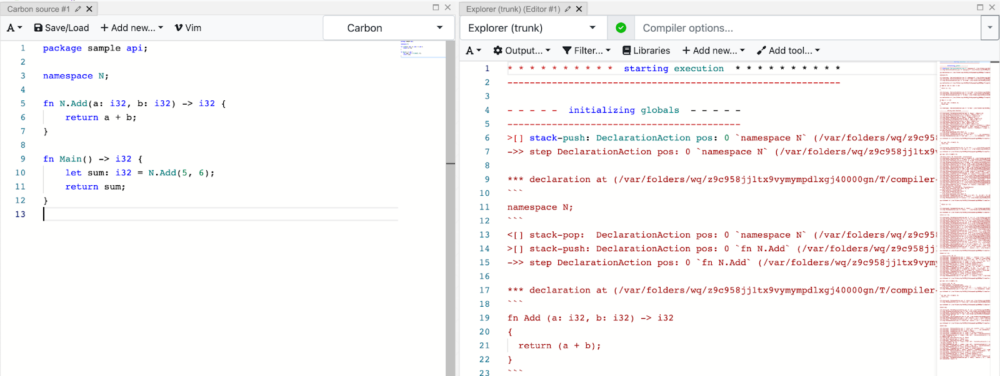

+++
title = "Improving the user-facing Carbon Explorer output"
date = "2023-11-21"
author = "Prabhat Sachdeva"

[cover]
image = "illustration.png"
+++

> Note: This is the first of two guest blog posts from Carbon's
> Google-Summer-of-Code contributors this year.

Carbon Explorer is a prototype interpreter for Carbon whose primary purpose is
to act as a clear executable specification of the language. It can also be used
as a platform for prototyping and validating changes to the language. Its
intended audience is people working on the design of Carbon, and it is not
intended for real-world Carbon programming on any scale.

Carbon Explorer’s trace output refers to a detailed record of program phases and
their internal processes a program goes through when executed using the
explorer.

If you want to read more about Carbon Explorer, you can follow this link:
https://github.com/carbon-language/carbon-lang/blob/trunk/explorer/README.md

And if you want to try out the Carbon Explorer you can try it out at Compiler
Explorer by following this link: https://carbon.godbolt.org/

Carbon Explorer’s trace output was very verbose and hard to use, so this project
was focused on improving the user facing trace output by doing a range of
improvements.

Improvements done to the trace output are classified in the following sections:

1. [Filtering](#filtering)
2. [A different way of tracing the state](#a-different-way-of-tracing-the-state)
3. [Adding the missing output](#adding-the-missing-output)
4. [Output format and design](#output-format-and-design)
5. [Testing the trace output](#testing-the-trace-output)
6. [Miscellaneous Changes](#misc-changes)

In this blog I will try to cover most of the improvements with respect to this
piece of code written in Carbon Language.

```carbon
package Something api;

namespace N;

fn N.Add(a: i32, b: i32) -> i32 {
	return a + b;
}

fn Main() -> i32 {
	let sum: auto = N.Add(1, 2);
	return sum;
}
```

Trace output **before** this project was started (1396 lines):
https://gist.github.com/prabhatexit0/e03c9ad426031813222b9faeb3216d0b

Trace output **after** the <u>GSoC’23</u> period was over (226 lines, default
options): https://gist.github.com/prabhatexit0/0ab3a7fec99e61eacccbcd4cf309b255

_See it [live in Compiler Explorer](https://carbon.godbolt.org/z/d66hr5vrb)!_

## Filtering

As you can notice from the trace output example shared above, it was really
verbose for a very simple program, this was majorly because it consisted of a
lot of trace output that belonged to the prelude and it included all the program
phases.

_Note: Trace output wasn’t added for all the program phases before this project
was started but we later added the missing trace output. That will be covered in
the [Adding the missing output section](#adding-the-missing-output)._

Now how did that happen?

So, there was no control mechanism for the trace output initially and everything
was getting added to the trace that consisted of traces from all the program
phases and both prelude and the user’s source code.

Hence, we implemented a filtering mechanism to let users select the program
phases and file contexts for which they want to see the trace output.

And by default the trace was displayed only for the user's source code and
execution phase, which resulted in a less verbose default trace output.

Users can now select the program phases by passing the `--trace_phase=...` as a
compiler flag when running a program using Carbon Explorer with tracing enabled,
similarly the `--trace_file_context=...` flag can be used for selecting the file
contexts.

Some examples (taking the code example shared initially in the blog for these
sample trace output):

```console
$ bazel run //explorer -- <file path> --trace_file=<trace file path> --trace_file_context=main --trace_phase=name_resolution

* * * * * * * * * *  resolving names  * * * * * * * * * *
---------------------------------------------------------
==> declared `N` as `namespace N` in `package` (./testfile.carbon:3)
==> resolved `N` as `namespace N` in `package` (./testfile.carbon:5)
==> declared `Add` as `fn N.Add` in `namespace N` (./testfile.carbon:7)
==> declared `Main` as `fn Main` in `package` (./testfile.carbon:12)
->> resolving decl `namespace N` (./testfile.carbon:3)
==> marked `N` usable in `package`
<<- finished resolving decl `namespace N` (./testfile.carbon:3)
->> resolving decl `fn N.Add` (./testfile.carbon:7)
==> resolved `N` as `namespace N` in `package` (./testfile.carbon:5)
...
```

```console
$ bazel run //explorer -- <file path> --trace_file=<trace file path> --trace_file_context=main --trace_phase=name_resolution,control_flow_resolution

* * * * * * * * * *  resolving names  * * * * * * * * * *
---------------------------------------------------------
==> declared `N` as `namespace N` in `package` (/app/example.carbon:3)
==> resolved `N` as `namespace N` in `package` (/app/example.carbon:5)
==> declared `Add` as `fn N.Add` in `namespace N` (/app/example.carbon:7)
==> declared `Main` as `fn Main` in `package` (/app/example.carbon:12)
...
* * * * * * * * * *  resolving control flow  * * * * * * * * * *
----------------------------------------------------------------
==> flow-resolved return statement `return (a + b);` in `fn N.Add` (./testfile.carbon:6)
==> flow-resolved return statement `return sum;` in `fn Main` (./testfile.carbon:11)
```

```console
$ bazel run //explorer -- <file path> --trace_file=<trace file path> --trace_file_context=prelude --trace_phase=name_resolution

* * * * * * * * * *  resolving names  * * * * * * * * * *
---------------------------------------------------------
==> declared `As` as `interface As` in `package` (prelude.carbon:14)
==> declared `ImplicitAs` as `interface ImplicitAs` in `package` (prelude.carbon:19)
==> declared `__EqualConverter` as `interface __EqualConverter` in `package` (prelude.carbon:25)
==> declared `__EqualConvert` as `fn __EqualConvert` in `package` (prelude.carbon:28)
==> declared `EqWith` as `interface EqWith` in `package` (prelude.carbon:87)
==> declared `Eq` as `constraint Eq` in `package` (prelude.carbon:91)
==> declared `Ordering` as `choice Ordering` in `package` (prelude.carbon:146)
==> declared `CompareWith` as `interface CompareWith` in `package` (prelude.carbon:152)
==> declared `Ordered` as `constraint Ordered` in `package` (prelude.carbon:155)
...
```

You can read more about the usage here:
https://github.com/carbon-language/carbon-lang/blob/trunk/explorer/README.md

### Related pull requests:

- Improved trace output selection using program phase filtering
  [#2851](https://github.com/carbon-language/carbon-lang/pull/2851)
- Implemented RAII Type to set current program phase
  [#2886](https://github.com/carbon-language/carbon-lang/pull/2886)
- Add -trace_phase option that takes list of allowed phases
  [#2962](https://github.com/carbon-language/carbon-lang/pull/2962)
- Comma separated selection of allowed phases for trace
  [#2963](https://github.com/carbon-language/carbon-lang/pull/2963)
- Trace output filtering based on file context
  [#2916](https://github.com/carbon-language/carbon-lang/pull/2916)

## A Different Way of Tracing the State

Before this project was started, the state of a Carbon program during the
execution with the Carbon Explorer was defined using the following:

```text
{
stack: ... ,
memory: ...
}
```

Here the stack represented what is inside the action stack and memory
represented the mapping of addresses to values. The memory is used to represent
both heap-allocated objects and also mutable parts of the procedure call stack.

The stack is list of actions separated by double pound signs (##). Each action
has the format:

```text
syntax .position. [[ results ]] { scope }
```

And this was traced whenever all steps for an action were executed or when a
recursive action was encountered.

Issue with this kind of approach was that it led to a lot of blank and repeated
entries of the state in the trace output.

```text
--- step decl namespace N .0. (./testfile.carbon:3) --->
{
stack:
memory: 0: Heap{}
}
{
stack:
memory: 0: Heap{}
}
--- step decl fn N.Add .0. (./testfile.carbon:7) --->
{
stack:
memory: 0: Heap{}
}
{
stack:
memory: 0: Heap{}
}
...
```

To get rid of this issue we decided to trace the state only when there is a
change in stack or memory but after trying this out we noticed that there were
many cases when there were changes in one and no changes in other and it was
adding some verbosity to the output. So, we decided to trace the stack only when
there is a change in the stack i.e. when an action is pushed or popped and trace
the memory only when there is a change in memory or the memory is read i.e.
allocation, deallocation, write, read.

For the action stack there were two operations that were pushing an action into
the stack and popping an action from the stack.

1. Push operation is printed as:
   ```text
   >[] stack-push: <action> (<source location>)
   ```
2. Pop operations is printed as:
   ```text
   <[] stack-pop: <action> (<source location>)
   ```

Here the first three characters try to resemble push/pop operation followed by
the operation (stack-push/stack-pop), then the action is printed that is in the
following format

```text
ActionKind pos: <pos_count> `<syntax>` results: [<collected_results>]  scope: [<scope>]
```

And for the memory,

1. Allocation is printed as:
   ```text
   ++# memory-alloc: #<allocation_index> `value` uninitialized?
   ```
2. Read from memory is printed as:
   ```text
   <-- memory-read: #<allocation_index> `value`
   ```
3. Deallocation is printed as:
   ```text
   --# memory-dealloc: #<allocation_index> `value`
   ```
4. Write to memory is printed as:
   ```text
   --> memory-write: #<allocation_index> `value`
   ```

You can read more about this format in the Carbon Explorer’s documentation at:
https://github.com/carbon-language/carbon-lang/blob/trunk/explorer/README.md

So, this was the final result we got for the same:

````text
>[] stack-push: DeclarationAction pos: 0 `namespace N` (./testfile.carbon:3)
->> step DeclarationAction pos: 0 `namespace N` (./testfile.carbon:3) --->

*** declaration at (./testfile.carbon:3)
```
namespace N;
```
<[] stack-pop:  DeclarationAction pos: 0 `namespace N` (./testfile.carbon:3)
>[] stack-push: DeclarationAction pos: 0 `fn N.Add` (./testfile.carbon:7)
.
.
*** statement at (./testfile.carbon:6)
```
return (a + b);
```
--> memory-write: #1 `3`
<[] stack-pop:  StatementAction pos: 1 `return (a + b);` results: [`3`]  (./testfile.carbon:6)
.
.
*** statement at (./testfile.carbon:10)
```
var sum: auto = N.Add(1, 2);
```
<-- memory-read: #1 `3`
=== match pattern `Placeholder<sum>`
    from initializing expression with value `3`
<[] stack-pop:  StatementAction pos: 1 `var sum: auto = N.Add(1, 2);` results: [`3`]  (./testfile.carbon:10)
````

> Note: We will talk about the changes to the output outside of the state
> tracing later in the blog.

As you can clearly see, by doing this change we could embed more meaningful
information by consuming less space. It also made the trace reading experience
more intuitive, as you can see the trace for a step method for a particular
action right after it is pushed into the stack and for the memory we know when
it is read, allocated, deallocated or written.

### Related pull requests:

- Trace stack and memory only when there is change in state
  [#2982](https://github.com/carbon-language/carbon-lang/pull/2982)
- Explorer: add more information to stack trace
  [#3040](https://github.com/carbon-language/carbon-lang/pull/3040)

## Adding the missing output

Initially the name resolution, control flow resolution and unformed names
resolution were not traced.

So, in this project we also added the trace for these phases.

### Name Resolution

Several aspects are involved in the name resolution process within Carbon
Explorer.

Firstly, all exposed names from declarations that possess a name to be exposed
are added into the
[StaticScope](https://github.com/carbon-language/carbon-lang/blob/trunk/explorer/ast/static_scope.h)
(declared).

Subsequently, name resolution is performed for each declaration.

For more details regarding name resolution, you can look at
[this source file](https://github.com/carbon-language/carbon-lang/blob/trunk/explorer/interpreter/resolve_names.h).

These are the details in the name resolution that we added into the trace
output:

- Declaring a name into the static scope:
  ```text
  ==> declared `name` as `name` in `scope` (source location)
  ```
- Resolving a name from the static scope:
  ```text
  ==> resolved `name` as `name` in `scope` (source location)
  ```
- Start and finish for resolving statements and declarations:
  ```text
  ->> resolving decl `decl syntax` (source location)
  <<- finished resolving decl/stmt `decl/statement syntax` (source location)
  ```
- Marking names declared or usable:
  ```text
  ==> marked `N` usable in `package`
  ==> marked `Add` declared but not usable in `namespace N`
  ==> marked `Add` usable in `namespace N`
  ```

You can view the name resolution trace by passing `name_resolution` in the
`--trace_phase=-...` flag.

Example: `--trace_phase=name_resolution,...`

### Control Flow Resolution

In control flow resolution non-local control flow edges such as break and return
are resolved that are there in the given AST.

For more details regarding control flow resolution, you can look at
[this source file](https://github.com/carbon-language/carbon-lang/blob/trunk/explorer/interpreter/resolve_control_flow.h).

For control flow resolution we add the details about following statements once
their control flow is resolved:

1. Return statements statements (ReturnVar and ReturnExpression)
   ```text
   ==> flow-resolved return statement `statement syntax` in `function declaration syntax` (source location)
   ```
2. Break statements
   ```text
   ==> flow-resolved break statement `statement syntax` for `loop syntax` (source location)
   ```
3. Continue statements
   ```text
   ==> flow-resolved continue statement `statement syntax` for `loop syntax` (source location)
   ```
4. For loop statement
   ```text
   ==> flow-resolved for statement `statement syntax` (source location)
   ```
5. While loop statement
   ```text
   ==> flow-resolved while statement `statement syntax` (source location)
   ```

You can view the name resolution trace by passing `name_resolution` in the
`--trace_phase=-...` flag.

Example: `--trace_phase=control_flow_resolution,...`

### Unformed Variables Resolution

Resolving unformed variables is a forward analysis that checks the may-be-formed
states on local variables, for the same there is a class
[FlowFacts](https://github.com/carbon-language/carbon-lang/blob/0ff5e42b1299c184f3eab55d37feffb06c5caee5/explorer/interpreter/resolve_unformed.h#L18C7-L18C16)
that maps the AST nodes to flow facts within a function.

Each AST node can be in either of the following form states:

1. Must be formed
2. May be formed
3. Unformed

Following are the actions that can be performed on the flow facts mapping:

1. Add initialized (adds a must-be-formed flow fact)
2. Add uninitialized (adds an unformed flow fact)
3. Form (Marks an unformed flow fact as may-be-formed)
4. Check (Returns compilation error if the AST node is impossible to be formed)
5. None (Used in traversing children nodes without an action to take)

For unformed variables resolution we added the following details into the trace
output:

1. Action taken:

   ```text
   ==> <action type> `name` (source location)
   ```

   Action type can be one of those defined above (AddInit, AddUninit, etc.)

2. When the explorer starts resolving unformed variables a statement
   ```text
   ->> resolving-unformed in stmt `statement syntax` (source location)
   ```
3. When the explorer starts resolving unformed variables a declaration
   ```text
   ->> resolving-unformed in decl `declaration syntax` (source location)
   ```

### Related pull requests:

- Add name resolution information to trace stream
  [#2986](https://github.com/carbon-language/carbon-lang/pull/2986)
- Explorer: add trace for control flow resolution
  [#3014](https://github.com/carbon-language/carbon-lang/pull/3014)
- Explorer: add trace for unformed variable resolution
  [#3015](https://github.com/carbon-language/carbon-lang/pull/3015)

## Misc Changes

There were a lot of minor changes we made to make the trace output more
consistent and easy to read/understand for users.

Listing all the minor changes will get very long so for this blog; I’m writing
just the major ones.

### Enclosing the code with backticks

If you notice in the old trace output that I shared in this blog in the
beginning, at some places it is getting a bit confusing to identify which part
of the trace belongs to the code and which part doesn’t. To avoid this problem
we enclosed all the code with backticks.

For single line code we used single backticks.

Example:

```text
<[] stack-pop: DeclarationAction pos: 0 `fn N.Add` (./testfile.carbon:7)
```

And for multi-line code we used triple backticks along with newlines.

Example:

````text
*** declaration at (./testfile.carbon:7)
```
fn Add (a: i32, b: i32) -> i32 { return (a + b); }
```
````

### Adding source location to Type Checker’s trace

Type checker’s trace was very inconsistent format wise and lacked the source
location at places where code was printed, so one of the additions while
improving the type checker was to include source location at places where code
is printed.

Before:

```text
** declaring function Add
checking TuplePattern (a: i32, b: i32)
checking BindingPattern a: i32
checking ExpressionPattern i32
checking IntTypeLiteral i32
```

After:

```text
->> declaring function `Add` (./testfile.carbon:7)
->> checking TuplePattern `(a: i32, b: i32)` (./testfile.carbon:5)
->> checking BindingPattern `a: i32` (./testfile.carbon:5)
->> checking ExpressionPattern `i32` (./testfile.carbon:5)
->> checking IntTypeLiteral `i32` (./testfile.carbon:5)
```

### Shorten prelude’s path when printing source location

Prelude’s path that was printed on printing the source location was really long
and it wasn’t important to fully specify it.

So, we shorten it down just to its filename.

Before:

```text
--- step decl interface As .0. (/private/var/tmp/_bazel_prabhatsachdeva/20081091d895e017d1f90f5df34bb89f/execroot/carbon/bazel-out/darwin_arm64-fastbuild/bin/explorer/explorer.runfiles/carbon/explorer/data/prelude.carbon:14) --->
```

After:

```text
->> step DeclarationAction pos: 0 `interface As` (prelude.carbon:14) --->
```

### Related pull requests:

- Explorer: improve type checking trace output
  [#3039](https://github.com/carbon-language/carbon-lang/pull/3039)
- Explorer: add trace for InstantiateType
  [#3041](https://github.com/carbon-language/carbon-lang/pull/3041)
- Explorer: Reduce prelude path when printing source location
  [#3080](https://github.com/carbon-language/carbon-lang/pull/3080)

## Output format and design

Trace output lacked a format and was really inconsistent, so we created a
convention to be followed in the trace and also created some helper methods to
make it easier to manage.

### Enhance Declaration and Statement Printing

Previously, the formatting of declarations and statements had inconsistencies,
such as irregular newlines, missing whitespaces, excessive curly braces etc. and
it also lacked indentation.

We manually fixed the inconsistencies by doing modifications in the Print
methods for `Declaration` and `Statement`.

There were three Print methods that existed for printing Declarations and
Statements i.e. `Print`, `PrintDepth` and `PrintID`.

The `PrintDepth` method had a parameter `depth` that signaled how many levels of
nesting to print. We initially tried to add the indentation logic in this method
but it was increasing the complexity and we later realized that there were no
active use cases for `PrintDepth`.

So, we renamed `PrintDepth` to `PrintIndent`, instead of the `depth` parameter
it has `num_indent_spaces` using which we can specify the required indentation
for the output and this method is called recursively for nested declarations or
statements.

Before:

```text
namespace N;fn Add (a: i32, b: i32)-> i32 {
{
return (a + b);
}

}
fn Main ()-> i32 {
{
var sum: auto = N.Add(1, 2);
return sum;
}

}
```

After:

```text
namespace N;

fn Add (a: i32, b: i32) -> i32
{
  return (a + b);
}

fn Main () -> i32
{
  var sum: auto = N.Add(1, 2);
  return sum;
}
```

### Line Prefixes

If you notice in trace output, you’ll see every line is prefixed with three
symbols followed by a whitespace.

We created these line prefixes to improve readability and these prefixes also
resemble the kind to which that particular line belongs to.

These are some of the methods that we created for adding line prefixes:

```cpp
auto Indent() const -> llvm::raw_ostream& { return *this << "    "; }
auto Start() const -> llvm::raw_ostream& { return *this << "->> "; }
auto Match() const -> llvm::raw_ostream& { return *this << "=== "; }
auto Result() const -> llvm::raw_ostream& { return *this << "==> "; }
auto Push() const -> llvm::raw_ostream& { return *this << ">[] "; }
auto Pop() const -> llvm::raw_ostream& { return *this << "<[] "; }
```

<u>Examples:</u>

In this example, declaring refers to some process that is starting for that we
created a prefix `->>`

```text
->> declaring function `Add` (./testfile.carbon:7)
->> checking TuplePattern `(a: i32, b: i32)` (./testfile.carbon:5)
```

In this example, the trace output is telling about some results so we prefixed
it with `==>`

```text
==> deduction succeeded with results: []
```

In this example, we prefixed the traced line for stack push with `>[]` and pop
with `<[]`

```text
>[] stack-push: ExpressionAction pos: 0 `i32` (./testfile.carbon:9)
->> step ExpressionAction pos: 0 `i32` (./testfile.carbon:9) --->
<[] stack-pop:  ExpressionAction pos: 0 `i32` (./testfile.carbon:9)
```

### Heading and Subheadings

Previously, formatting style for headings and subheadings was in the following
manner:

```text
********** heading **********
********** subheading **********
```

To make it look better visually we changed it to this way:

```text
* * * * * * * * * *  Heading  * * * * * * * * * *
-------------------------------------------------

- - - - - Subheading   - - - - -
--------------------------------
```

And we also created following utility methods for the same:

```cpp
void Heading(std::string_view heading) const {
  add_blank_lines(2);
  const std::string_view stars = "* * * * * * * * * *";
  const std::string dashed_line(stars.size() * 2 + heading.size() + 4, '-');
  *this << stars << "  " << heading << "  " << stars << "\n"
        << dashed_line << "\n";
}

void SubHeading(std::string_view sub_heading) const {
  add_blank_lines(1);
  const std::string_view dashes = "- - - - -";
  const std::string dashed_line(dashes.size() * 2 + sub_heading.size() + 4, '-');
  *this << dashes << "  " << sub_heading << "  " << dashes << "\n"
        << dashed_line << "\n";
}
```

These utility methods assist in generating the new style by adding the
appropriate number of blank lines and constructing the required patterns of
asterisks and dashes for both headings and subheadings. This results in a
cleaner and more organized presentation of content, making it easier to visually
distinguish between different sections.

### Related pull requests:

- Explorer: Remove PrintDepth and implement PrintIndent.
  [#3113](https://github.com/carbon-language/carbon-lang/pull/3113)
- Explorer: Add methods to trace for line prefixes
  [#3076](https://github.com/carbon-language/carbon-lang/pull/3076)
- Explorer: Add heading and sub-heading methods to trace
  [#3088](https://github.com/carbon-language/carbon-lang/pull/3088)
- Explorer: add blank lines between trace of different sections
  [#3096](https://github.com/carbon-language/carbon-lang/pull/3096)

## Testing the trace output

Before this project was started there existed only sanity checks for the trace
output that were using
[LLVM FileCheck](https://llvm.org/docs/CommandGuide/FileCheck.html) and
[LLVM LIT](https://llvm.org/docs/CommandGuide/lit.html).

Initially for testing the trace output for the program phase filters that we
added, we used LLVM LIT to create checks similar to how it was being done
before, with a few changes to the configuration to support the compiler flags.

But the limitation with these checks was that they didn’t support autoupdate
(for anything that changes the trace output we would have to change that part in
the test manually as well) and they were prone to missing some significant
changes in the explorer that might make changes in the trace output.

So, we created a test to completely check the trace output and that also
supported autoupdate and that used a new testing infrastructure that was being
built for the Carbon Language project to replace LLVM LIT and FileCheck.

### Related pull requests:

- Improved trace output selection using program phase filtering
  [#2851](https://github.com/carbon-language/carbon-lang/pull/2851)
- Trace output filtering based on file context
  [#2916](https://github.com/carbon-language/carbon-lang/pull/2916)
- Check explorer's full trace output
  [#2934](https://github.com/carbon-language/carbon-lang/pull/2934)

## Conclusion

As I look back on my journey during the Google Summer of Code 2023 with Carbon
Language, I am proud of the progress we've made towards enhancing the
user-facing trace output of the Carbon Explorer.

But there are still a lot of improvements that can be made to the trace output.

These are the possible tasks that we might accomplish in future.

### Possible tasks for future

#### Source location based filtering to check trace for specific part of code

This will let users select trace output for select parts of the code.

Example usage:

```text
1  | package Something api;
2  |
3  | namespace N;
4  |
5  | fn N.Add(a: i32, b: i32) -> i32 {
6  | 	 return a + b;
7  | }
8  |
9  | fn Main() -> i32 {
10 | 	 let sum: auto = N.Add(1, 2);
11 |	 return sum;
12 | }
```

Using the --trace_source_lines=5-7 flag like in the following command

```console
$ bazel run //explorer <file path> --trace_file=... --trace_source_lines=5-7
```

Should print trace output that only belongs to the `function N.Add`

#### Customize highlighting in the godbolt output panel



Currently, the trace output in the Compiler Explorer’s output panel uses ASM
syntax highlighting and that doesn’t look right and the ASM syntax isn’t
compatible with the trace we are producing.

But we can have custom syntax highlighting for the trace output, Compiler
Explorer uses monaco editor and for that we can create declarative syntax
highlighting for trace using
[Monarch](https://microsoft.github.io/monaco-editor/monarch.html).

### What we tried but didn’t work out

#### Indent the trace

There are many parts in the trace output which are nested and for that we
planned on using indentation for them but it didn’t work out nicely as it made
it consume a lot of horizontal space and that made readability hard.

#### Grouping messages and putting tab space between them for a column-like view

We created a log method in the TraceStream and tried to give more space between
the arguments passed to it to give it a table like view similar to how assembly
is formatted but for our case it didn’t work out and parts of trace can be
really long.

## Thank You!

At the end I would like to mention that contributing to Carbon Language as part
of Google Summer of Code was a dream come true moment for me.

I'm really fortunate that I got this opportunity to connect with folks at Carbon
Language and I will keep contributing to Carbon Language even after this GSoC
period.

I’m extremely thankful to my mentor Richard Smith for guiding me through the
project, all the reviews and all the weekly meetings!

Thank you for reading this blog! If you have any suggestions or doubts you can
reach out to me on:

- Email: [prabhatexit0@gmail.com](mailto:prabhatexit0@gmail.com)
- Discord: `prabhatexit0`
