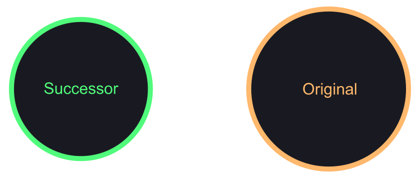
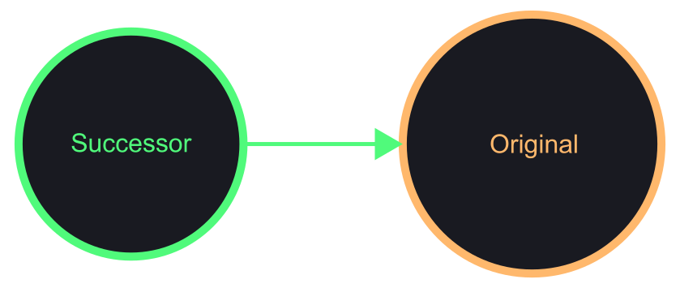
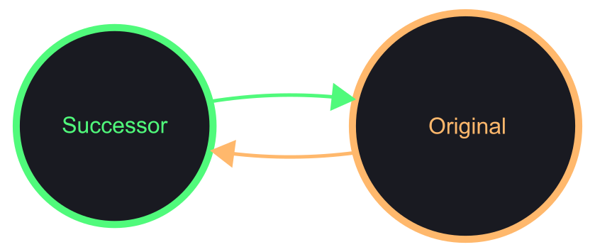
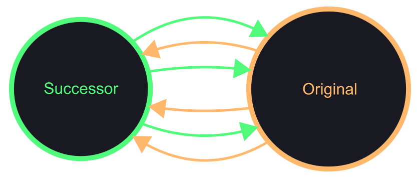

+++
weight = 2
outputs = ["Reveal"]
+++

## Carbon's successor strategy has some important question marks:

- What do we mean by successor? Why not superset?
- How do we make this work? C++ interop requires superpowers...
- How does this get us to _memory safety_?

---

# Successor language vs. superset language

{}

Let's start off by digging into the distinction we're making in Carbon to be a
successor language without being a superset language.

{}

---

## Or: what _kind_ of successor language is Carbon?

{}

Or put differently, let's look at what exact kind of successor we're aiming to
build with Carbon, because I think this clarifies a bunch of the design
tradeoffs we're making here.

{}

---

## Two main approaches to a successor languages:

1. Connect through _intersection_

2. Connect through _interoperation_

---

## Intersection approach has different forms:

<div class="col-container r-stretch"
     style="align-items: center; justify-content: center;">
<div class="col fragment">

Subset:

<svg viewBox="0 0 400 400" preserveAspectRatio="xMidYMid slice" role="img">
  <title>
    A diagram of a subset successor language within an original language.
  </title>
  <g fill="#191a21">
  <g color="#ffb86c">
  <circle cx="200" cy="200" r="160"
          stroke-width="10"
          stroke="currentcolor"
          />
  <text x="175" y="320" font-size="32"
        stoke="currentcolor" fill="currentcolor">
    Original
  </text>
  </g>
  <g color="#50fa7b">
  <circle cx="180" cy="180" r="100"
          stroke-width="10"
          stroke="currentcolor"
          />
  <text x="110" y="220" font-size="32"
        stoke="currentcolor" fill="currentcolor">
    Successor
  </text>
  </g>
  </g>
</svg>

<div class="center">

Example: "Modern" C++

</div>
</div>
<div class="col fragment">

Superset:

<svg viewBox="0 0 400 400" preserveAspectRatio="xMidYMid slice" role="img">
  <title>
    A diagram of a superset successor language encompassing an original
    language.
  </title>
  <g fill="#191a21">
  <g color="#50fa7b">
  <circle cx="200" cy="200" r="160"
          stroke-width="10"
          stroke="currentcolor"
          />
  <text x="120" y="100" font-size="32"
        stoke="currentcolor" fill="currentcolor">
    Successor
  </text>
  </g>
  <g color="#ffb86c">
  <circle cx="220" cy="220" r="100"
          stroke-width="10"
          stroke="currentcolor"
          />
  <text x="160" y="180" font-size="32"
        stoke="currentcolor" fill="currentcolor">
    Original
  </text>
  </g>
  </g>
</svg>

<div class="center">

Example: Circle

</div>
</div>
<div class="col fragment">

Overlap:

<svg viewBox="0 0 400 400" preserveAspectRatio="xMidYMid slice" role="img">
  <title>
    A diagram of a superset successor language encompassing an original
    language.
  </title>
  <g fill="#191a21">
  <g color="#ffb86c">
  <circle cx="125" cy="160" r="110"
          stroke-width="10"
          stroke="transparent"
          />
  <circle cx="275" cy="240" r="110"
          stroke-width="10"
          stroke="currentcolor"
          />
  <text x="240" y="240" font-size="32"
        stoke="currentcolor" fill="currentcolor">
    Original
  </text>
  </g>
  <g color="#50fa7b">
  <circle cx="125" cy="160" r="110"
          stroke-width="10"
          stroke="currentcolor" fill="transparent"
          />
  <text x="50" y="140" font-size="32"
        stoke="currentcolor" fill="currentcolor">
    Successor
  </text>
  </g>
  </g>
</svg>

<div class="center">

Example: Cpp2?

</div>
</div>
</div>

---

## Intersection can be implemented as a C++ frontend: cpp-front and Cpp2

<div class="col-container">
<div class="col">

```cpp{|1-2|16|}
#include <iostream>
#include <string>

name: () -> std::string = {
  s: std::string = "world";
  decorate(s);
  return s;
}

decorate: (inout s: std::string) = {
  s = "[" + s + "]";
}

auto main() -> int {
  // name();
  std::cout << "Hello " << name() << "\n";
}
```

</div>
<div class="col fragment">

```cpp{|6-7|15|}
//=== Cpp2 type declarations
#include "cpp2util.h"

//=== Cpp2 type definitions
//=== and function declarations
#include <iostream>
#include <string>

[[nodiscard]] auto name() -> std::string;

auto decorate(std::string& s) -> void;

auto main() -> int {
  // name();
  std::cout << "Hello " << name() << "\n";
}

//=== Cpp2 function definitions
[[nodiscard]] auto name() -> std::string{
  std::string s {"world"};
  decorate(s);
  return std::move(s);
}

auto decorate(std::string& s) -> void{
  s = "[" + s + "]";
}
```

</div>
</div>

{}

When implementing an intersection based successor language, an obvious and
really appealing strategy is to build a C++ frontend where you translate from
the new language into the original one.

It's tempting to imagine that this is "just" using C++ as a "backend", but that
is rarely the case. There was a "C backend" for LLVM ages ago that did this --
it truly did _just_ use C as a backend target, the language didn't leak through
(much).

But in reality, the whole point of taking this approach when building an
intersection is that you can just pass the intersection through! And you can
often use a very high-level lowering of the parts that are translated rather
than having to implement a full compiler for them.

This technique has been used for a long time and is really robust. C-Front of
course started this, and this is how Cpp2's cpp-front works.

But it has some serious limitations. Inevitably IMO, the semantics of the target
leak into the new language in surprising ways. This starts with the
intersection, but will typically sneak into other things around the edges and in
the lowering. It makes it very hard to define clean and precise new semantics,
because you have to actively work against the target language semantics having
any effect. A classic place where this friction shows up is when there is an
error message from the C++ compiler about the _lowered_ code. This error message
won't make much sense as it will refer to something other than what the
programmer actually wrote. Fixing this requires your C++ frontend to diagnose
_every possible error_ that might result in the generated C++ code. At that
point, you've likely implemented a decent chunk of the complexity of the C++
compiler itself for those constructs, and lost most of the cost savings of this
approach.

It also creates a serious compile time problem. C++ compile times are already
extraordinarily bad, and when using this technique you basically define away any
hope of improving on them because you're literally adding another step to the
process.

{}

---

## Intersection as extensions to a C++ compiler

<div class="col-container">
<div class="col">

Good:

- Sound semantic model
- More flexibility
- Avoids two-step compilation
  - Good error messages
  - Faster compile times

</div>
<div class="col">

Limitations:

- Complexity of both C++ and new language
- Hard to separate concerns / design

</div>
</div>

{}

The other approach to building an intersection-based successor is to start with
a reasonably flexibly C++ compiler and start extending it with a custom mode of
some kind. IMO, this is a more compelling approach than building a C++ frontend
because it is a good way to ensure you get reasonably direct semantics designed
and implemented. Error messages will be produced for the language being used,
etc.

However, it still comes with some limitations. You have to deal with the
complexity of _both_ C++ and your new language. And you can't get strong
separation of concerns or the design between the two.

But still, this is definitely the strategy I find most compelling for building
an intersection based C++ successor.

{}

---


## Aside: fine-grained selection of extensions in C++ successor

Good: allows rapid and incremental experimentation

Problems:
- Creates serious problems of fragmentation
- When designing an API, callee and caller need to agree
  - Makes mutually incompatible features _really_ hard
  - Limiting to composable features works but is... limiting
  - Especially if all of existing C++ is included
  - Already a problem causing pain in C++: exceptions, [RTTI], [LP64 vs. LLP64]
- Applications and libraries will need a cohesive & coherent feature set

[RTTI]: https://en.wikipedia.org/wiki/Run-time_type_information
[LP64 vs. LLP64]:
  https://en.wikipedia.org/wiki/64-bit_computing#64-bit_data_models

{}

"Choose your own adventure" style of successor, only really makes sense as a way
of building an intersection based successor because it is all about
incrementally tweaking the original language. However, fully embracing this and
making it completely configurable creates serious problems of fragmentation.
APIs need callers and callees to agree on the feature sets that can be used
across the boundary. Which means mutually incompatible extensions aren't really
in scope, and limiting to composable features becomes more important. But this
in turn is ... limiting. Especially with all of C++ included.

This isn't a new problem with successors though, this is a problem with C++ --
exceptions, RTTI, 64-bit, we have all kinds of dialects that cause these
problems today. And these end up being real problems in practice. This isn't
something that we should make worse.

Ultimately, we always want a cohesive and coherent feature set. Even with an
intersection based successor design. And this is really an integral part of what
is difficult in designing a successor, so IMO it doesn't make sense to defer
this.

Anyways, enough aside, let's talk about the alternative approach of interop
based successor design...

{}

---



## Interop successor approaches _connect_

<div class="diagram-center r-stretch">

</div>

{}

In contrast, an interop approach is going to keep each language separate.

{}

---

## Interop successor approaches _connect_

<div class="diagram-center r-stretch">

</div>

{}

To be effective as a successor, it instead builds some _connection_ that allows
using the original language from the new one.

{}

---

## Interop successor approaches _connect_

<div class="diagram-center r-stretch">

</div>

{}

And I think you also need to a way to use the new language from the original.
Without both directions here, you have a strict order in which any code has to
migrate, and in my experience this makes it impossible to scale up the use of a
successor language.

{}

---

## Interop successor approaches _connect_

<div class="diagram-center r-stretch">

</div>

{}

In reality, there will likely be _TONS_ of connections you need in order to make
the interoperability seamless and really friendly. For almost anything that
appears on the boundary between languages, you need to build an edge here.

These connections are what create interop. When we talk about interop as a noun,
a thing you have, it is these connections we're talking about.

_(highlight the lines somehow)_

This is also where the cost comes from -- you have to build the connective
tissue between the two languages here. These are reasonably complex and
difficult to produce.

Understanding this cost in turn can let us talk about the crucial decision here.
Because this is engineering, and _everything_ is about _tradeoffs_... So the
tradeoff between these strategies, at its most fundamental level:

{}

---

# Intersection _constrains_ and _limits_ the design & implementation<br/><br/>Interoperation is _expensive_ and _difficult_ to build

{}

Interoperation as the means of building an effective successor language makes it
significantly more expensive and difficult to build.

But intersection, while much easier and less expensive, comes with constraints
and limitations.

This is the fundamental tradeoff between the two approaches IMO. You have to
pick whether the constraints and limitations of intersection are tolerable, or
whether you can afford the costs of an interoperation approach.

{}

---

## Intersection _constrains_ and _limits_<br/>both the design & implementation

- Intersecting features must cover all interactions between original and new
  - The successor inherits at least the technical debt inherent in the overlap
  - Can't make design improvements to those features
  - Can't shape non-overlapping designs in a way that conflicts with overlap
- Implementation has to support the full _union_ of features
  - No separation of concerns or strong abstraction for new designs
  - Hard to ever fully realize benefits even where no original code

{}

{}

---

## Intersection _constrains_ and _limits_<br/>both the design & implementation

<svg class="r-stretch" viewBox="0 0 400 400" preserveAspectRatio="xMidYMid meet" role="img">
  <title>
    A diagram of a superset successor language encompassing an original
    language.
  </title>
  <g fill="#191a21">
  <g color="#ffb86c">
  <circle cx="125" cy="160" r="150"
          stroke-width="10"
          stroke="transparent"
          />
  <circle cx="275" cy="240" r="150"
          stroke-width="10"
          stroke="currentcolor"
          />
  <text x="280" y="280" font-size="32"
        stoke="currentcolor" fill="currentcolor">
    Original
  </text>
  </g>
  <g color="#50fa7b">
  <circle cx="125" cy="160" r="150"
          stroke-width="10"
          stroke="currentcolor" fill="transparent"
          />
  <text x="20" y="120" font-size="32"
        stoke="currentcolor" fill="currentcolor">
    Successor
  </text>
  </g>
  </g>
  <text x="152" y="232" font-size="100" class="fragment">⚓</text>
</svg>

{}

Essentially, the intersection approach creates an anchor of the original
language that limits what the new language can achieve.

In some cases, this is OK. The starting point is tolerable, and the costs of
interoperation are too high.

But for C++, we feel like especially the technical debt and complexity effects
of this were too concerning. We really wanted to try a more dramatically
different approach, which is why we're looking at interop.

{}

---

## Interoperation is _expensive_ and _difficult_ to build

- Total cost is higher -- requires building & maintaining the interop layer
- Can require greater complexity in the new language
- The starting cost and difficulty are especially impacted
  - Have to have a viable whole new language
  - And have to build near complete interop layer
  - No easy incremental paths

{}

And the costs are really significant here.

The total cost is high because you have to build a pretty complex layer of
interop, and maintain it forever. You'll also have some complexity in the new
language in most cases to support the interop.

But the _starting_ cost is where this really hits. The first viable increment of
a new language is a much more monolithic step because you need to build all of
the foundations, all of the core of the language. And because the original
language you're connecting to is a large, mature language, the interop itself
will be quite complex even in its first increments. That in turn will force a
_huge_ number of features into the first increment.

If you go to Carbon's first milestone, it is a preposterously large feature list
to be the "minimum viable" one. But that's a consequence of this strategy.

This cost is exactly why I suspect it was critical for TypeScript to _not_ go
this route -- it would have had the _even higher_ cost due to the deep inertia
of the combined web and browser ecosystems.

{}

---

## Carbon's strategy is to _interoperate_ with C++

- More expensive to build
- But we expect good return on that investment:
  - More flexible language design
  - Strong separation from legacy & tech debt
  - Best possible experience within Carbon code

{}

Ultimately, the interop tradeoff makes the most sense for Carbon. While it makes
this expensive to build, we think we'll get a really strong return on our
investment there. It opens up a number of exciting language design options,
especially to get both powerful and ergonomic features like memory safety.

We also really want to maximize our ability to separate the technical debt and
clean things up.

And last but not least, we're particularly interested in getting significant
compile time speedups and other simplifications in the pure-Carbon parts of the
code.

{}
