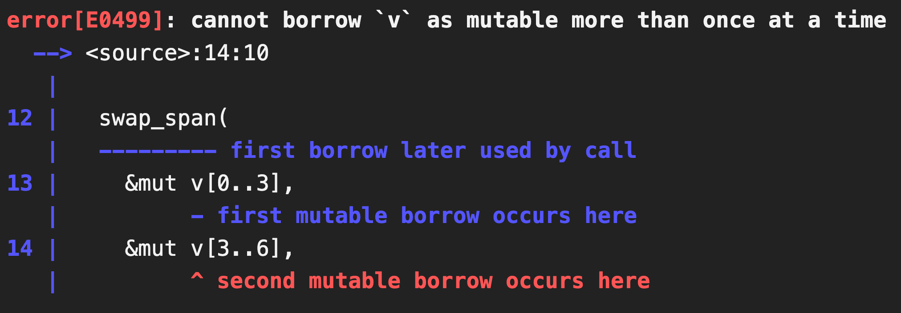

+++
weight = 4
outputs = ["Reveal"]
+++

# Memory safety

{}

... and talk about memory safety.

There are a lot of different motivations for Carbon, not _just_ memory safety.
But safety is _one_ of the most important and it is also especially topical
right now and here at this conference.

In many ways, the memory safety challenges that are finally being fully
acknowledged and grappled with across the C++ world are for me _emblematic_ of
the challenges faced by C++, and the motivations I have for wanting to explore
Carbon. Here is yet another critical need for our users, maybe the most critical
one we've seen yet. And again, C++ is struggling to address the need.

So I'd like to walk through _what_ I think memory safety really means at the
language level, what is needed to address it, and then the biggest thing I want
to do is try to give some idea of how the Carbon successor strategy I've
outlined can be effective at helping move in this direction.

{}

---

## What do we mean by memory safety?

{}

First, we need to break down what we actually mean when we talk about memory
safety. There is a fairly broad usage of this term, and I know several others
are working on posts, articles, and presentations discussing this. Here, I'd
like to share the framework that I use to think about these.

{}

---

## Bugs, safety, and safety bugs

- **Bugs**: program behavior contrary to the author's intent
  - Software, in practice, always has bugs -- we must plan for them

---

## Bugs, safety, and safety bugs

- **Bugs**: program behavior contrary to the author's intent
  - Software, in practice, always has bugs -- we must plan for them
- **Safety**: invariants or limits on program behavior _in the face of bugs_

---

## Bugs, safety, and safety bugs

- **Bugs**: program behavior contrary to the author's intent
  - Software, in practice, always has bugs -- we must plan for them
- **Safety**: invariants or limits on program behavior _in the face of bugs_
- **Safety bugs**: bugs where some aspect of program behavior has _no_
  invariants or limits
  - Checking for an unexpected value and calling `abort()`: detects a _bug_, but
    is _safe_
  - Calling `std::unreachable()` is also a bug, but _unsafe_ and a _safety bug_

---

## Bugs, safety, and safety bugs

- **Bugs**: program behavior contrary to the author's intent
  - Software, in practice, always has bugs -- we must plan for them
- **Safety**: invariants or limits on program behavior _in the face of bugs_
- **Safety bugs**: bugs where some aspect of program behavior has _no_
  invariants or limits
  - Checking for an unexpected value and calling `abort()`: detects a _bug_, but
    is _safe_
  - Calling `std::unreachable()` is also a bug, but _unsafe_ and a _safety bug_
- **Initial bug**: the first deviation of program behavior
  - Buggy behavior often causes more buggy behavior -- all are bugs
  - Our focus is on fixing the _initial_ bug

{}

Let's start with some basic terms.

{}

---

## Safety, bugs, and security vulnerabilities

- **Security vulnerabilities**: ability of a malicious user to subvert a
  program's behavior, typically through exploiting bugs

---

## Safety, bugs, and security vulnerabilities

- **Security vulnerabilities**: ability of a malicious user to subvert a
  program's behavior, typically through exploiting bugs
  - **Detecting**: while still vulnerable, exploits of a bug can be detected or
    tracked

---

## Safety, bugs, and security vulnerabilities

- **Security vulnerabilities**: ability of a malicious user to subvert a
  program's behavior, typically through exploiting bugs
  - **Detecting**: while still vulnerable, exploits of a bug can be detected or
    tracked
  - **Mitigating**: making a vulnerability significantly more expensive,
    difficult, or improbable to be exploited

---

## Safety, bugs, and security vulnerabilities

- **Security vulnerabilities**: ability of a malicious user to subvert a
  program's behavior, typically through exploiting bugs
  - **Detecting**: while still vulnerable, exploits of a bug can be detected or
    tracked
  - **Mitigating**: making a vulnerability significantly more expensive,
    difficult, or improbable to be exploited
  - **Preventing**: while still a bug, making it impossible to be a
    vulnerability

---

## Safety, bugs, and security vulnerabilities

- **Security vulnerabilities**: ability of a malicious user to subvert a
  program's behavior, typically through exploiting bugs
  - **Detecting**: while still vulnerable, exploits of a bug can be detected or
    tracked
  - **Mitigating**: making a vulnerability significantly more expensive,
    difficult, or improbable to be exploited
  - **Preventing**: while still a bug, making it impossible to be a
    vulnerability
  - **Fixing**: no longer a bug, much less a vulnerability

---

## Safety, bugs, and security vulnerabilities

- **Security vulnerabilities**: ability of a malicious user to subvert a
  program's behavior, typically through exploiting bugs
  - **Detecting**: while still vulnerable, exploits of a bug can be detected or
    tracked
  - **Mitigating**: making a vulnerability significantly more expensive,
    difficult, or improbable to be exploited
  - **Preventing**: while still a bug, making it impossible to be a
    vulnerability
  - **Fixing**: no longer a bug, much less a vulnerability
- Safety doesn't require _fixing_ bugs, but it can _prevent_ or _mitigate_
  vulnerabilities
  - Constructively-correct or proofs are a subset of safety techniques,
    <br/>essentially limiting even forming a program in the face of bugs

---

## Memory safety bugs and security

- **Memory safety bugs**: Safety bugs that additionally read or write memory
- A focus because they are the dominant cause of _security vulnerabilities_
  - Over 65% of high / critical vulnerabilities (sources
    [1],[2],[3],[4],[5],[6])
- **Memory safety**: limits program behavior to only read or write intended
  memory, even in the face of bugs
  - Sufficient to mitigate and prevent these classes of vulnerabilities in
    practice

[1]: https://www.chromium.org/Home/chromium-security/memory-safety
[2]:
  https://android-developers.googleblog.com/2020/02/detecting-memory-corruption-bugs-with-hwasan.html
[3]:
  https://docs.google.com/spreadsheets/d/1lkNJ0uQwbeC1ZTRrxdtuPLCIl7mlUreoKfSIgajnSyY/edit#gid=1190662839
[4]: https://twitter.com/geofft/status/1132739184060489729
[5]:
  https://msrc-blog.microsoft.com/2019/07/16/a-proactive-approach-to-more-secure-code/
[6]: https://langui.sh/2019/07/23/apple-memory-safety/

{}

{}

---

## Classes of memory safety bugs

- **Spatial**: memory access outside of an allocated region

---

## Classes of memory safety bugs

- **Spatial**: memory access outside of an allocated region
- **Temporal**: access after the lifetime of the object in memory

---

## Classes of memory safety bugs

- **Spatial**: memory access outside of an allocated region
- **Temporal**: access after the lifetime of the object in memory
- **Type**: accessing memory which isn't a valid representation for a type

---

## Classes of memory safety bugs

- **Spatial**: memory access outside of an allocated region
- **Temporal**: access after the lifetime of the object in memory
- **Type**: accessing memory which isn't a valid representation for a type
- **Initialization**: reading memory before it is initialized

---

## Classes of memory safety bugs

- **Spatial**: memory access outside of an allocated region
- **Temporal**: access after the lifetime of the object in memory
- **Type**: accessing memory which isn't a valid representation for a type
- **Initialization**: reading memory before it is initialized
- **Data-Race**: unsynchronized reads & writes by different threads

{}

{}

---

## Suggested programming language approach to memory safety

A language is **_rigorously memory-safe_** if it:

- has a well-delineated safe subset, and
- provides spatial, temporal, type, and initialization safety in its safe
  subset.

This should be the required minimum for programming languages going forward.

{}

{}

---

## Details of rigorous memory safety

- Safe subset must be a viable _default_, with unsafe being _exceptional_
- Delineated unsafe constructs must be _visible_ and _auditable_
- Safety can be through any combination of compile-time and runtime protections
  - However, must _prevent_ vulnerabilities, not just _mitigate_ them

{}

{}

---

## Details of rigorous memory safety

- Data-race safety remains highly _desirable_ but not a strict requirement:
  - It would increase the constraints on the available solutions
  - No evidence (yet) of comparable security risks when other safety is achieved

{}

{}

---

## How can Carbon get us there starting from C++?

{}

Ok, now that we're all talking about memory safety in programming languages the
same way, let's get to the crux of this, how do you get there? And why is Carbon
helpful?

{}

---

## First, we need to _introduce_ a safe subset

{}

{}

---

## Best candidate for C++ is likely similar to Rust's borrow checker

- High performance: ensures safety at compile-time with the type system
- [Explored] in the context of C++'s type system, w/ many barriers
  - Non-destructive moves constantly leaves "dangling" references
  - Inconvenient to track in/out "borrows" w/o language support
- Fundamentally requires a significant increase in type system complexity
  - More parameterized types in C++ means more templates
  - C++ doesn't have the tools used by Rust (and others): _checked generics_

[Explored]:
  https://docs.google.com/document/d/e/2PACX-1vSt2VB1zQAJ6JDMaIA9PlmEgBxz2K5Tx6w2JqJNeYCy0gU4aoubdTxlENSKNSrQ2TXqPWcuwtXe6PlO/pub

{}

{}

---

## Beyond language changes, a borrow checker needs different APIs and idioms

{}

Beyond the strict language changes, there is also a more pervasive difference --
the standard library, APIs, and common coding idioms differ between C++ and a
safe language like Rust.

{}

---

## Example differences in a borrow-checked language

<div class="col-container">
<div class="col">

```cpp{|13|14|1-2|6|}
void swap_span(std::span<int> a,
               std::span<int> b) {
  for (size_t i = 0;
       i < a.size();
       i += 1) {
    std::swap(a[i], b[i]);
  }
}

int main() {
   std::vector<int> v = {1, 2, 3, 4, 5, 6};
   swap_span(
       std::span(v).subspan(0, 3),
       std::span(v).subspan(3, 3)
   );
}
```

</div>
<div class="col fragment">

```rust{|13|14|1-2|6|}
fn swap_span(a: &mut [i32],
             b: &mut [i32]) {


  for i in 0..a.len() {
    std::mem::swap(&mut a[i], &mut b[i])
  }
}

pub fn main() {
  let mut v = vec![1, 2, 3, 4, 5, 6, 7];
  swap_span(
    &mut v[0..3],
    &mut v[3..6],
  )
}
```

</div>
</div>

{}

Let's look concretely at just how different even simple programming patterns
need to be in order to work well in a borrow checked language.

Huge credit and thanks goes to Dana Jansens, Dmitri Gribenko, and several other
folks working with Rust for helping me really understand this difference.
Especially big thanks to Dana for suggesting these excellent examples, my
knowledge of Rust is far too weak to have gotten all of this right, even once I
understood _that_ these kinds of differences would emerge.

So this is pretty boring and normal C++ code. It's condensed to fit onto a
slide, but extracting spans from sub-regions of a vector is pretty normal stuff.

Swapping data between them (or some other mutual mutation between them) is also
pretty normal stuff. Especially if you're trying to carefully manage memory.

We can rewrite this into essentially identical Rust code. Same slices. Same
mutations. Perfectly analogous.

But this Rust code doesn't compile....

{}

---

## Equivalent code doesn't work:



https://godbolt.org/z/MG1vE9Yxq

{}

This code requires two mutable borrows of the same underlying data structure.
The whole point of the borrow checker is to forbid that!

Now, these borrows don't _technically_ overlap. But determining that is
surprisingly difficult. You'd have to understand how the `vec!` macro
worked, the memory layout it used, and then the exact, precise relationship
between every element's location and the regions of the created sub-spans. At
worst, this will end up making the borrow checker problem infeasible to solve in
reasonable compile times, and at _best_ it will require a great deal of
complexity and create rules that are hard for developers to understand.

{}

---

## So how would we fix this?

{}

So how do you fix this in a borrow checked language? Well, you have to write
code differently...

{}

---

## Different code can "work":

```rust{|10-11|13-16|}
fn swap_span(a: &mut [i32], b: &mut [i32]) {
  for i in 0..a.len() {
    std::mem::swap(&mut a[i], &mut b[i])
  }
}

pub fn main() {
  let mut v = vec![1, 2, 3, 4, 5, 6];

  // Need to make a pointer, without borrowing ``v`` mutably.
  let ptr: *mut i32 = v.as_mut_ptr();

  // Bypassing the borrow checker so that we can make
  // two independent borrowing references from it.
  let first = unsafe { std::slice::from_raw_parts_mut(ptr, 3) };
  let second = unsafe { std::slice::from_raw_parts_mut(ptr.add(3), 3) };

  swap_span(first, second);
}
```

https://godbolt.org/z/Ehn5se9oP

{}

This is fundamentally not something we can do in pure `safe` Rust.

Instead, we'll extract a raw pointer here, and then use unsafe code to create
the two mutable slices. The idea is that this should be sound because the slices
(or spans in C++ terms) are non-overlapping, and don't allow out-of-bounds
access.

However, even this isn't quite sound. Because we've not actually mutably
borrowed `v` here. The `unsafe` turned that off. So some other code could mutate
`v` in this code breaking everything. But don't worry, we can fix this... We
need to make the code look even more different...

{}

---

## Even more different code works better:

```rust{|9,19|}
fn swap_span(a: &mut [i32], b: &mut [i32]) {
  for i in 0..a.len() {
    std::mem::swap(&mut a[i], &mut b[i])
  }
}

pub fn main() {
  let mut v = vec![1, 2, 3, 4, 5, 6];
  let (first, second) = (|v: &mut Vec<i32>| {
    // Need to make a pointer, without borrowing ``v`` mutably (again).
    let ptr: *mut i32 = v.as_mut_ptr();

    // Bypassing the borrow checker so that we can make
    // two independent borrowing references from it.
    let first = unsafe { std::slice::from_raw_parts_mut(ptr, 3) };
    let second = unsafe { std::slice::from_raw_parts_mut(ptr.add(3), 3) };

    (first, second)
  })(&mut v); // Takes a mutable borrow on ``v`` here.

  swap_span(first, second);
}
```

https://godbolt.org/z/5ov97MYEa

{}

We can fix this with a somewhat more complex formulation that mutably borrows
`v` first, and _then_ extracts the two mutable slices with `unsafe` code.

{}

---

## But this no longer resembles C++

<div class="col-container">
<div class="col">

```cpp{}
void swap_span(std::span<int> a,
               std::span<int> b) {
  for (size_t i = 0;
       i < a.size();
       i += 1) {
    std::swap(a[i], b[i]);
  }
}

int main() {
   std::vector<int> v = {1, 2, 3,
                         4, 5, 6};
   swap_span(
       std::span(v).subspan(0, 3),
       std::span(v).subspan(3, 3)
   );
}
```

</div>
<div class="col">

```rust{}
fn swap_span(a: &mut [i32],
             b: &mut [i32]) {
  for i in 0..a.len() {
    std::mem::swap(&mut a[i], &mut b[i])
  }
}

pub fn main() {
  let mut v = vec![1, 2, 3, 4, 5, 6];
  let (first, second) = (|v: &mut Vec<i32>| {
    let ptr: *mut i32 = v.as_mut_ptr();
    let first = unsafe {
      std::slice::from_raw_parts_mut(ptr, 3)
    };
    let second = unsafe {
      std::slice::from_raw_parts_mut(ptr.add(3),
                                     3)
    };

    (first, second)
  })(&mut v);

  swap_span(first, second);
}
```

</div>
</div>

{}

If we ... well, work really hard to squeeze this onto a slide. It still doesn't
look like C++ anymore.

Mostly, it can no longer use an API and calling pattern that resembles anything
C++ uses. So the code has to instead look dramatically different.

In turn, you'd expect the standard library and abstractions provided to be
significantly different to make this work well...

{}

---

## It needs different APIs to work well:

<div class="col-container">
<div class="col">

```cpp{}
void swap_span(std::span<int> a,
               std::span<int> b) {
  for (size_t i = 0;
       i < a.size();
       i += 1) {
    std::swap(a[i], b[i]);
  }
}

int main() {
   std::vector<int> v = {1, 2, 3, 4, 5, 6};

   swap_span(
       std::span(v).subspan(0, 3),
       std::span(v).subspan(3, 3)
   );
}
```

</div>
<div class="col">

```rust{|13-15|}
fn swap_span(a: &mut [i32],
             b: &mut [i32]) {


  for i in 0..a.len() {
    std::mem::swap(&mut a[i], &mut b[i])
  }
}

pub fn main() {
  let mut v = vec![1, 2, 3, 4, 5, 6];

  // Mutable borrows ``v`` once, but produces
  // two independent mutable spans.
  let (first, second) = v.split_at_mut(3);

  swap_span(first, second);
}
```

</div>
</div>

{}

So here, we finally get things back into a comparable state. These are both
reasonable code sequences. Both of them seem clean, maintainable, and at least
to me, "good".

But they are _different_. They need very different support in the standard
library, and on the Rust side some of this is quite complex to managed the
borrowing state. And the way the API is called ends up looking very different as
a result.

I don't think either of these is all that much _better_ than the other. That's
not really my point. I just think these are _different_.

And getting the standard library into a shape where it can support anything like
what is on the Rust side, and that's not about _Rust_, that's about the
necessities imposed by a borrow checker, will require significant changes.

{}

---

## Making a safe subset a reasonable default requires breaking changes

- Current defaults in C++ are too unsafe to be realistically delineated
- This means a large amount of breaking change
  - Need to move existing unsafe code towards separable constructs
  - Clear space for safe defaults throughout the language
  - Especially disruptive to pointers, references, and the STL

{}

And not just changes, but _breaking_ changes. The C++ defaults are too far from
what is desired, and the standard libraries will have to change too much for
this to be something that can be easily introduced without a fundamental ability
to carefully but effectively make some breaking changes to code.

{}

---

## WG21 makes this essentially impossible. 😞

{}

And unfortunately, breaking changes are essentially impossible with the current
approach being taken by the committee. We have tried for _many_ years to find
some way to make meaningful changes here without success. We have to look for
other strategies.

{}

---

## Carbon gives us a viable strategy:

- Make _unsafe_ Carbon a migration target from C++ w/ great interop
- Evolve and extend Carbon to have a viable _safe_ subset
- Migrate _unsafe_ C++ to _unsafe_ Carbon at scale
- Incrementally rewrite _unsafe_ Carbon to _safe_ Carbon

{}

{}

---

## Need to separate the two migrations

- Making C++ → Carbon also require unsafe → safe magnifies the costs
  - Especially if not _all_ code or users need to move to safety
  - At that point, should probably just target Rust
- Interesting space, and focus of experiment, is a two-phase approach
- Chance to drop the initial cost and scale up overall migration

{}

{}

---

# What will this look like for memory safety? <span class="fragment">🤷</span>

## Let's look at a simpler example: _null_-safety {.fragment}

{}

Now, what will this look like for memory safety in practice? Hard to say.

Realistically, we need to get our interop story implemented and at a place where
folks can play with it and evaluate it. We keep getting that feedback. So we're
prioritizing that, and haven't been able to really build out a more _concrete_
memory safety design enough to show what it will look like. Rust of course gives
a good idea of what it _can_ look like, but there are other interesting ideas to
look at in this space, especially those of Swift and Val.

There's also a _lot_ to figure out with memory safety. Like, a _lot_. Not sure
we could really even give a good overview here.

But we _can_ look at a somewhat simpler and much better understood case that I
think illustrates what we're expecting: null safety.

{}

---

## Null-safety: type-system enforced null pointers

- Null pointers are tracked in the type system explicitly
- Code must explicitly check for null before dereferencing
- Result: no more null pointer bugs
  - Still bugs, and still null pointers!
  - Remaining bugs are incorrectly checking or handling null
  - These are localized, don't cross APIs, are amenable to static analysis, etc.

{}

Let's be explicit what we mean here: this isn't about removing null pointers
entirely. It's about using the type system to help enforce where null pointers
can be and both how and when you must check for them. This in turn can provide
strong guarantees that code doesn't have null pointer _bugs_. There may be null
pointers, but they must be handled. There may be bugs in that handling, but they
are localized bugs that occur immediately where the null pointer is handled.
They're amenable to code review, static analysis, etc.

And there is good evidence around this -- both at the language level and even in
localized contexts. Even with the presence of escape hatches, code bases have
rolled out these kinds of checks and empirically shown the rate of bugs from
null pointers to drop to essentially zero. So it does work.

{}

---

## C++ references are _partially_ null safe, <br/>but not enough

```cpp{|5-6|9-10}
class Employer;

class Employee {
public:
  // Problem: can call with a temporary!
  Employee(const Employer& employer) : employer_(employer) {}

private:
  // Problem: can't copy-assign or move-assign even when desired!
  const Employer& employer_;
};
```

{}

First, we can't really use them by default because of some peculiarities of how
references work. First, we can't always use `const T&` in parameters because
that would allow accidentally binding to a temporary.

We also can't use references in any place where we want to enable rebinding.

Between these two cases, we continue to see pretty widespread use of pointers
even in codebases that try to use references wherever possible to track
nullability. And when we analyze these code bases, in fact the vast majority of
the pointers actually shouldn't support null.

This in turn makes it really hard to build and deploy static analyses or other
techniques to enforce that code checks for null before binding a reference -- it
would be much too noisy in all the code that really never _intended_ to support
null.

{}

---

## Can extend C++ to add an annotation

```cpp{1-2|8|11}
// Use a Clang extension to provide nullability.
template <typename T> using NonNull = T _Nonnull;

class Employer;

class Employee {
public:
  Employee(const NonNull<Employer*> employer) : employer_(employer) {}

private:
  const NonNull<Employer*> employer_;
};
```

{}

This uses a Clang language extensions to annotate a type. It then attaches this
annotation to a parameter or a member.

This lets us have a non-null pointer rather than a const reference, and avoid
the problems we encountered there.

{}

---

## Can extend C++ to add an annotation

```cpp{3|19|11-14,17,19}
// Use a Clang extension to provide nullability.
template <typename T> using NonNull = T _Nonnull;
template <typename T> using Nullable = T _Nullable;

class Employer;

class Employee {
public:
  Employee(const NonNull<Employer*> employer) : employer_(employer) {}

  void ChangeEmployer(const NonNull<Employer*> new_employer) {
    previous_employer_ = employer_;
    employer_ = new_employer;
  }

private:
  const NonNull<Employer*> employer_;

  const Nullable<Employer*> previous_employer_ = nullptr;
};
```

{}

But in some ways, its the _nullable_ thing that makes the most sense to annotate
here. That's where null checks are needed, and that's how most languages at this
point annotate things.

So we can add that annotation. Using that, we can have a clearly nullable
pointer and write functions that clearly and correctly mix null and non-null.

This is a bit annotation heavy, and so we can imagine getting rid of one of
these by making that the default. Empirically looking at real world APIs, the
most common case here is non-null, so we could make that the default somehow...

{}

---

## Can even establish a way to shift the default!

```cpp{2|9|17}
// Use a Clang extension to provide nullability.
#pragma clang assume_pointers(Nonnull)
template <typename T> using Nullable = T _Nullable;

class Employer;

class Employee {
public:
  Employee(const Employer* employer) : employer_(employer) {}

  void ChangeEmployer(const Employer* new_employer) {
    previous_employer_ = employer_;
    employer_ = new_employer;
  }

private:
  const Employer* employer_;

  const Nullable<Employer*> previous_employer_ = nullptr;
};
```

{}

And this is pretty nice!

I should also mention that a lot of folks have been looking at this in C++ and
informed my thinking here, including changing my mind. Just want to give credit
where credit is due to my coworkers who have helped really establish how we
could make this work in C++.

But while it is a pretty great improvement, and is _fantastic_ because we can
actually imagine deploying this... It's not great in absolute terms. There are
some awkward aspects and limitations here because of C++.

{}

---

## Limits of doing this in C++:

- A lot of effort and distraction due to wrong defaults
- Superficial simplicity, but deep complexity
  - Smart pointers: `unique_ptr`, `shared_ptr`, ...
  - Conversions: `const`, derived-to-base, ...
- Expressive limits: can't overload

{}

There is a bunch of verbosity and distraction because the defaults are all wrong
in C++. We also have to use super verbose constructs and compiler extensions
which makes this not the most portable.

The simplicity I'm presenting is also very superficial. There is deep complexity
here -- what happens if we use smart pointers? How do conversions work,
especially around `const` and derived-to-base or other places where we have
highly specialized pointer conversions in C++. Making these work is really
complex, and is a huge reason we have to rely on a compiler extension.

And there are also expressive limits -- the system here can't be used to
overload or specialize in particularly interesting ways. It's somewhat limited.
And removing those limits makes the complexity _even worse_.

{}

---

## And this is a best-case-scenario:<br/>Well factored, fairly simple code

{}

And remember that the code example was already really close to tracking
nullability in the type system. It was factored nicely, we just couldn't use
references. For code that _doesn't_ do this, the pain points would be much
sharper. And that's exactly the situation we expect when doing this with memory
safety. Nullability is also a fairly simple thing to track in a type system
compared to memory safety.

In many ways, null safety is a _best case scenario_, and it's still pretty bad.

{}

---

## Carbon models nullable pointers as optional pointers

- _Cannot_ dereference a nullable pointer: it's not a pointer!
- Trivial to make unwrapping syntax make the potential for null obvious
- As a full type, fully supported in the type system (overloads, etc)
- Can build up smart pointers to consistently incorporate this model

{}

{}

---

## Even in simple cases, we get nicer syntax:

```carbon{4,15|17-18|}
class Employer;

class Employee {
  Make(employee: const Employer*) -> Employee {
    return {.employee = employee};
  }

  void ChangeEmployer[addr self: Self*](new_employee: const Employer*) {
    // If we allow direct assignment to an optional like C++ does:
    self->previous_employer = self->employer;

    self->employer = new_employer;
  }

  private var employer: const Employer*;

  // Makes an optional pointer with ``T*?``, defaults to null.
  private var previous_employer: const Employer*?;
};
```

---

## Benefits of the model compound with advanced language features

- Pattern matching can be designed for testing & unwrapping
- Can layer control flow constructs, as in Rust, that further improve
  - `if let` to test and unwrap
  - `let else` to test and unwrap with early exit

{}

{}

---

## Migration strategy for null-safety:

1) Clean up C++ to be close to desired model
   - May use extensions or annotation systems
   - May not get full fidelity, coverage, or benefits

---

## Migration strategy for null-safety:

1) Clean up C++ to be close to desired model
   - May use extensions or annotation systems
   - May not get full fidelity, coverage, or benefits
2) Migrate at-scale from C++ to Carbon
   - Specifically with any remaining null-unsafety

---

## Migration strategy for null-safety:

1) Clean up C++ to be close to desired model
   - May use extensions or annotation systems
   - May not get full fidelity, coverage, or benefits
2) Migrate at-scale from C++ to Carbon
   - Specifically with any remaining null-unsafety
3) Incrementally refactor towards null-safety
   - Redesign APIs as needed, leveraging language facilities

---

## This is a pattern that we want to repeat

- Reduce the gap and improve migration using C++ annotations & extensions
- Large scale migration of code as-is from C++ to Carbon
- Incremental and focused improvements with new features

---


<div class="col-container center">

#### Null-unsafe C++ {class="col-4 right"}

#### → {class="col center"}

#### -unsafe Carbon {class="col-4 center"}

#### → {class="col center"}

#### -safe Carbon {class="col-4 left"}

</div>

---


<div class="col-container center">

#### Null-unsafe C++ {class="col-4 right"}

#### → {class="col center"}

#### -unsafe Carbon {class="col-4 center"}

#### → {class="col center"}

#### -safe Carbon {class="col-4 left"}

</div>
<div class="col-container center">

#### Memory-unsafe C++ {class="col-4 right"}

#### → {class="col center"}

#### -unsafe Carbon {class="col-4 center"}

#### → {class="col center"}

#### -safe Carbon {class="col-4 left"}

</div>

---


<div class="col-container center">

#### Null-unsafe C++ {class="col-4 right"}

#### → {class="col center"}

#### -unsafe Carbon {class="col-4 center"}

#### → {class="col center"}

#### -safe Carbon {class="col-4 left"}

</div>
<div class="col-container center">

#### Memory-unsafe C++ {class="col-4 right"}

#### → {class="col center"}

#### -unsafe Carbon {class="col-4 center"}

#### → {class="col center"}

#### -safe Carbon {class="col-4 left"}

</div>
<div class="col-container center">

#### C++ templates {class="col-4 right"}

#### → {class="col center"}

#### Carbon templates {class="col-4 center"}

#### → {class="col center"}

#### Checked generics<br/><span class="fragment">(see tomorrow's talk!)</span> {class="col-4 left"}

</div>
