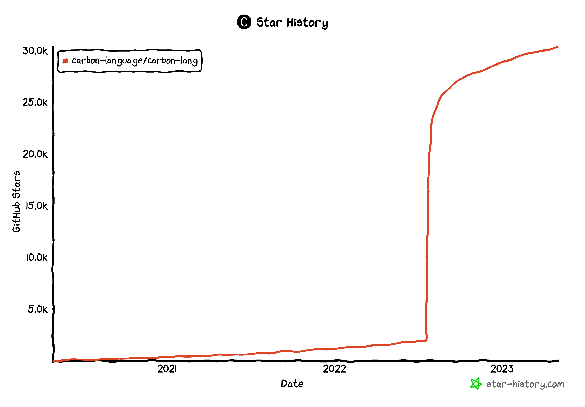

+++
weight = 1
outputs = ["Reveal"]
+++

# Carbon Language {.r-fit-text}

# An experimental successor to C++ {.r-fit-text}

{}

Let's start off with a brief recap of what the Carbon Language is...

This is our attempt to build a compelling _successor_ to C++.

{}

---



## Carbon goals as a _successor language_

Starts with our goals for C++ in https://wg21.link/p2137r0:

- Performance-critical software
- Software and language evolution
- Code that is easy to read, understand, and write
- Practical safety and testing mechanisms
- Fast and scalable development
- Modern OS platforms, hardware architectures, and environments

{}

- Carbon's goals as a successor language to C++ start from the goals we outlined
  in P2137 for C++ itself: [read goals].
- Today, while C++ may be the best language out there to hit these goals, it
  still leaves a _lot_ on the table, and the gaps are widening in terms of what
  we'd like to see here, not narrowing.
- Because C++ is struggling to improve and better address these goals, we'd like
  to try a different approach as a successor language, which does slightly tweak
  these goals...

{}

---



## Carbon goals as a _successor language_

- Performance-critical software
- Software and language
  evolution
- Code that is easy to read, understand, and write
- Practical safety and testing mechanisms
- Fast and scalable development
- Modern OS platforms, hardware architectures, and environments
- _Interoperability
  with and
  migration from
  existing C++ code_

{}

- We need to add a goal to address interoperability and migration from existing
  C++ code. If we can do _that_ while also addressing these other goals, we have
  a really compelling direction.
- But to sustain that going forward, we can't just improve once. We need the
  language to continue to evolve over time.

{}

---

## Background & overview in the CppNorth talk



---

## Carbon open source project

https://github.com/carbon-language/carbon-lang

{}

- Since we made the project public, there has been a lot of passive interest and
  excitement with over 30k stars so far and counting.

- We've also had some great contributions from the community, and we're really
  excited about the growing involvement here.

{}

---

## Carbon open source project

- Removing friction wherever we can for folks to join & contribute
  - GitHub PR (Pull Request) focused workflow, with detailed docs
  - Over 751 PRs merged 12 months, 231 from outside the initial team
  - Active Discord server, both real-time and async discussion
- Hosting Summer of Code students this summer
- Dedicated list of good-first-issues for new contributors

---

## Carbon design, evolution, & governance

- Building a comprehensive, living design document
  - 46 files and over 21k lines of markdown
- Evolved through 33 GitHub PR _proposals_ in the past 12 months
- GitHub issue process to discuss and make _decisions_ (59)

---

## Community metrics

- 36 open & [minuted] weekly meetings
  - Updates on decisions made and newly requested
  - Updates on proposal [RFCs] and approvals
  - Summaries of discussions, and other activities
- Published 3 quarterly [transparency reports]

[minuted]:
  https://docs.google.com/document/d/1zPVPl6yEhnhAYUd5tbRg9u5NcrQ2DgBXxxyJyP2zsJQ/edit?pli=1#
[RFCs]: https://en.wikipedia.org/wiki/Request_for_Comments
[transparency reports]:
  https://github.com/carbon-language/carbon-lang/discussions/categories/transparency-reports

---

## Carbon implementation

- Explorer provides high-level "abstract machine" implementation
  - An interpreter rather than a compiler
  - Prioritizes rapid evaluation of language designs
  - Live on [Compiler Explorer] with [many features]
- Toolchain is the expected user-facing implementation
  - Compiling, linking, and other tooling as needed
  - Built on LLVM and all of its technology: Clang, LLD, etc.
  - Many things parse, and early work on semantics & lowering

[Compiler Explorer]: https://carbon.compiler-explorer.com/
[many features]:
  https://github.com/carbon-language/carbon-lang/wiki/Are-we-explorer-yet%3F

---

## Carbon's milestones

- **0.1**: the MVP (Minimum Viable Product) to _start_ evaluating Carbon
  - Focused on complete, functioning _C++ interop_

{}

We recently established some long-term milestones for the project.

- These will help us with planning our work over the next few years.
- Also help us and the broader community understand where we are and what what
  we're trying to achieve.

{}

---

## Carbon's milestones

- **0.1**: the MVP (Minimum Viable Product) to _start_ evaluating Carbon
  - Focused on complete, functioning _C++ interop_
- **0.2**: feature complete to enable both finishing evaluations & concluding
  experiment
  - Notable feature: _memory safety_

{}

{}

---

## Carbon's milestones

- **0.1**: the MVP (Minimum Viable Product) to _start_ evaluating Carbon
  - Focused on complete, functioning _C++ interop_
- **0.2**: feature complete to enable both finishing evaluations & concluding
  experiment
  - Notable feature: _memory safety_
- **1.0**: _if_ the experiment is successful, our production-ready milestone

{}

{}

---

## Carbon's milestones are **_over one year_** in scope

## Building for _sustainability_ and the _long term_ {.fragment}

---

## Carbon's roadmap for 2023

- Finish the design for 0.1's features
- Explorer implements the risky parts of this design
- Toolchain can build a minimal program mixing C++ and Carbon
- Share ideas & progress with the C++ community (Hi!)
