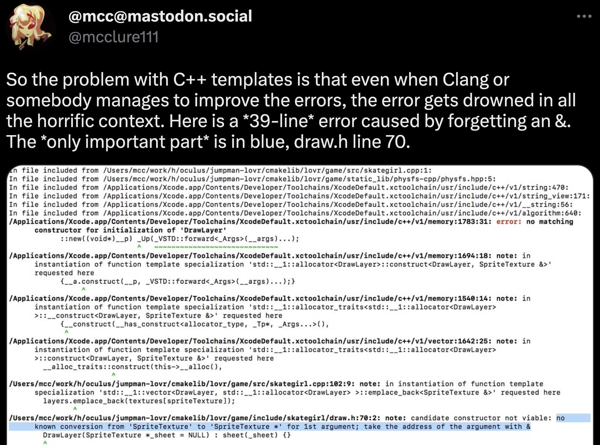

+++
weight = 30
outputs = ["Reveal"]
+++



# Why is type checking generic definitions useful?

{}

Ok, so we've sketched out what it means to check a generic definition -- it
means establishing a proper type system for the generic itself and doing type
checking for it. And while in _theory_ that may be possible with C++20 concepts,
its not easy.

But why do we need this?

What does type checking a generic definition really give us in a language?

{}

---

## Better error messages?

<div class="diagram-center r-stretch">

</div>

{}

{}

---

## Better error messages?

Example from the original Concepts Lite paper:

```cpp{}
list<int> lst = ...;
sort(lst); // Error
```

```plaintext
error: no matching function for call to ‘sort(list<int>&)’
   sort(l);
         ^
note: candidate is:
note: template<Sortable T> void sort(T)
   void sort(T t) { }
        ^
note: template constraints not satisfied because
note:   ‘T’ is not a/an ‘Sortable’ type [with T = list<int>] since
note:     ‘declval<T>()[n]’ is not valid syntax
```

{}


{}

---

## Better error messages?<br/>Mostly covered by C++20 concepts

- Concrete outline of how to use concepts: https://wg21.link/p2429
- Important benefit is diagnosing a failed constraint, which works
- Many other aspects of error messages important to improve

{}

{}

---

## Lots more to do on error _messages_,<br/>but definition checking isn't crucial there

{}

{}

---

## Definition checking helps you _get the errors_

{}

{}

---

## Changes how to develop generic code

- Zero gaps -- if the definition type checks, it's right
  - No action-at-a-distance or surprise breakage for users of a template
  - Enables substantially more aggressive evolution of generic code
- No futile attempt to cover every instantiation in unit tests
  - Or updating the endless tests when you change something

{}

{}

---

## Is static typing useful?<br/><span class="fragment">IMO, yes: [shifting-left] & large-scale refactoring</span>

## Checked generics give static typing benefits<br/>for large-scale _generic_ software. {.fragment}

[shifting-left]:
  https://abseil.io/resources/swe-book/html/ch01.html#shifting_left

{}

How many folks think that static typing is good and useful?

(If there is time, an aside...) How many folks think that there is clear and
conclusive evidence to support the idea that static is better than dynamic
typing?

:raise hand:

Well, I do have some bad news for you: there doesn't seem to be much credible
research to empirically support this position: https://danluu.com/empirical-pl/
(end of aside)

Maybe ask this in a more simple way -- does it seem like a useful tool to you?

IMO, yes. Maybe we don't have empirical data at this stage, but I think both the
shifting-left of our detection of an error in software, and the enabling of
large-scale refactorings are key benefits of static, strong typing. Here,
"shifting left" means moving the point of detection earlier in the lifecycle of
software development.

And that's also why I want checked generics. They provide static type for
large-scale _generic_ software.

I say "large-scale" here because I think that is actually essential to observe
this. Within a small scope or scale, it is easy to compile literally everything
-- every generic and every user of the generic. And when you do, its hard to see
any difference here. But for large scale software, whether its just too big to
compile everything, or if you're just publishing a library to an unbounded (and
thus likely large) set of users you may never meet, either way I think you
essentially lose all ability to have a statically typed development experience
with generic code unless you have _checked_ generics.

{}

---

## _Complete_ definition checking unlocks _type erasure_ {.r-fit-text}

{}

{}

---

## Type erasure is a powerful missing abstractions

- C++ dynamic dispatch tools don't address the needs:
  - Inheritance is a _closed_ extension space, not _open_
  - Inheritance creates composition problems with diamond dependencies
- Templates can compose and are an open extension space
  - But they don't form a meaningful abstraction boundary

{}

{}

---

## Type-checked definitions also improve implementation options

- Avoid repeated type checking during instantiation
- Avoid silently generating ODR-violations
- Reduce (but not eliminate) the generation duplicated code

{}

OK, hopefully this has helped motivate all of you to desperately want this
feature in your programming languages.

And hopefully not bored too much the folks in the audience who taught _me_ all
of this years ago to get me interested in checked generics. (By the way,
thanks!)

But all of these benefits are just the very, well, _generic_ benefits we would
expect.

{}

---

## Checked generics can also improve the _foundations_ of the language

{}

There are also dramatic ways that having checked generics in a language can
impact and influence the foundations of the language design. They can make it
more cohesive, powerful, and more composable.

But to dig into this, we'll need to understand _how_ generics work in some
detail. So let me hand things over to my friend Josh who is going to walk us
through a crash course in how checked generics work in a number of languages,
and especially Carbon where we've been exploring how to realize as many of these
benefits as possible.

{}
