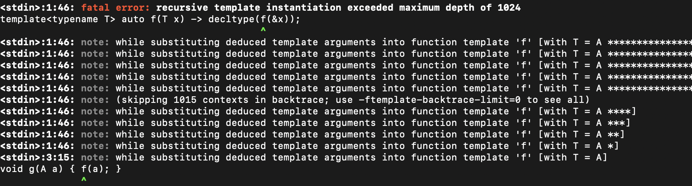
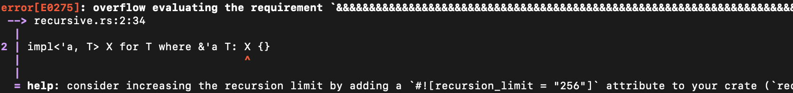

+++
weight = 20
outputs = ["Reveal"]
+++



# Termination rules are hard

{}
OK, so Carbon can determine whether two types are the same in a way that
terminates. But for that to be really useful, we need the rest of type-checking
to also terminate.
{}

---

## Problem statement

```carbon
impl forall [T:! type where T* impls Interface] T as Interface;
```

<div class="fragment">

- `T` implements `Interface` if `T*` implements `Interface` if `T**` implements `Interface` if ...

</div>

<div class="fragment">

- Can express arbitrary computation in this way:
  - `()` implements `TuringMachineHalts(state1, tape1)` if <br> `()` implements `TuringMachineHalts(state2, tape2)` if ...

</div>

<div class="fragment">

- Ideally, the answer to "Is this a valid program?" should not be `¯\_(ツ)_/¯`

</div>

---

## Alternative: do nothing

- Ignore the problem
- Compiler will run out of memory or time out
- This appears to be what the Swift compiler currently does

---

## Alternative: recursion limits

- This is a familiar problem in C++, with a familiar solution



<!--
```plaintext
<source>:1:46: fatal error: recursive template instantiation exceeded maximum depth of 1024
template<typename T> auto f(T x) -> decltype(f(&x));
                                             ^
[...]
<source>:1:46: note: (skipping 1015 contexts in backtrace; use -ftemplate-backtrace-limit=0 to see all)
<source>:1:46: note: while substituting deduced template arguments into function template 'f' [with T = A ****]
<source>:1:46: note: while substituting deduced template arguments into function template 'f' [with T = A ***]
<source>:1:46: note: while substituting deduced template arguments into function template 'f' [with T = A **]
<source>:1:46: note: while substituting deduced template arguments into function template 'f' [with T = A *]
<source>:3:15: note: while substituting deduced template arguments into function template 'f' [with T = A]
void g(A a) { f(a); }
              ^
```
-->

<div class="fragment">

- The same approach is used in Rust



<!--
```plaintext
error[E0275]: overflow evaluating the requirement ``...``
[...]
  = help: consider increasing the recursion limit by adding a
          ``#![recursion_limit = "256"]`` attribute to your crate
```
-->

</div>

---

## Alternative: recursion limits

{}
- Small change can cause you to hit the limit.
- Computing and caching an intermediate result can hide problems.

*click*

- Two libraries that both stay under limit may exceed it when combined

*click*

- Errors tend to produce a huge wall of uninformative text
{}

- Brittle and order-dependent

<div class="fragment">

- Not composable

</div><div class="fragment">

- Verbose unhelpful diagnostics

</div>

---

## Alternative: disallow recursion

{}
We could maybe address this by disallowing recursion entirely.
(read slide)
{}

- If an `impl` declaration recursively tries to use itself, reject
- Only finitely many `impl` declarations, so this always halts

<div class="fragment">

- Rejects important use cases

```carbon
interface Hashable { fn Hash[self: Self](); }

impl forall [T:! Hashable] Vector(T) as Hashable { ... }

fn Hash2dVector(v: Vector(Vector(i32*))) {
  v.(Hashable.Hash)();
}
```

</div>

---

## Carbon's approach

Disallow "bad" recursion

- Allow recursion, but only if we don't reach a step that is strictly more complex
  - Or a cycle

{}
It would be ideal to just disallow "bad" recursion, whatever that means. In Carbon, we try to do that.
Allow recursion, unless we end up back at the same `impl` with a query that is strictly more complex.
What is strictly more complex? (next slide)

{}

---

## Disallow recursion with more complex queries

- Query:

<div class="r-stack no-lang-marker">
<div>

```
Vector(Vector(i32*)) as Hashable 
```

</div>

<div class="fragment" data-fragment-index="1">

```
Vector(Vector(i32*)) as Hashable 
^      ^      ^  ^      ^
```

</div>
</div>

<div class="fragment" data-fragment-index="0">

- Count the number of times each label appears

</div>

<div class="r-stack fragment no-lang-marker" data-fragment-index="1">
<div>

```
{``Vector``: 2, ``i32``: 1, ``*``: 1, ``Hashable``: 1} 
```

</div>
</div>

<div class="fragment" data-fragment-index="2">

- Recursive query using same `impl`:

<div class="r-stack no-lang-marker">

<div class="fragment" data-fragment-index="2">

```
Vector(i32*) as Hashable
```

</div>

<div class="fragment" data-fragment-index="3">

```
Vector(i32*) as Hashable
^      ^  ^     ^
```

</div>

</div>

<div class="r-stack"><div class="fragment no-lang-marker" data-fragment-index="3">

```
{``Vector``: 1, ``i32``: 1, ``*``: 1, ``Hashable``: 1} 
```

</div></div>

</div>

<div class="fragment">

- Reject if none are < and at least one is >
  - That is, if the multiset of labels is a strict superset

</div>

{}
(go through slide)
...strict superset..., that is, if there's the same stuff in the query but just more of it.

In this case, we allow recursion in this direction, but not in the opposite
direction.
{}

---

## Disallow recursion with more complex queries

**Theorem:** this guarantees termination

- Finite # labels in the program
  - no infinite subsequence of differing multisets
- Finite # arrangements of a multiset of names into a query
  - no infinite subsequence of equal multisets

---

### Non-type arguments

Proof relies on # labels being finite
- ... but infinitely many non-type values

Integer values are given a synthetic label and a count of `abs(n)`

<div class="fragment no-lang-marker">

Example:

```
(Array(5, i32), IntInRange(-8, 7)) as Hashable
       ^                    ^  ^
```

```
{``()``: 1, ``Array``: 1, ``i32``: 1, ints: 5+8+7=20, ``Hashable``: 1}
                                      ^ ^ ^
```

</div>

<div class="fragment">

Can recurse if sum of ints decreases, even if nothing else changes

</div>

---

### Non-type arguments

Proof relies on # labels being finite
- ... but infinitely many non-type values

Non-integer values are erased prior to the check

{}

If the only thing that changes is a non-integer value, we always reject.
We have ideas for how to do better but don't know if they're needed.

{}

<!--

<div class="fragment">

Example:

```
class FractionalArray(N:! f64, T:! type) { ... }

impl forall [N:! f64, T:! type where FractionalArray(N * 0.99, T) impls Hashable]
  FractionalArray(N, T) impls Hashable { ... }
```

<div class="fragment">

- `FractionalArray(1.0, i32) as Hashable` rewritten to `FractionalArray(❓, i32) as Hashable`

</div>

<div class="fragment">

- Recursively queries `FractionalArray(0.99, i32) as Hashable`

</div>

<div class="fragment">

- `FractionalArray(0.99, i32) as Hashable` rewritten to `FractionalArray(❓, i32) as Hashable`

</div>

<div class="fragment">

- That query is already being performed: ❌ Rejected

</div>

</div>

-->

---

## Disallow recursion with more complex queries

Good:

- Precise errors, no giant stack trace

```plaintext
error: <source>:16: impl matching recursively performed a more complex match
                    using the same impl: number of ``*``s increasing
  outer match: Vector(Vector(i32)) as Hashable
  inner match: Vector(Vector(i32)*) as Hashable
```

- Always terminates
- No arbitrary limits
- Composable and predictable
- Can still express any computation with a computable time bound

Bad:

- Open question whether this disallows any important use cases

---

## Summary

Terminating type checking is hard

- *Swift:* compilation may time out
- *C++:* recursion limit
- *Rust:* recursion limit
- *Carbon:* always terminating

Carbon rule can be used in other languages
