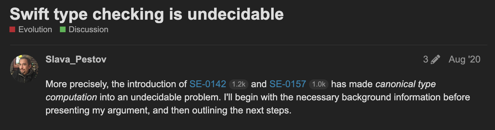

+++
weight = 10
outputs = ["Reveal"]
+++



<!-- TODO: Move somewhere more central. -->
<script>
window.addEventListener('load', (loadEvent) => {
  var setIndexes = function() {
    Array.from(document.getElementsByClassName('code-with-fragment-indexes')).forEach(function(codeDiv) {
      indexes = JSON.parse('['+codeDiv.getAttribute('data-fragment-indexes')+']');
      codeDiv.childNodes.forEach(function(outer) {
        outer.childNodes.forEach(function(item) {
          if (item.hasAttribute('data-fragment-index'))
            item.setAttribute('data-fragment-index', indexes.shift());
        });
      });
    });
  };
  if (Reveal.isReady())
    setIndexes();
  else
    Reveal.on('slidechanged', event => { setIndexes() });
});
</script>

# Type equality is hard

{}

The first hard problem we're going to look at is type equality.

{}

---

<!--

## Refresher: How to type-check a template

- In C++, `template<typename T>` means we will eventually have a real type `T` to check against, such as `int`
- Only syntax and non-dependent operations can be checked early
- Meaning of operations is determined by the properties of that type
- Dependent operations don't have any semantics until instantiation

<div class="fragment">

```cpp
template<typename T> void Mystery(T &x) {
  // What does this mean?
  x << 1;
}


```

</div>

---

## Refresher: How to type-check a template

- In C++, `template<typename T>` means we will eventually have a real type `T` to check against, such as `int`
- Only syntax and non-dependent operations can be checked early
- Meaning of operations is determined by the properties of that type
- Dependent operations don't have any semantics until instantiation

```cpp [3,8-9|3,10-11|3,12-13]
template<typename T> void Mystery(T &x) {
  // What does this mean?
  x << 1;
}

int main() {
  int n = 1;
  // Double an integer!
  Mystery(n);
  // Print a number!
  Mystery(std::cout);
  // Produce an error!
  Mystery("hello");
}
```

---

## How to type-check a generic

- Central idea: treat `T` as a real type, not as a placeholder for an eventual type
- Operations available on `T` are determined by declared constraints on `T`

<div class="fragment fade-in">

```carbon
interface Widget {
  fn Rotate[self: Self]();
};


fn RotateTwice[T:! Widget](x: T) {
  x.Rotate();
  x.Rotate();
}
```

</div>

<div class="fragment fade-in">

- The type of the expression `x` is `T`, and `T` implements `Widget`, so we can rotate `x`

</div>

<div class="fragment fade-in">

- `x.Rotate()` always means `Widget.Rotate` for `T`
  - even if `T` has its own member named `Rotate`

</div>

<div class="fragment fade-in">

- If type-checking succeeds, every "instantiation" will work
  - and will have the same meaning

</div>

---

## How to type-check a generic

- The return type of a function call can be computed from its generic parameters

{}
In Carbon, almost everything is a function call,
so if we understand function calls,
we understand almost everything.
{}

<div class="code-with-fragment-indexes" data-fragment-indexes="0,1,2,3,4,5">

```carbon{|1-2,6-7|1-2,7|7|4,7-8|4,8|6,8}
fn RepeatNTimes[T:! type](`<0>x: T`, n: i32)
  -> `<1>Vector(T)`;

fn `<3>Vector(U:! type).Front`[self: Self]() -> `<4>U`;

fn DuplicateAndRotate[`<5>V:! Widget`](`<0>x: V`) {
  var `<2>widgets: auto` = `<1>RepeatNTimes`(`<0>x`, 5);
  `<3>widgets.Front()`.`<5>Rotate()`;
}
```

</div>

<div class="fragment" data-fragment-index="0">

- Deduce that `T == V`

</div><div class="fragment" data-fragment-index="1">

- Therefore the return type of `RepeatNTimes` is `Vector(V)`

</div><div class="fragment" data-fragment-index="2">

- Therefore the type of `widgets` is `Vector(V)`

</div><div class="fragment" data-fragment-index="3">

- Therefore `V == U`

</div><div class="fragment" data-fragment-index="4">

- Therefore the return type of `Front` is `V`

</div><div class="fragment" data-fragment-index="5">

- Therefore we can call `Rotate`, because we have a `Widget`

</div>

---

## Associated types

- What if we don't have a nice expression for the return type, like `T*` or `Vector(T)`?

<div class="fragment">

```carbon
interface Iterator {

  fn Deref[self: Self]() -> ???;
  fn Advance[addr self: Self*]();
}

fn DerefAndAdvance[I:! Iterator](p: I*) -> ??? {
  let value: ??? = p->Deref();
  p->Advance();
  return value;
}
```

</div>

---

## Associated types

- What if we don't have a nice expression for the return type, like `T*` or `Vector(T)`?

```carbon
interface Iterator {
  let `<0>ValueType:! type`;
  fn Deref[self: Self]() -> `<1>ValueType`;
  fn Advance[addr self: Self*]();
}

fn DerefAndAdvance[I:! Iterator](p: I*) -> `<1>I.ValueType` {
  let value: `<1>I.ValueType` = p->Deref();
  p->Advance();
  return value;
}
```

---

## Associated types

- Associated types can have non-trivial equality relationships

```carbon
interface Iterator {
  let ValueType:! type;
  fn Deref[self: Self]() -> ValueType;
}

interface Container {
  let ValueType:! type;
  let IteratorType:! Iterator;
  fn Add[self: Self](v: ValueType);
  fn Begin[self: Self]() -> IteratorType;
}
```

<div class="fragment">

```
fn RepeatFirstElement[C:! Container](p: C*) {
  // ❌ Given ``C.Iterator.ValueType``, want ``C.ValueType``.
  p->Add(p->Begin().Deref());
}
```

</div>

---

## Associated types

- Associated types can have non-trivial equality relationships

```carbon
interface Iterator {
  let ValueType:! type;
  fn Deref[self: Self]() -> ValueType;
}

interface Container {
  let ValueType:! type;
  let IteratorType:! Iterator `<0>where .ValueType = ValueType`;
  fn Add[self: Self](v: ValueType);
  fn Begin[self: Self]() -> IteratorType;
}
```

<div class="fragment" data-fragment-index="0">

- `where` clause constrains that `C.IteratorType.ValueType == C.ValueType`
- `impl` must satisfy this constraint, client code can rely on it

</div>

<div class="fragment" data-fragment-index="1">

```
fn RepeatFirstElement[C:! Container](p: C*) {
  // ✅ Now we know that these types always match
  p->Add(p->Begin().Deref());
}
```

</div>

---

## Associated types

- Equality relationships also affect available operations

<div class="code-with-fragment-indexes" data-fragment-indexes="0,1,2,3">

```carbon{|3,10,15|8|13|13,15}
interface Iterator {
  let ValueType:! type;
  fn Deref[self: Self]() -> ValueType;
}

interface Container {
  let ValueType:! type;
  let IteratorType:! Iterator where .ValueType = ValueType;
  fn Add[self: Self](v: ValueType);
  fn Begin[self: Self]() -> IteratorType;
}

fn AddAndRotate[W:! Widget, C:! Container where .ValueType = W](c: C, w: W) {
  c.Add(w);
  c.Begin().Deref().Rotate();
}
```

</div>

<div class="fragment" data-fragment-index="0">

- Type of `c.Begin().Deref()` is `C.IteratorType.ValueType`<span class="fragment" data-fragment-index="1">,
  which is `C.ValueType`</span><span class="fragment" data-fragment-index="2">, which is `W`</span>

</div><div class="fragment" data-fragment-index="3">

- `W` is a `Widget`, so the `Rotate` call is OK
  - and calls `Widget.Rotate` for `W`

</div>

-->

## Recall from part 1...

<div class="code-with-fragment-indexes" data-fragment-indexes="0">

```carbon{|2,7,8}
interface Iterator {
  let ValueType:! type;
  fn Deref[self: Self]() -> ValueType;
}

interface Container {
  let ValueType:! type;
  let IteratorType:! Iterator `<1>where .ValueType = ValueType`;
  fn Begin[self: Self]() -> IteratorType;
  fn End[self: Self]() -> IteratorType;
}
```

</div>

{}
In part 1, saw that interfaces (in other languages: concepts, traits,
protocols) describe constraints on type.
*click*
- Can include associated types.
*click*
- Sometimes we want to constrain that an assoc type is equal to some type expr.
- More generally that some type expr involving assoc types is equal to some other type expr.
Here, we're saying that the iterator's value type is the container's value type.
{}

<div class="fragment" data-fragment-index="0">

- Interfaces can have associated types

</div>

<div class="fragment" data-fragment-index="1">

- Associated types can have equality constraints

</div>

---

## Problem statement

- How do we determine if two type expressions are equal?

<div class="fragment">

- Can we always determine this?

</div>

<div class="fragment">

- Ideally, the answer to "Is this a valid program?" should not be `¯\_(ツ)_/¯`

</div>

---

## This is hard

Given arbitrary `where A.B = C.D` constraints, is type `T` the same as type `U`?
- Constraints are rewrite rules on type expressions
- Rephrase problem as: given these rewrites, can we rewrite string `T` to string `U`?

{}
For some of you with a background in theoretical computer science or pure
math, alarm bells are probably going off.
{}

---

## This is hard

Example:

```
interface X { let A:! X; let B:! X; }
```

where `X.A.B = X.B.A`.

<div class="fragment">

- `X.A.B.A = X.A.A.B`

</div><div class="fragment">

- `X.A.B.B.A.B.A.B = X.A.A.A.B.B.B.B`

</div><div class="fragment">

- Types are equal if they have the same number of `A`s and they
  have the same number of `B`s; this is the semigroup {a, b | ab=ba}.

</div><div class="fragment">

- Type equality is the *word problem* for the semigroup.

</div><div class="fragment">

- Can model any finitely-generated semigroup this way.

</div>

{}
- Let's look at a simple example. (Describe it.)
*click*
- This means can rewrite trailing .B.A to .A.B
*click*
- and after a sequence of rewrites, can rewrite this
*click*
- and more generally can reorder As and Bs arbitrarily; this is semigroup
*click*
- Type equality is word problem
*click*
- Can model any semigroup. Let's look at a more interesting semigroup.
{}

---

## This is hard

Example (G.S. Céjtin, *An associative calculus with an insoluble problem of equivalence*, 1957):

```
interface X { let A:! X; let B:! X; let C:! X; let D:! X; let E:! X; }
```

where `X.A.C = X.C.A`, `X.A.D = X.D.A`, `X.B.C = X.C.B`, `X.B.D = X.D.B`,<br>
`X.C.E = X.E.C.A`, `X.D.E = X.E.D.B`, `X.C.C.A = X.C.C.A.E`.

<div class="fragment">

- The word problem for this semigroup is *unsolvable*.

</div><div class="fragment">

- Type-equality in this system of constraints is *undecidable*.

</div><div class="fragment">

- Determining whether you're in such a case is *undecidable*.

</div>

{}
This set of constraints models a semigroup that has an unsolvable word problem. *click*
That means that a program containing an interface like this cannot be type-checked. *click*
And even determining whether you're in an undecidable case is undecidable. *click*
And yet this can be expressed in Swift and Rust. So what do they do?
{}

---

<!--

## C++'s approach

- At least type equality is easy in C++, right?

<div class="fragment">

```cpp
template<typename T> void f(T x, decltype(x) y) {}
template<typename T> void f(T x, T y) {}
```

</div>

<div class="fragment">

- Types are definitely the same if they are spelled the same way ("equivalent")
- Types are definitely not the same if they mean different things ("functionally equivalent")
- For cases in between, there are no constraints on the behavior of the compiler

</div>

-->

## Swift

---

## Swift's approach

- Permits arbitrary equality constraints on associated types

```swift
protocol IteratorProtocol {
  associatedtype Element
}

protocol Sequence {
  associatedtype Iterator : IteratorProtocol
  associatedtype Element
    where Element == Iterator.Element
  associatedtype SubSequence : Sequence
    where Element == SubSequence.Element,
          SubSequence.SubSequence == SubSequence
}
```

Given `T: Sequence`, these types are all the same:

- `T.Element`, `T.Iterator.Element`, `T.SubSequence.Element`,
  `T.SubSequence.Iterator.Element`, `T.SubSequence.SubSequence.Element`, ...

{}
Example from Swift standard library.
Swift allows an infinite family of equal types to arise from a simple set of rules.
Allowing this leads to... (next slide) ... Swift's type system being undecidable
{}

---

{}
... Swift's type system being undecidable
The example on the previous slide was taken from this post to the Swift forums,
as was the observation that this is the word problem for semigroups.
Also notes that problems were being seen in practice.
In response, Swift switched to a different approach.
{}

<div class="r-stack">

</div>

<div style="text-align: right">

[[source]](https://forums.swift.org/t/swift-type-checking-is-undecidable/39024)

</div>

---

## Swift's approach

Pursuing Knuth-Bendix completion algorithm

{}

- Given a protocol or set of interdependent protocols, computes an efficient procedure for rewriting types to canonical representatives
  - Either accept the protocol and handle all examples, or reject
  - Huge improvement
  - Still undecidable, use iteration limit
- Lots of common examples work
  - But hard to characterize what is allowed and what fails, or give an error that says what's wrong and how to fix it

{}

- Analyze a protocol and try to compute an efficient set of rewrite rules
- Algorithm may give up and may not terminate
  - Swift compiler provides an iteration limit
- Common examples work, but hard to understand and debug failures

---

## Rust

---

## Rust's approach

- Can constrain the value of an associated type

```rust
trait Iterator {
  type ValueType;
}
trait Container {
  type ValueType;
  type IteratorType: Iterator<ValueType = Self::ValueType>;
}
```

---

<!--

## Rust's approach

- Have syntax to constrain the value of a more complex type expression

```rust
trait Iterator {
  type ValueType;
}
trait Container {
  type IteratorType: Iterator;
  type ConstIteratorType: Iterator;
}
fn F<C: Container>(c: &mut C)
  where C::IteratorTypes::ValueType == C::ConstIteratorType::ValueType {}
```

<div class="fragment">

- But...

```plaintext
error: equality constraints are not yet supported in ``where`` clauses
  -\-> src/lib.rs:55:9
   |
55 |   where C::IteratorType::ValueType == C::ConstIteratorType::ValueType {}
   |         ^^^^^^^^^^^^^^^^^^^^^^^^^^^^^^^^^^^^^^^^^^^^^^^^^^^^^^^^^^^^^ not supported
   |
   = note: see issue #20041 <https://github.com/rust-lang/rust/issues/20041> for more information
```

</div><div class="fragment">

- Even without this, can still express undecidable systems

</div>

---

-->

## Rust's approach

- Unclear what algorithm is used, but like Swift there is a recursion limit

```rust
trait Recursive : Sized {
  // A.B == B.A
  type A: Recursive<B = <Self::B as Recursive>::A>;
  // B.A == A.B
  type B: Recursive<A = <Self::A as Recursive>::B>;
}
```

<div class="fragment">

```plaintext
error[E0275]: overflow evaluating the requirement
              ``<<Self as Recursive>::B as Recursive>::A == _``
```

</div><div class="fragment">

- No clear guidance on how to write self-referential constraints that work

</div><div class="fragment">

> Consider changing your trait bounds so that they're less self-referential.

<div style="text-align: right">-- Rust documentation</div>

</div>

{}
Not theoretical, search for E0275 finds confused users. Example where adding an import introduces error.

Ferrocene doesn't say what to do.
Chalk allows this example. And the unsolvable example. For that one, asking X.A == X.B runs forever.
{}

---

## Carbon

---

## Carbon's approach

- Want a decidable, efficient, comprehensible, general rule
- Split the problem into two parts
    - 90+%, ergonomic solution to automatically handle easy cases
    - General solution for the hard cases

---

## Easy cases: member rewrite rules

```carbon{7-9|10-12}
interface Iterator {
  let Element:! type;
}

interface Sequence {
  let Element:! type;
  // ✅ Sequence.IteratorType.Element = Sequence.Element
  let IteratorType:! Iterator
    where .Element = Element;
  // ❌ Cannot access Sequence.Element because Sequence is not complete
  let SubSequence:! Sequence
    where .Element = Element and .SubSequence = .Self;
}
```

- When a type variable or associated type is introduced, specify rewrite rules
  for its _immediate_ members with `where .Member = Value`
- Cannot constrain members whose type is the enclosing interface

<div class="fragment">

- Consequence: all cycles are easily detectable
- Consequence: rewrite sequence always terminates

</div>

{}
Specify rewrite rules. Syntax like Rust, but only performed in one direction.

Cannot constrain members whose type is the enclosing interface, or any
incomplete interface
- This eliminates the ability to encode arbitrary semigroups into the rewrite rules.

*click*

{}

---

## Easy cases: member rewrite rules

<div class="code-with-fragment-indexes" data-fragment-indexes="0,2,4,5">

```carbon{|12|17|15}
interface Iterator {
  let Element:! type;
}

interface Sequence {
  let Element:! type;
  let IteratorType:! Iterator where .Element = Element;
}

interface SliceableSequence {
  extend Sequence;
  let SubSequence:! Sequence where .IteratorType = IteratorType;
}

impl forall [T:! type] T* as Iterator where .Element = T {}

fn F[C:! SliceableSequence where .IteratorType = i32*](c: C) ->
  C.SubSequence.IteratorType.Element;
```

</div>

Example: return type of `F` is...

<!--

0: C.SubSequence.IteratorType.Element
   ^^^^^^^^^^^^^^^^^^^^^^^^^^
1: C.IteratorType.Element
   ^^^^^^^^^^^^^^

2: C.IteratorType.Element
   ^^^^^^^^^^^^^^
3: (i32*).Element
   ^^^^^^

4: (i32*).Element
   ^^^^^^^^^^^^^^
5: i32
   ^^^

-->

<div style="display: grid; width: 0">

<div style="grid-area: 1 / 1 / 1 / 1; text-align: right" class="fragment fade-out" data-fragment-index="0">
<code>C.SubSequence.IteratorType</code>
</div>

<div style="grid-area: 1 / 1 / 1 / 1; text-align: right" class="fragment" data-fragment-index="0">
<div class="fragment fade-out" data-fragment-index="1">
<code><b>C.SubSequence.IteratorType</b></code>
</div>
</div>

<div style="grid-area: 1 / 1 / 1 / 1; text-align: right" class="fragment fade-up" data-fragment-index="1">
<div class="fragment fade-out" data-fragment-index="3">
<code><b>C.IteratorType</b></code>
</div>
</div>

<!-- avoid renumbering -->
<div class="fragment" data-fragment-index="2"></div>

<div style="grid-area: 1 / 1 / 1 / 1; text-align: right" class="fragment fade-up" data-fragment-index="3">
<div class="fragment fade-out" data-fragment-index="5">
<code><b>(i32*)</b></code>
</div>
</div>

<div style="grid-area: 1 / 2 / 1 / 2; text-align: right" class="fragment fade-out" data-fragment-index="4">
<code>.Element</code>
</div>

<div style="grid-area: 1 / 2 / 1 / 2; text-align: right" class="fragment" data-fragment-index="4">
<div class="fragment fade-out" data-fragment-index="5">
<code><b>.Element</b></code>
</div>
</div>

<div style="grid-area: 1 / 1 / 1 / 2; text-align: right" class="fragment fade-up" data-fragment-index="5">
<code><b>i32</b></code>
</div>

</div>

---

## Easy cases: member rewrite rules

- Not all constraints can be written in this way, but most constraints that
  we've seen in practice can be.
- Produces a canonical type that determines the operations and `impl`s available.
- Still want an answer for "hard" cases.

---


## Hard cases: single-step equality conversions

{}
Written with `==` *click*. We think of this as a comparison, not assignment or rewrite.

The compiler doesn't treat types constrained in this way to be the same, but
allows an implicit no-op conversion between types that differ only by equal
components in any position.
{}

<div class="code-with-fragment-indexes" data-fragment-indexes="1,2">

<pre data-id="sse-code"><code class="language-carbon" data-trim data-line-numbers="3,7|10-13">
interface Container {
  // ...
  let IteratorType:! Iterator `<0>where .ValueType == ValueType`;
  // ...
}

fn AddAndExtract[W:! Widget, C:! Container `<0>where .ValueType == W`](c: C, w: W) {
  c.Add(w);

  // OK, convert C.IteratorType.ValueType to C.ValueType
  let w1: C.ValueType = c.Begin().Deref();
  // OK, convert C.ValueType to W
  let w2: W = w1;
}
</code></pre>

</div>

- General type equality constraints are written as `where T == U`

<div class="fragment" data-fragment-index=2>

- Can implicitly convert between types constrained to be equal
  - And between (eg) `Vector(T)` and `Vector(U)`

</div>

---


## Hard cases: single-step equality conversions

{}
Not transitive, similar to C++'s "at most one user-defined conversion" rule
{}

<div class="code-with-fragment-indexes" data-fragment-indexes="1,2">

<pre data-id="sse-code"><code class="language-carbon" data-trim data-line-numbers="10-11">
interface Container {
  // ...
  let IteratorType:! Iterator where .ValueType == ValueType;
  // ...
}

fn AddAndExtract[W:! Widget, C:! Container where .ValueType == W](c: C, w: W) {
  c.Add(w);

  // Error, can't convert C.IteratorType.ValueType to W
  let w: W = c.Begin().Deref();
}
</code></pre>

</div>

- Do not compute transitive closure of equality rules
  - Similar to C++'s "at most one user-defined conversion" rule

---


## Hard cases: single-step equality conversions

<pre data-id="sse-code"><code class="language-carbon" data-trim data-line-numbers="10-12">
interface Container {
  // ...
  let IteratorType:! Iterator where .ValueType == ValueType;
  // ...
}

fn AddAndExtract[W:! Widget, C:! Container where .ValueType == W](c: C, w: W) {
  c.Add(w);

  // OK, equality proof provided by developer
  observe C.IteratorType.ValueType == C.ValueType == W;
  let w: W = c.Begin().Deref();
}
</code></pre>

{}
`observe` declarations allow the developer to provide a proof that two types
are equal through any number of intermediate steps.
{}

- If more than one equality step is required, must be performed manually

---

## Hard cases: single-step equality conversions

{}
Not ergonomic, but we can provide quality-of-implementation warnings when the
compiler can figure out what `observe` should have been used
{}

- Fully general
- Efficient to type-check
- Not ergonomic
- Not transitive

---

## Summary

Type equality is hard

- *Swift:* type equality is undecidable, hard cases can hit iteration limit
- *Rust:* type equality is undecidable, hard cases can hit iteration limit
- *Carbon:* type equality is decidable, hard cases are less ergonomic
