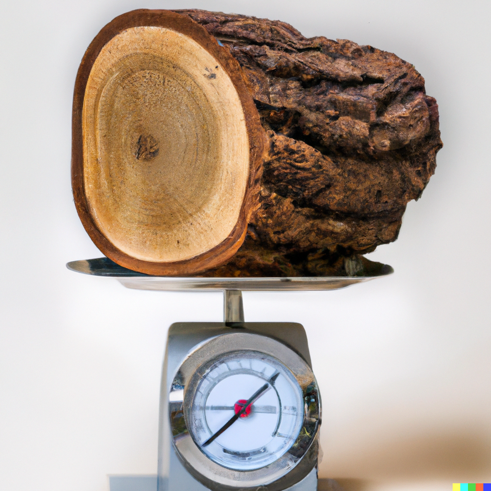
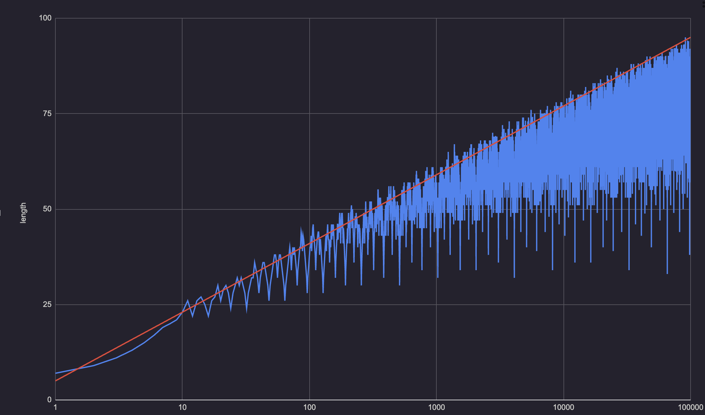

+++
title = "Writing a lookup table"
outputs = ["Reveal"]
draft = true
+++

<style>
@keyframes zooma {
  from {
    font-size: 100%;
  }
  to {
    font-size: 50%;
  }
}
@keyframes zoomb {
  from {
    font-size: 50%;
  }
  to {
    font-size: 10%;
  }
}
@keyframes spin {
  from {
    font-size: 10%;
  }
  to {
    font-size: 10%;
    transform-origin: top left;
    transform: translateY(100%) rotate(-90deg) scale(2.0);
  }
}
@keyframes zoomc {
  from {
    font-size: 10%;
    transform-origin: top left;
    transform: translateY(100%) rotate(-90deg) scale(2.0);
  }
  to {
    font-size: 5%;
    transform-origin: top left;
    transform: translateY(100%) rotate(-90deg) scale(12.0, 2.0);
  }
}
#code {
  overflow: clip;
  animation-duration: 3s;
  animation-fill-mode: forwards;
}
#code:has(> #stage1.current-fragment) {
  animation-name: zooma;
}
#code:has(> #stage2.current-fragment) {
  animation-name: zoomb;
}
#code:has(> #stage3.current-fragment) {
  animation-name: spin;
}
#code:has(> #stage4.current-fragment) {
  animation-name: zoomc;
}
</style>

<div class="r-stretch" style="display: flex; flex-direction: column; justify-content: center">

# writing a lookup table

## in completely normal C++ code

</div>
<div class="col-container"><div class="col-4">

### @zygoloid

</div><div class="col right">

### CppNow 2023

</div>

{}
Recently tasked to improve the performance of a very important operation.
This is business critical, we have a very important upcoming release.
Idea: use a lookup table. This is a pretty normal thing to do.
{}

---

```cpp{}
int incremented[] = {
```

{}

totally normal c++ programming

This array will hold the incremented value.

{}

---

```cpp{}
int incremented[] = {
  1, 2, 3, 4,
```

{}

absolutely normal c++ programming

{}

---

```cpp{}
int incremented[] = {
  1, 2, 3, 4, ⍌∖⩓ⶩ✾⎄⑐Ⲉ⤮⎌❷⊍ℷ⇗⺟➺┢⛥➼⦻⟆ⴥ⪒⤚⋁ⴡ⦲┆↏⻴⚡ⅾⲼ⯞Ⱜ⃁ⱉ␇ⓗ═ℐⳚ☡➨␱⯸⼱⿋⎍⥫⫷✙⟉⁦⺫♄ⴿ⅏⤹⦩⸭Ⓐ┙⬦⾎⅏⭜⌭⃋Ⲁ⁤⯛↖⹐⺲⮺ⶩ⢔╃ⷘ⬧ⴚⓙ⍪✳⌔∣╭⦴⩐␗⇞⋓⤍ⴒ⦴⌇∵⬻⒆
```

<div class="fragment">

- I spilled my coffee on my keyboard

</div>

<div class="fragment">

- Bad news: alphanumeric keys are broken

</div>

<div class="fragment">

- Good news: I can still type symbols `!!! :-)`

</div>

<div class="fragment">

- Bad news: deadline is approaching

</div>

{}

utterly normal c++ programming

{}

---

# oh no fired

---

# talk over thank you

---

# ...

{}
...but maybe...
{}

---

`[]{}`

{}
I can write a lambda.
{}

---

# `[]{}`

{}
Do you see it yet?
{}

---

<div class="r-fit-text">

`[]{}`

</div>

{}
Do you see it now?
{}

---

<div class="r-fit-text">

*`![]{}`*

</div>

{}
I can take the logical not of a lambda.
This is totally normal C++ code, of course.
{}

---

{}

phew, normal c++ programming still works

Let's make sure we have an int. Relying on implicit conversion from bool to int would be bad style.

I don't want to type too much, though, so let's pick the shortest one that works.

So how to express this? And this?
I'm not typing that much!
{}

<div class="fragment">

<span class="fragment">`false == `</span> `![]{}`

</div>

<div class="fragment">

<span class="fragment">` true ==`</span> `!![]{}`

</div>

<div class="fragment">

`0 == ` <span class="fragment"> `-![]{}` </span>

</div>

<div class="fragment">

`1 == ` <span class="fragment"> `-~![]{}` </span>

</div>

<div class="fragment">

`2 == ` <span class="fragment"> `-~-~![]{}` </span>

</div>

<div class="fragment">

`3 == ` <span class="fragment"> `-~-~-~![]{}` </span>

</div>

<div class="fragment">

...

`8 == ` <span class="fragment"> `-~![]{}<<-~-~-~![]{}` </span>

</div>

<div class="fragment">

`9 == ` <span class="fragment"> `~-~-~![]{}*~-~-~![]{}` </span>

</div>

---

<div id="code">
<div id="stage1" class="fragment"></div>
<div id="stage2" class="fragment"></div>
<div id="stage3" class="fragment"></div>
<div id="stage4" class="fragment"></div>

```cpp{}
int incremented[] = {
  -~![]{},
  -~-~![]{},
  -~-~-~![]{},
  -~-~-~-~![]{},
  -~-~-~-~-~![]{},
  -~-~-~-~-~-~![]{},
  -~-~-~-~-~-~-~![]{},
  -~![]{}<<-~-~-~![]{},
  ~-~-~![]{}*~-~-~![]{},
  ~-~![]{}*~-~-~-~-~![]{},
  ~-(-~-~-~![]{}<<-~-~![]{}),
  -~-~-~![]{}<<-~-~![]{},
  -~(-~-~-~![]{}<<-~-~![]{}),
  ~-~![]{}*~-~-~-~-~-~-~![]{},
  ~-~-~![]{}*~-~-~-~-~![]{},
  -~![]{}<<-~-~-~-~![]{},
  -~(-~![]{}<<-~-~-~-~![]{}),
  ~-~-~![]{}*~-~-~-~-~-~![]{},
  -~-~-~(-~![]{}<<-~-~-~-~![]{}),
  -~-~-~-~-~![]{}<<-~-~![]{},
  ~-~-~![]{}*~-~-~-~-~-~-~![]{},
  ~-~-(-~-~-~![]{}<<-~-~-~![]{}),
  ~-(-~-~-~![]{}<<-~-~-~![]{}),
  -~-~-~![]{}<<-~-~-~![]{},
  -~(-~-~-~![]{}<<-~-~-~![]{}),
  -~-~(-~-~-~![]{}<<-~-~-~![]{}),
  -~-~-~(-~-~-~![]{}<<-~-~-~![]{}),
  -~-~-~-~-~-~-~![]{}<<-~-~![]{},
  ~-~-~-(-~![]{}<<-~-~-~-~-~![]{}),
  ~-~-(-~![]{}<<-~-~-~-~-~![]{}),
  ~-(-~![]{}<<-~-~-~-~-~![]{}),
  -~![]{}<<-~-~-~-~-~![]{},
  -~(-~![]{}<<-~-~-~-~-~![]{}),
  -~-~(-~![]{}<<-~-~-~-~-~![]{}),
  -~-~-~(-~![]{}<<-~-~-~-~-~![]{}),
  ~-~-~![]{}*~-~-~![]{}<<-~-~![]{},
  -~(~-~-~![]{}*~-~-~![]{}<<-~-~![]{}),
  ~-~-(-~-~-~-~-~![]{}<<-~-~-~![]{}),
  ~-(-~-~-~-~-~![]{}<<-~-~-~![]{}),
  -~-~-~-~-~![]{}<<-~-~-~![]{},
  -~(-~-~-~-~-~![]{}<<-~-~-~![]{}),
  -~-~(-~-~-~-~-~![]{}<<-~-~-~![]{}),
  -~-~-~(-~-~-~-~-~![]{}<<-~-~-~![]{}),
  ~-~-~-~-(-~-~-~![]{}<<-~-~-~-~![]{}),
  ~-~-~-(-~-~-~![]{}<<-~-~-~-~![]{}),
  ~-~-(-~-~-~![]{}<<-~-~-~-~![]{}),
  ~-(-~-~-~![]{}<<-~-~-~-~![]{}),
  -~-~-~![]{}<<-~-~-~-~![]{},
  -~(-~-~-~![]{}<<-~-~-~-~![]{}),
  -~-~(-~-~-~![]{}<<-~-~-~-~![]{}),
  -~-~-~(-~-~-~![]{}<<-~-~-~-~![]{}),
  -~-~-~-~(-~-~-~![]{}<<-~-~-~-~![]{}),
  -~-~-~-~-~(-~-~-~![]{}<<-~-~-~-~![]{}),
  ~-~-(-~-~-~-~-~-~-~![]{}<<-~-~-~![]{}),
  ~-(-~-~-~-~-~-~-~![]{}<<-~-~-~![]{}),
  -~-~-~-~-~-~-~![]{}<<-~-~-~![]{},
  -~(-~-~-~-~-~-~-~![]{}<<-~-~-~![]{}),
  -~-~(-~-~-~-~-~-~-~![]{}<<-~-~-~![]{}),
  ~-~-~-~-~-(-~![]{}<<-~-~-~-~-~-~![]{}),
  ~-~-~-~-(-~![]{}<<-~-~-~-~-~-~![]{}),
  ~-~-~-(-~![]{}<<-~-~-~-~-~-~![]{}),
  ~-~-(-~![]{}<<-~-~-~-~-~-~![]{}),
  ~-(-~![]{}<<-~-~-~-~-~-~![]{}),
  -~![]{}<<-~-~-~-~-~-~![]{},
  -~(-~![]{}<<-~-~-~-~-~-~![]{}),
  -~-~(-~![]{}<<-~-~-~-~-~-~![]{}),
  -~-~-~(-~![]{}<<-~-~-~-~-~-~![]{}),
  -~-~-~-~(-~![]{}<<-~-~-~-~-~-~![]{}),
  -~-~-~-~-~(-~![]{}<<-~-~-~-~-~-~![]{}),
  -~-~-~-~-~-~(-~![]{}<<-~-~-~-~-~-~![]{}),
  ~-(~-~-~![]{}*~-~-~![]{}<<-~-~-~![]{}),
  ~-~-~![]{}*~-~-~![]{}<<-~-~-~![]{},
  -~(~-~-~![]{}*~-~-~![]{}<<-~-~-~![]{}),
  -~-~(~-~-~![]{}*~-~-~![]{}<<-~-~-~![]{}),
  ~-~-~![]{}*~(-~-~-~![]{}<<-~-~-~![]{}),
  ~-~-~-~-(-~-~-~-~-~![]{}<<-~-~-~-~![]{}),
  ~-~-~-(-~-~-~-~-~![]{}<<-~-~-~-~![]{}),
  ~-~-(-~-~-~-~-~![]{}<<-~-~-~-~![]{}),
  ~-(-~-~-~-~-~![]{}<<-~-~-~-~![]{}),
  -~-~-~-~-~![]{}<<-~-~-~-~![]{},
  -~(-~-~-~-~-~![]{}<<-~-~-~-~![]{}),
  -~-~(-~-~-~-~-~![]{}<<-~-~-~-~![]{}),
  -~-~-~(-~-~-~-~-~![]{}<<-~-~-~-~![]{}),
  -~-~-~-~(-~-~-~-~-~![]{}<<-~-~-~-~![]{}),
  ~-~-~-~-~![]{}*~(-~![]{}<<-~-~-~-~![]{}),
  -~(~-~-~-~-~![]{}*~(-~![]{}<<-~-~-~-~![]{})),
  ~-(~-(-~-~-~![]{}<<-~-~![]{})<<-~-~-~![]{}),
  ~-(-~-~-~![]{}<<-~-~![]{})<<-~-~-~![]{},
  -~(~-(-~-~-~![]{}<<-~-~![]{})<<-~-~-~![]{}),
  ~-~-~-~-~-~-(-~-~-~![]{}<<-~-~-~-~-~![]{}),
  ~-~-~-~-~-(-~-~-~![]{}<<-~-~-~-~-~![]{}),
  ~-~-~-~-(-~-~-~![]{}<<-~-~-~-~-~![]{}),
  ~-~-~-(-~-~-~![]{}<<-~-~-~-~-~![]{}),
  ~-~-(-~-~-~![]{}<<-~-~-~-~-~![]{}),
  ~-(-~-~-~![]{}<<-~-~-~-~-~![]{}),
  -~-~-~![]{}<<-~-~-~-~-~![]{},
  -~(-~-~-~![]{}<<-~-~-~-~-~![]{}),
  -~-~(-~-~-~![]{}<<-~-~-~-~-~![]{}),
  -~-~-~(-~-~-~![]{}<<-~-~-~-~-~![]{}),
  -~-~-~-~(-~-~-~![]{}<<-~-~-~-~-~![]{}),
  -~-~-~-~-~(-~-~-~![]{}<<-~-~-~-~-~![]{}),
  ~-~-~![]{}*~-~(-~![]{}<<-~-~-~-~-~![]{}),
  ~-(-~(-~-~-~![]{}<<-~-~![]{})<<-~-~-~![]{}),
  -~(-~-~-~![]{}<<-~-~![]{})<<-~-~-~![]{},
  ~-~-~![]{}*~-~-~(-~![]{}<<-~-~-~-~-~![]{}),
  -~-~(-~(-~-~-~![]{}<<-~-~![]{})<<-~-~-~![]{}),
  ~-~-~-~-~-(-~-~-~-~-~-~-~![]{}<<-~-~-~-~![]{}),
  -~-~-~(-~-~-~![]{}<<-~-~-~![]{})<<-~-~![]{},
  ~-~-~-(-~-~-~-~-~-~-~![]{}<<-~-~-~-~![]{}),
  ~-~-(-~-~-~-~-~-~-~![]{}<<-~-~-~-~![]{}),
  ~-(-~-~-~-~-~-~-~![]{}<<-~-~-~-~![]{}),
  -~-~-~-~-~-~-~![]{}<<-~-~-~-~![]{},
  -~(-~-~-~-~-~-~-~![]{}<<-~-~-~-~![]{}),
  -~-~(-~-~-~-~-~-~-~![]{}<<-~-~-~-~![]{}),
  -~-~-~(-~-~-~-~-~-~-~![]{}<<-~-~-~-~![]{}),
  ~-~-~-(-~![]{}<<-~-~-~-~-~![]{})<<-~-~![]{},
  ~-~-~![]{}*-~-(-~-~-~-~-~![]{}<<-~-~-~![]{}),
  ~-~-(~-~-~![]{}*~-~-~-~-~![]{}<<-~-~-~![]{}),
  ~-(~-~-~![]{}*~-~-~-~-~![]{}<<-~-~-~![]{}),
  ~-~-~![]{}*~-~-~-~-~![]{}<<-~-~-~![]{},
  -~(~-~-~![]{}*~-~-~-~-~![]{}<<-~-~-~![]{}),
  ~-~-~-~-~-~-(-~![]{}<<-~-~-~-~-~-~-~![]{}),
  ~-~-~-~-~-(-~![]{}<<-~-~-~-~-~-~-~![]{}),
  ~-~-~-~-(-~![]{}<<-~-~-~-~-~-~-~![]{}),
  ~-~-~-(-~![]{}<<-~-~-~-~-~-~-~![]{}),
  ~-~-(-~![]{}<<-~-~-~-~-~-~-~![]{}),
  ~-(-~![]{}<<-~-~-~-~-~-~-~![]{}),
  -~![]{}<<-~-~-~-~-~-~-~![]{},
  -~(-~![]{}<<-~-~-~-~-~-~-~![]{}),
  -~-~(-~![]{}<<-~-~-~-~-~-~-~![]{}),
  -~-~-~(-~![]{}<<-~-~-~-~-~-~-~![]{}),
  -~-~-~-~(-~![]{}<<-~-~-~-~-~-~-~![]{}),
  -~-~-~-~-~(-~![]{}<<-~-~-~-~-~-~-~![]{}),
  -~-~-~-~-~-~(-~![]{}<<-~-~-~-~-~-~-~![]{}),
  ~-(-~(-~![]{}<<-~-~-~-~![]{})<<-~-~-~![]{}),
  -~(-~![]{}<<-~-~-~-~![]{})<<-~-~-~![]{},
  -~(-~(-~![]{}<<-~-~-~-~![]{})<<-~-~-~![]{}),
  ~-~-~![]{}*-~-~-(-~-~-~![]{}<<-~-~-~-~![]{}),
  ~-~(~-~-~![]{}*~-(-~-~-~![]{}<<-~-~-~-~![]{})),
  -~-~-~(-~![]{}<<-~-~-~-~-~![]{})<<-~-~![]{},
  ~-~-~![]{}*-~-(-~-~-~![]{}<<-~-~-~-~![]{}),
  ~-~-(~-~-~![]{}*~-~-~![]{}<<-~-~-~-~![]{}),
  ~-(~-~-~![]{}*~-~-~![]{}<<-~-~-~-~![]{}),
  ~-~-~![]{}*~-~-~![]{}<<-~-~-~-~![]{},
  -~(~-~-~![]{}*~-~-~![]{}<<-~-~-~-~![]{}),
  -~-~(~-~-~![]{}*~-~-~![]{}<<-~-~-~-~![]{}),
  ~-~-~![]{}*~(-~-~-~![]{}<<-~-~-~-~![]{}),
  -~(~-~-~![]{}*~(-~-~-~![]{}<<-~-~-~-~![]{})),
  -~-~(~-~-~![]{}*~(-~-~-~![]{}<<-~-~-~-~![]{})),
  ~-~-~![]{}*~-~(-~-~-~![]{}<<-~-~-~-~![]{}),
  -~(~-~-~![]{}*~-~(-~-~-~![]{}<<-~-~-~-~![]{})),
  -~-~-~(-~![]{}<<-~-~-~-~![]{})<<-~-~-~![]{},
  ~-~-~![]{}*~-~-~(-~-~-~![]{}<<-~-~-~-~![]{}),
  ~(~-~-~-~-~![]{}*~-(-~![]{}<<-~-~-~-~-~![]{})),
  ~-~-~-~-~-(-~-~-~-~-~![]{}<<-~-~-~-~-~![]{}),
  ~-~-~-~-(-~-~-~-~-~![]{}<<-~-~-~-~-~![]{}),
  ~-~-~-(-~-~-~-~-~![]{}<<-~-~-~-~-~![]{}),
  ~-~-(-~-~-~-~-~![]{}<<-~-~-~-~-~![]{}),
  ~-(-~-~-~-~-~![]{}<<-~-~-~-~-~![]{}),
  -~-~-~-~-~![]{}<<-~-~-~-~-~![]{},
  -~(-~-~-~-~-~![]{}<<-~-~-~-~-~![]{}),
  -~-~(-~-~-~-~-~![]{}<<-~-~-~-~-~![]{}),
  -~-~-~(-~-~-~-~-~![]{}<<-~-~-~-~-~![]{}),
  -~-~-~-~(-~-~-~-~-~![]{}<<-~-~-~-~-~![]{}),
  ~-~-~-~-~![]{}*~(-~![]{}<<-~-~-~-~-~![]{}),
  -~(~-~-~-~-~![]{}*~(-~![]{}<<-~-~-~-~-~![]{})),
  ~-(~-~-~![]{}*~-~-~-~-~-~-~![]{}<<-~-~-~![]{}),
  ~-~-~![]{}*~-~-~-~-~-~-~![]{}<<-~-~-~![]{},
  -~(~-~-~![]{}*~-~-~-~-~-~-~![]{}<<-~-~-~![]{}),
  ~-~-~-~-~![]{}*~-~(-~![]{}<<-~-~-~-~-~![]{}),
  ~(-~![]{}<<~-~-~![]{}*~-~-~![]{})/~-~-~![]{},
  -~-~-~(-~-~-~-~-~![]{}<<-~-~-~![]{})<<-~-~![]{},
  ~-~-~-(~-(-~-~-~![]{}<<-~-~![]{})<<-~-~-~-~![]{}),
  ~-~-(~-(-~-~-~![]{}<<-~-~![]{})<<-~-~-~-~![]{}),
  ~-(~-(-~-~-~![]{}<<-~-~![]{})<<-~-~-~-~![]{}),
  ~-(-~-~-~![]{}<<-~-~![]{})<<-~-~-~-~![]{},
  -~(~-(-~-~-~![]{}<<-~-~![]{})<<-~-~-~-~![]{}),
  -~-~(~-(-~-~-~![]{}<<-~-~![]{})<<-~-~-~-~![]{}),
  -~-~-~(~-(-~-~-~![]{}<<-~-~![]{})<<-~-~-~-~![]{}),
  ~-~-~-(-~-~-~![]{}<<-~-~-~-~![]{})<<-~-~![]{},
  -~(~-~-~-(-~-~-~![]{}<<-~-~-~-~![]{})<<-~-~![]{}),
  ~-~-(~-(-~-~-~![]{}<<-~-~-~![]{})<<-~-~-~![]{}),
  ~-(~-(-~-~-~![]{}<<-~-~-~![]{})<<-~-~-~![]{}),
  ~-(-~-~-~![]{}<<-~-~-~![]{})<<-~-~-~![]{},
  -~(~-(-~-~-~![]{}<<-~-~-~![]{})<<-~-~-~![]{}),
  ~-~-~-~-~-~-(-~-~-~![]{}<<-~-~-~-~-~-~![]{}),
  ~-~-~-~-~-(-~-~-~![]{}<<-~-~-~-~-~-~![]{}),
  ~-~-~-~-(-~-~-~![]{}<<-~-~-~-~-~-~![]{}),
  ~-~-~-(-~-~-~![]{}<<-~-~-~-~-~-~![]{}),
  ~-~-(-~-~-~![]{}<<-~-~-~-~-~-~![]{}),
  ~-(-~-~-~![]{}<<-~-~-~-~-~-~![]{}),
  -~-~-~![]{}<<-~-~-~-~-~-~![]{},
  -~(-~-~-~![]{}<<-~-~-~-~-~-~![]{}),
  -~-~(-~-~-~![]{}<<-~-~-~-~-~-~![]{}),
  -~-~-~(-~-~-~![]{}<<-~-~-~-~-~-~![]{}),
  -~-~-~-~(-~-~-~![]{}<<-~-~-~-~-~-~![]{}),
  -~-~-~-~-~(-~-~-~![]{}<<-~-~-~-~-~-~![]{}),
  ~-~-~![]{}*~-~(-~![]{}<<-~-~-~-~-~-~![]{}),
  ~-(-~(-~-~-~![]{}<<-~-~-~![]{})<<-~-~-~![]{}),
  -~(-~-~-~![]{}<<-~-~-~![]{})<<-~-~-~![]{},
  ~-~-~![]{}*~-~-~(-~![]{}<<-~-~-~-~-~-~![]{}),
  -~-~(-~(-~-~-~![]{}<<-~-~-~![]{})<<-~-~-~![]{}),
  -~-~-~(-~(-~-~-~![]{}<<-~-~-~![]{})<<-~-~-~![]{}),
  -~-~-~(-~-~-~![]{}<<-~-~-~-~![]{})<<-~-~![]{},
  ~-~-~-~-~![]{}*~(-~-~-~-~-~![]{}<<-~-~-~![]{}),
  ~-~-(-~(-~-~-~![]{}<<-~-~![]{})<<-~-~-~-~![]{}),
  ~-(-~(-~-~-~![]{}<<-~-~![]{})<<-~-~-~-~![]{}),
  -~(-~-~-~![]{}<<-~-~![]{})<<-~-~-~-~![]{},
  -~(-~(-~-~-~![]{}<<-~-~![]{})<<-~-~-~-~![]{}),
  -~-~(-~(-~-~-~![]{}<<-~-~![]{})<<-~-~-~-~![]{}),
  -~-~-~(-~(-~-~-~![]{}<<-~-~![]{})<<-~-~-~-~![]{}),
  -~-~-~-~-~(-~-~-~![]{}<<-~-~-~-~![]{})<<-~-~![]{},
  ~-~-~![]{}*-~-(~-~-~![]{}*~-~-~![]{}<<-~-~-~![]{}),
  ~-~-(-~-~-~(-~-~-~![]{}<<-~-~-~![]{})<<-~-~-~![]{}),
  ~-(-~-~-~(-~-~-~![]{}<<-~-~-~![]{})<<-~-~-~![]{}),
  -~-~-~(-~-~-~![]{}<<-~-~-~![]{})<<-~-~-~![]{},
  ~-~-~-~-~-~-~![]{}*-~-(-~![]{}<<-~-~-~-~-~![]{}),
  ~-~-~-~-~-~-(-~-~-~-~-~-~-~![]{}<<-~-~-~-~-~![]{}),
  ~-~-~-~-~-(-~-~-~-~-~-~-~![]{}<<-~-~-~-~-~![]{}),
  ~-~-~-~-(-~-~-~-~-~-~-~![]{}<<-~-~-~-~-~![]{}),
  ~-~-~-(-~-~-~-~-~-~-~![]{}<<-~-~-~-~-~![]{}),
  ~-~-(-~-~-~-~-~-~-~![]{}<<-~-~-~-~-~![]{}),
  ~-(-~-~-~-~-~-~-~![]{}<<-~-~-~-~-~![]{}),
  -~-~-~-~-~-~-~![]{}<<-~-~-~-~-~![]{},
  -~(-~-~-~-~-~-~-~![]{}<<-~-~-~-~-~![]{}),
  -~-~(-~-~-~-~-~-~-~![]{}<<-~-~-~-~-~![]{}),
  -~-~-~(-~-~-~-~-~-~-~![]{}<<-~-~-~-~-~![]{}),
  -~-~-~-~(-~-~-~-~-~-~-~![]{}<<-~-~-~-~-~![]{}),
  -~-~-~-~-~(-~-~-~-~-~-~-~![]{}<<-~-~-~-~-~![]{}),
  ~-~-~-~-~![]{}*-~-~-(-~-~-~![]{}<<-~-~-~-~![]{}),
  ~-~-~-~-~-~-~![]{}*~(-~![]{}<<-~-~-~-~-~![]{}),
  ~-~-~-(-~![]{}<<-~-~-~-~-~![]{})<<-~-~-~![]{},
  -~(~-~-~-(-~![]{}<<-~-~-~-~-~![]{})<<-~-~-~![]{}),
  ~(~-~-~-~-~![]{}*~-(-~-~-~![]{}<<-~-~-~-~![]{})),
  ~-~-~-~-~![]{}*-~-(-~-~-~![]{}<<-~-~-~-~![]{}),
  ~(~-~-~![]{}*~-(-~-~-~-~-~![]{}<<-~-~-~-~![]{})),
  ~-~-~![]{}*-~-(-~-~-~-~-~![]{}<<-~-~-~-~![]{}),
  ~-~-(~-~-~![]{}*~-~-~-~-~![]{}<<-~-~-~-~![]{}),
  ~-(~-~-~![]{}*~-~-~-~-~![]{}<<-~-~-~-~![]{}),
  ~-~-~![]{}*~-~-~-~-~![]{}<<-~-~-~-~![]{},
  -~(~-~-~![]{}*~-~-~-~-~![]{}<<-~-~-~-~![]{}),
  -~-~(~-~-~![]{}*~-~-~-~-~![]{}<<-~-~-~-~![]{}),
  ~-~-~![]{}*~(-~-~-~-~-~![]{}<<-~-~-~-~![]{}),
  ~-~-~-(-~![]{}<<-~-~-~-~-~-~![]{})<<-~-~![]{},
  ~-~-~-~-~![]{}*~(-~-~-~![]{}<<-~-~-~-~![]{}),
  ~-~-~![]{}*~-~(-~-~-~-~-~![]{}<<-~-~-~-~![]{}),
  ~-(~-(-~![]{}<<-~-~-~-~-~![]{})<<-~-~-~![]{}),
  ~-(-~![]{}<<-~-~-~-~-~![]{})<<-~-~-~![]{},
  -~(~-(-~![]{}<<-~-~-~-~-~![]{})<<-~-~-~![]{}),
  ~-~-~-~-~-~-(-~![]{}<<-~-~-~-~-~-~-~-~![]{}),
  ~-~-~-~-~-(-~![]{}<<-~-~-~-~-~-~-~-~![]{}),
  ~-~-~-~-(-~![]{}<<-~-~-~-~-~-~-~-~![]{}),
  ~-~-~-(-~![]{}<<-~-~-~-~-~-~-~-~![]{}),
  ~-~-(-~![]{}<<-~-~-~-~-~-~-~-~![]{}),
  ~-(-~![]{}<<-~-~-~-~-~-~-~-~![]{}),
  -~![]{}<<-~-~-~-~-~-~-~-~![]{},
  -~(-~![]{}<<-~-~-~-~-~-~-~-~![]{}),
  -~-~(-~![]{}<<-~-~-~-~-~-~-~-~![]{}),
  -~-~-~(-~![]{}<<-~-~-~-~-~-~-~-~![]{}),
  -~-~-~-~(-~![]{}<<-~-~-~-~-~-~-~-~![]{}),
  -~-~-~-~-~(-~![]{}<<-~-~-~-~-~-~-~-~![]{}),
  -~-~-~-~-~-~(-~![]{}<<-~-~-~-~-~-~-~-~![]{}),
  ~-(-~(-~![]{}<<-~-~-~-~-~![]{})<<-~-~-~![]{}),
  -~(-~![]{}<<-~-~-~-~-~![]{})<<-~-~-~![]{},
  -~(-~(-~![]{}<<-~-~-~-~-~![]{})<<-~-~-~![]{}),
  -~-~(-~(-~![]{}<<-~-~-~-~-~![]{})<<-~-~-~![]{}),
  -~-~-~(-~(-~![]{}<<-~-~-~-~-~![]{})<<-~-~-~![]{}),
  -~-~-~(-~![]{}<<-~-~-~-~-~-~![]{})<<-~-~![]{},
  -~(-~-~-~(-~![]{}<<-~-~-~-~-~-~![]{})<<-~-~![]{}),
  ~-~-(-~(-~![]{}<<-~-~-~-~![]{})<<-~-~-~-~![]{}),
  ~-(-~(-~![]{}<<-~-~-~-~![]{})<<-~-~-~-~![]{}),
  -~(-~![]{}<<-~-~-~-~![]{})<<-~-~-~-~![]{},
  -~(-~(-~![]{}<<-~-~-~-~![]{})<<-~-~-~-~![]{}),
  -~-~(-~(-~![]{}<<-~-~-~-~![]{})<<-~-~-~-~![]{}),
  -~-~-~(-~(-~![]{}<<-~-~-~-~![]{})<<-~-~-~-~![]{}),
  -~-~-~-~-~(-~![]{}<<-~-~-~-~-~-~![]{})<<-~-~![]{},
  ~-~(~-~-~![]{}*~-~-~-(-~-~-~![]{}<<-~-~-~-~-~![]{})),
  ~(~-~-~![]{}*~-~-~-(-~-~-~![]{}<<-~-~-~-~-~![]{})),
  ~-~-~![]{}*-~-~-~-(-~-~-~![]{}<<-~-~-~-~-~![]{}),
  -~-~-~(-~![]{}<<-~-~-~-~-~![]{})<<-~-~-~![]{},
  ~(~-~-~![]{}*~-~-(-~-~-~![]{}<<-~-~-~-~-~![]{})),
  ~-~-~![]{}*-~-~-(-~-~-~![]{}<<-~-~-~-~-~![]{}),
  ~-~(~-~-~![]{}*~-(-~-~-~![]{}<<-~-~-~-~-~![]{})),
  ~(~-~-~![]{}*~-(-~-~-~![]{}<<-~-~-~-~-~![]{})),
  ~-~-~![]{}*-~-(-~-~-~![]{}<<-~-~-~-~-~![]{}),
  ~-~-(~-~-~![]{}*~-~-~![]{}<<-~-~-~-~-~![]{}),
  ~-(~-~-~![]{}*~-~-~![]{}<<-~-~-~-~-~![]{}),
  ~-~-~![]{}*~-~-~![]{}<<-~-~-~-~-~![]{},
  -~(~-~-~![]{}*~-~-~![]{}<<-~-~-~-~-~![]{}),
  -~-~(~-~-~![]{}*~-~-~![]{}<<-~-~-~-~-~![]{}),
  ~-~-~![]{}*~(-~-~-~![]{}<<-~-~-~-~-~![]{}),
  -~(~-~-~![]{}*~(-~-~-~![]{}<<-~-~-~-~-~![]{})),
  -~-~(~-~-~![]{}*~(-~-~-~![]{}<<-~-~-~-~-~![]{})),
  ~-~-~![]{}*~-~(-~-~-~![]{}<<-~-~-~-~-~![]{}),
  -~(~-~-~![]{}*~-~(-~-~-~![]{}<<-~-~-~-~-~![]{})),
  -~(~-~-~![]{}*~-~-~![]{}<<-~-~![]{})<<-~-~-~![]{},
  ~-~-~![]{}*~-~-~(-~-~-~![]{}<<-~-~-~-~-~![]{}),
  -~(~-~-~![]{}*~-~-~(-~-~-~![]{}<<-~-~-~-~-~![]{})),
  -~-~(~-~-~![]{}*~-~-~(-~-~-~![]{}<<-~-~-~-~-~![]{})),
  ~-~-~![]{}*~-~-~-~(-~-~-~![]{}<<-~-~-~-~-~![]{}),
  -~(~-~-~![]{}*~-~-~-~(-~-~-~![]{}<<-~-~-~-~-~![]{})),
  ~-~-(-~-~-~(-~![]{}<<-~-~-~-~![]{})<<-~-~-~-~![]{}),
  ~-(-~-~-~(-~![]{}<<-~-~-~-~![]{})<<-~-~-~-~![]{}),
  -~-~-~(-~![]{}<<-~-~-~-~![]{})<<-~-~-~-~![]{},
  -~(-~-~-~(-~![]{}<<-~-~-~-~![]{})<<-~-~-~-~![]{}),
  ~-~-~-~-~-~![]{}*~-~-~(-~-~-~![]{}<<-~-~-~-~![]{}),
  (-~-~-~![]{}<<~-~-~![]{}*~-~-~![]{})/-~-~-~-~-~![]{},
  ~-~-~-(-~-~-~-~-~![]{}<<-~-~-~-~![]{})<<-~-~![]{},
  ~(~-~-~-~-~![]{}*~-~-(-~![]{}<<-~-~-~-~-~-~![]{})),
  ~-~-~-~-~![]{}*-~-~-(-~![]{}<<-~-~-~-~-~-~![]{}),
  ~-(~-(-~-~-~-~-~![]{}<<-~-~-~![]{})<<-~-~-~![]{}),
  ~-(-~-~-~-~-~![]{}<<-~-~-~![]{})<<-~-~-~![]{},
  -~(~-(-~-~-~-~-~![]{}<<-~-~-~![]{})<<-~-~-~![]{}),
  ~(~-~-~-~-~![]{}*~-(-~![]{}<<-~-~-~-~-~-~![]{})),
  ~-~-~-~-~-(-~-~-~-~-~![]{}<<-~-~-~-~-~-~![]{}),
  ~-~-~-~-(-~-~-~-~-~![]{}<<-~-~-~-~-~-~![]{}),
  ~-~-~-(-~-~-~-~-~![]{}<<-~-~-~-~-~-~![]{}),
  ~-~-(-~-~-~-~-~![]{}<<-~-~-~-~-~-~![]{}),
  ~-(-~-~-~-~-~![]{}<<-~-~-~-~-~-~![]{}),
  -~-~-~-~-~![]{}<<-~-~-~-~-~-~![]{},
  -~(-~-~-~-~-~![]{}<<-~-~-~-~-~-~![]{}),
  -~-~(-~-~-~-~-~![]{}<<-~-~-~-~-~-~![]{}),
  -~-~-~(-~-~-~-~-~![]{}<<-~-~-~-~-~-~![]{}),
  -~-~-~-~(-~-~-~-~-~![]{}<<-~-~-~-~-~-~![]{}),
  ~-~-~-~-~![]{}*~(-~![]{}<<-~-~-~-~-~-~![]{}),
  -~(~-~-~-~-~![]{}*~(-~![]{}<<-~-~-~-~-~-~![]{})),
  ~-(-~(-~-~-~-~-~![]{}<<-~-~-~![]{})<<-~-~-~![]{}),
  -~(-~-~-~-~-~![]{}<<-~-~-~![]{})<<-~-~-~![]{},
  -~(-~(-~-~-~-~-~![]{}<<-~-~-~![]{})<<-~-~-~![]{}),
  ~-~-~-~-~![]{}*~-~(-~![]{}<<-~-~-~-~-~-~![]{}),
  -~(~-~-~-~-~![]{}*~-~(-~![]{}<<-~-~-~-~-~-~![]{})),
  -~-~-~(-~-~-~-~-~![]{}<<-~-~-~-~![]{})<<-~-~![]{},
  ~-~-~![]{}*-~-(-~-~-~-~-~-~-~![]{}<<-~-~-~-~![]{}),
  ~-~-(~-~-~![]{}*~-~-~-~-~-~-~![]{}<<-~-~-~-~![]{}),
  ~-(~-~-~![]{}*~-~-~-~-~-~-~![]{}<<-~-~-~-~![]{}),
  ~-~-~![]{}*~-~-~-~-~-~-~![]{}<<-~-~-~-~![]{},
  -~(~-~-~![]{}*~-~-~-~-~-~-~![]{}<<-~-~-~-~![]{}),
  -~-~(~-~-~![]{}*~-~-~-~-~-~-~![]{}<<-~-~-~-~![]{}),
  ~-~-~![]{}*~(-~-~-~-~-~-~-~![]{}<<-~-~-~-~![]{}),
  ~((-~![]{}<<~-~![]{}*~-~-~-~-~![]{})/~-~-~![]{}),
  (-~![]{}<<~-~![]{}*~-~-~-~-~![]{})/-~-~-~![]{},
  ~-~(-~![]{}<<~-~![]{}*~-~-~-~-~![]{})/~-~-~![]{},
  ~-~-~-~-~-~-~![]{}*~(-~-~-~![]{}<<-~-~-~-~![]{}),
  -~-~-~(-~-~-~-~-~![]{}<<-~-~-~![]{})<<-~-~-~![]{},
  ~-~-~![]{}*~-~-~(-~-~-~-~-~-~-~![]{}<<-~-~-~-~![]{}),
  -~-~(-~-~-~(-~-~-~-~-~![]{}<<-~-~-~![]{})<<-~-~-~![]{}),
  ~-~-~-~-~-(~-(-~-~-~![]{}<<-~-~![]{})<<-~-~-~-~-~![]{}),
  ~-~-~-~-(~-(-~-~-~![]{}<<-~-~![]{})<<-~-~-~-~-~![]{}),
  ~-~-~-(~-(-~-~-~![]{}<<-~-~![]{})<<-~-~-~-~-~![]{}),
  ~-~-(~-(-~-~-~![]{}<<-~-~![]{})<<-~-~-~-~-~![]{}),
  ~-(~-(-~-~-~![]{}<<-~-~![]{})<<-~-~-~-~-~![]{}),
  ~-(-~-~-~![]{}<<-~-~![]{})<<-~-~-~-~-~![]{},
  -~(~-(-~-~-~![]{}<<-~-~![]{})<<-~-~-~-~-~![]{}),
  -~-~(~-(-~-~-~![]{}<<-~-~![]{})<<-~-~-~-~-~![]{}),
  -~-~-~(~-(-~-~-~![]{}<<-~-~![]{})<<-~-~-~-~-~![]{}),
  -~-~-~-~(~-(-~-~-~![]{}<<-~-~![]{})<<-~-~-~-~-~![]{}),
  ~-~-~-~-~-~-~![]{}*~-~-~(-~-~-~![]{}<<-~-~-~-~![]{}),
  ~-~-(~-~-~-(-~-~-~![]{}<<-~-~-~-~![]{})<<-~-~-~![]{}),
  ~-(~-~-~-(-~-~-~![]{}<<-~-~-~-~![]{})<<-~-~-~![]{}),
  ~-~-~-(-~-~-~![]{}<<-~-~-~-~![]{})<<-~-~-~![]{},
  -~(~-~-~-(-~-~-~![]{}<<-~-~-~-~![]{})<<-~-~-~![]{}),
  -~-~(~-~-~-(-~-~-~![]{}<<-~-~-~-~![]{})<<-~-~-~![]{}),
  ~-~-~![]{}*~(~-~-~![]{}*~-~-~-~-~![]{}<<-~-~-~![]{}),
  ~-~-~-~-~-(-~-~-~![]{}<<-~-~-~-~-~![]{})<<-~-~![]{},
  ~-~-~-(~-(-~-~-~![]{}<<-~-~-~![]{})<<-~-~-~-~![]{}),
  ~-~-(~-(-~-~-~![]{}<<-~-~-~![]{})<<-~-~-~-~![]{}),
  ~-(~-(-~-~-~![]{}<<-~-~-~![]{})<<-~-~-~-~![]{}),
  ~-(-~-~-~![]{}<<-~-~-~![]{})<<-~-~-~-~![]{},
  -~(~-(-~-~-~![]{}<<-~-~-~![]{})<<-~-~-~-~![]{}),
  -~-~(~-(-~-~-~![]{}<<-~-~-~![]{})<<-~-~-~-~![]{}),
  -~-~-~(~-(-~-~-~![]{}<<-~-~-~![]{})<<-~-~-~-~![]{}),
  ~-~-~-(-~-~-~![]{}<<-~-~-~-~-~![]{})<<-~-~![]{},
  -~(~-~-~-(-~-~-~![]{}<<-~-~-~-~-~![]{})<<-~-~![]{}),
  ~-~-(~-(-~-~-~![]{}<<-~-~-~-~![]{})<<-~-~-~![]{}),
  ~-(~-(-~-~-~![]{}<<-~-~-~-~![]{})<<-~-~-~![]{}),
  ~-(-~-~-~![]{}<<-~-~-~-~![]{})<<-~-~-~![]{},
  -~(~-(-~-~-~![]{}<<-~-~-~-~![]{})<<-~-~-~![]{}),
  ~-~-~-~-~-~-(-~-~-~![]{}<<-~-~-~-~-~-~-~![]{}),
  ~-~-~-~-~-(-~-~-~![]{}<<-~-~-~-~-~-~-~![]{}),
  ~-~-~-~-(-~-~-~![]{}<<-~-~-~-~-~-~-~![]{}),
  ~-~-~-(-~-~-~![]{}<<-~-~-~-~-~-~-~![]{}),
  ~-~-(-~-~-~![]{}<<-~-~-~-~-~-~-~![]{}),
  ~-(-~-~-~![]{}<<-~-~-~-~-~-~-~![]{}),
  -~-~-~![]{}<<-~-~-~-~-~-~-~![]{},
  -~(-~-~-~![]{}<<-~-~-~-~-~-~-~![]{}),
  -~-~(-~-~-~![]{}<<-~-~-~-~-~-~-~![]{}),
  -~-~-~(-~-~-~![]{}<<-~-~-~-~-~-~-~![]{}),
  -~-~-~-~(-~-~-~![]{}<<-~-~-~-~-~-~-~![]{}),
  -~-~-~-~-~(-~-~-~![]{}<<-~-~-~-~-~-~-~![]{}),
  ~-~-~![]{}*~-~(-~![]{}<<-~-~-~-~-~-~-~![]{}),
  ~-(-~(-~-~-~![]{}<<-~-~-~-~![]{})<<-~-~-~![]{}),
  -~(-~-~-~![]{}<<-~-~-~-~![]{})<<-~-~-~![]{},
  ~-~-~![]{}*~-~-~(-~![]{}<<-~-~-~-~-~-~-~![]{}),
  -~-~(-~(-~-~-~![]{}<<-~-~-~-~![]{})<<-~-~-~![]{}),
  ~-~-~-~-~![]{}*-~-(-~-~-~-~-~![]{}<<-~-~-~-~![]{}),
  -~-~-~(-~-~-~![]{}<<-~-~-~-~-~![]{})<<-~-~![]{},
  -~(-~-~-~(-~-~-~![]{}<<-~-~-~-~-~![]{})<<-~-~![]{}),
  ~-~-(-~(-~-~-~![]{}<<-~-~-~![]{})<<-~-~-~-~![]{}),
  ~-(-~(-~-~-~![]{}<<-~-~-~![]{})<<-~-~-~-~![]{}),
  -~(-~-~-~![]{}<<-~-~-~![]{})<<-~-~-~-~![]{},
  -~(-~(-~-~-~![]{}<<-~-~-~![]{})<<-~-~-~-~![]{}),
  -~-~(-~(-~-~-~![]{}<<-~-~-~![]{})<<-~-~-~-~![]{}),
  -~-~-~(-~(-~-~-~![]{}<<-~-~-~![]{})<<-~-~-~-~![]{}),
  -~-~-~-~-~(-~-~-~![]{}<<-~-~-~-~-~![]{})<<-~-~![]{},
  ~-~-~-~-~![]{}*~(-~-~-~-~-~![]{}<<-~-~-~-~![]{}),
  -~(~-~-~-~-~![]{}*~(-~-~-~-~-~![]{}<<-~-~-~-~![]{})),
  ~-(-~-~-~(-~-~-~![]{}<<-~-~-~-~![]{})<<-~-~-~![]{}),
  -~-~-~(-~-~-~![]{}<<-~-~-~-~![]{})<<-~-~-~![]{},
  -~(-~-~-~(-~-~-~![]{}<<-~-~-~-~![]{})<<-~-~-~![]{}),
  ~-~-~-~-~![]{}*~-~(-~-~-~-~-~![]{}<<-~-~-~-~![]{}),
  ~-~-~![]{}*~(-~(-~![]{}<<-~-~-~-~![]{})<<-~-~-~![]{}),
  ~-~-~-~-(-~(-~-~-~![]{}<<-~-~![]{})<<-~-~-~-~-~![]{}),
  ~-~-~-(-~(-~-~-~![]{}<<-~-~![]{})<<-~-~-~-~-~![]{}),
  ~-~-(-~(-~-~-~![]{}<<-~-~![]{})<<-~-~-~-~-~![]{}),
  ~-(-~(-~-~-~![]{}<<-~-~![]{})<<-~-~-~-~-~![]{}),
  -~(-~-~-~![]{}<<-~-~![]{})<<-~-~-~-~-~![]{},
  -~(-~(-~-~-~![]{}<<-~-~![]{})<<-~-~-~-~-~![]{}),
  -~-~(-~(-~-~-~![]{}<<-~-~![]{})<<-~-~-~-~-~![]{}),
  -~-~-~(-~(-~-~-~![]{}<<-~-~![]{})<<-~-~-~-~-~![]{}),
  -~-~-~-~(-~(-~-~-~![]{}<<-~-~![]{})<<-~-~-~-~-~![]{}),
  -~-~-~-~-~(-~(-~-~-~![]{}<<-~-~![]{})<<-~-~-~-~-~![]{}),
  ~(~-~-~![]{}*~-~-~![]{}*-~-(-~-~-~![]{}<<-~-~-~-~![]{})),
  ~-~-~![]{}*~-~-~![]{}*~-(-~-~-~![]{}<<-~-~-~-~![]{}),
  -~-~-~-~-~(-~-~-~![]{}<<-~-~-~-~![]{})<<-~-~-~![]{},
  ~(-~![]{}<<-~-~-~-~![]{})*~(-~-~-~![]{}<<-~-~-~![]{}),
  (-~-~-~-~-~![]{}<<-~-~-~-~-~-~-~-~![]{})/-~-~-~![]{},
  ~(-~-~-~-~-~![]{}<<-~-~-~-~-~-~-~-~![]{})/~-~-~![]{},
  ~(~-~-~![]{}*~-(~-~-~![]{}*~-~-~![]{}<<-~-~-~-~![]{})),
  ~-~-~![]{}*-~-(~-~-~![]{}*~-~-~![]{}<<-~-~-~-~![]{}),
  ~-~-(-~-~-~(-~-~-~![]{}<<-~-~-~![]{})<<-~-~-~-~![]{}),
  ~-(-~-~-~(-~-~-~![]{}<<-~-~-~![]{})<<-~-~-~-~![]{}),
  -~-~-~(-~-~-~![]{}<<-~-~-~![]{})<<-~-~-~-~![]{},
  -~(-~-~-~(-~-~-~![]{}<<-~-~-~![]{})<<-~-~-~-~![]{}),
  ~-~-~-~-~-~-~![]{}*-~-~-(-~![]{}<<-~-~-~-~-~-~![]{}),
  ~-~-~![]{}*~(~-~-~![]{}*~-~-~![]{}<<-~-~-~-~![]{}),
  ~-~-~-(-~-~-~-~-~-~-~![]{}<<-~-~-~-~![]{})<<-~-~![]{},
  -~-~(~-~-~![]{}*~(~-~-~![]{}*~-~-~![]{}<<-~-~-~-~![]{})),
  ~-~-~![]{}*~-~(~-~-~![]{}*~-~-~![]{}<<-~-~-~-~![]{}),
  ~-(~-(-~-~-~-~-~-~-~![]{}<<-~-~-~![]{})<<-~-~-~![]{}),
  ~-(-~-~-~-~-~-~-~![]{}<<-~-~-~![]{})<<-~-~-~![]{},
  ~-~-~-~-~-~-~![]{}*-~-(-~![]{}<<-~-~-~-~-~-~![]{}),
  ~-~-~-~-~-~-(-~-~-~-~-~-~-~![]{}<<-~-~-~-~-~-~![]{}),
  ~-~-~-~-~-(-~-~-~-~-~-~-~![]{}<<-~-~-~-~-~-~![]{}),
  ~-~-~-~-(-~-~-~-~-~-~-~![]{}<<-~-~-~-~-~-~![]{}),
  ~-~-~-(-~-~-~-~-~-~-~![]{}<<-~-~-~-~-~-~![]{}),
  ~-~-(-~-~-~-~-~-~-~![]{}<<-~-~-~-~-~-~![]{}),
  ~-(-~-~-~-~-~-~-~![]{}<<-~-~-~-~-~-~![]{}),
  -~-~-~-~-~-~-~![]{}<<-~-~-~-~-~-~![]{},
  -~(-~-~-~-~-~-~-~![]{}<<-~-~-~-~-~-~![]{}),
  -~-~(-~-~-~-~-~-~-~![]{}<<-~-~-~-~-~-~![]{}),
  -~-~-~(-~-~-~-~-~-~-~![]{}<<-~-~-~-~-~-~![]{}),
  -~-~-~-~(-~-~-~-~-~-~-~![]{}<<-~-~-~-~-~-~![]{}),
  -~-~-~-~-~(-~-~-~-~-~-~-~![]{}<<-~-~-~-~-~-~![]{}),
  -~-~-~-~-~-~(-~-~-~-~-~-~-~![]{}<<-~-~-~-~-~-~![]{}),
  ~-~-~-~-~-~-~![]{}*~(-~![]{}<<-~-~-~-~-~-~![]{}),
  -~(-~-~-~-~-~-~-~![]{}<<-~-~-~![]{})<<-~-~-~![]{},
  -~(-~(-~-~-~-~-~-~-~![]{}<<-~-~-~![]{})<<-~-~-~![]{}),
  -~-~(-~(-~-~-~-~-~-~-~![]{}<<-~-~-~![]{})<<-~-~-~![]{}),
  ~(~-~-~-~-~![]{}*~-~-~-~-(-~-~-~![]{}<<-~-~-~-~-~![]{})),
  -~-~-~(-~-~-~-~-~-~-~![]{}<<-~-~-~-~![]{})<<-~-~![]{},
  ~(~-~-~-~-~-~-~![]{}*-~-~(-~![]{}<<-~-~-~-~-~-~![]{})),
  ~-~-~-~-~-~-~![]{}*~-~(-~![]{}<<-~-~-~-~-~-~![]{}),
  ~-(~-~-~-(-~![]{}<<-~-~-~-~-~![]{})<<-~-~-~-~![]{}),
  ~-~-~-(-~![]{}<<-~-~-~-~-~![]{})<<-~-~-~-~![]{},
  -~(~-~-~-(-~![]{}<<-~-~-~-~-~![]{})<<-~-~-~-~![]{}),
  -~-~(~-~-~-(-~![]{}<<-~-~-~-~-~![]{})<<-~-~-~-~![]{}),
  -~-~-~(~-~-~-(-~![]{}<<-~-~-~-~-~![]{})<<-~-~-~-~![]{}),
  ~-~(~-~-~-~-~![]{}*~-~-(-~-~-~![]{}<<-~-~-~-~-~![]{})),
  ~(~-~-~-~-~![]{}*~-~-(-~-~-~![]{}<<-~-~-~-~-~![]{})),
  ~-~-~-~-~![]{}*-~-~-(-~-~-~![]{}<<-~-~-~-~-~![]{}),
  ~-~-~![]{}*-~-~-~-(-~-~-~-~-~![]{}<<-~-~-~-~-~![]{}),
  ~-~-~-~-~-(-~![]{}<<-~-~-~-~-~-~![]{})<<-~-~-~![]{},
  ~(~-~-~![]{}*~-~-(-~-~-~-~-~![]{}<<-~-~-~-~-~![]{})),
  ~(~-~-~-~-~![]{}*~-(-~-~-~![]{}<<-~-~-~-~-~![]{})),
  ~-~-~-~-~![]{}*-~-(-~-~-~![]{}<<-~-~-~-~-~![]{}),
  ~(~-~-~![]{}*~-(-~-~-~-~-~![]{}<<-~-~-~-~-~![]{})),
  ~-~-~![]{}*-~-(-~-~-~-~-~![]{}<<-~-~-~-~-~![]{}),
  ~-~-(~-~-~![]{}*~-~-~-~-~![]{}<<-~-~-~-~-~![]{}),
  ~-(~-~-~![]{}*~-~-~-~-~![]{}<<-~-~-~-~-~![]{}),
  ~-~-~![]{}*~-~-~-~-~![]{}<<-~-~-~-~-~![]{},
  -~(~-~-~![]{}*~-~-~-~-~![]{}<<-~-~-~-~-~![]{}),
  -~-~(~-~-~![]{}*~-~-~-~-~![]{}<<-~-~-~-~-~![]{}),
  ~-~-~![]{}*~(-~-~-~-~-~![]{}<<-~-~-~-~-~![]{}),
  -~(~-~-~![]{}*~(-~-~-~-~-~![]{}<<-~-~-~-~-~![]{})),
  ~-~-~-~-~![]{}*~(-~-~-~![]{}<<-~-~-~-~-~![]{}),
  ~-~-~![]{}*~-~(-~-~-~-~-~![]{}<<-~-~-~-~-~![]{}),
  ~-(~-~-~-(-~![]{}<<-~-~-~-~-~-~![]{})<<-~-~-~![]{}),
  ~-~-~-(-~![]{}<<-~-~-~-~-~-~![]{})<<-~-~-~![]{},
  ~-~-~![]{}*~-~-~(-~-~-~-~-~![]{}<<-~-~-~-~-~![]{}),
  ~-~-~-~-~![]{}*~-~(-~-~-~![]{}<<-~-~-~-~-~![]{}),
  -~(~-~-~-~-~![]{}*~-~(-~-~-~![]{}<<-~-~-~-~-~![]{})),
  ~-~-~-~-~-(-~![]{}<<-~-~-~-~-~-~-~![]{})<<-~-~![]{},
  ~-~-~-(~-(-~![]{}<<-~-~-~-~-~![]{})<<-~-~-~-~![]{}),
  ~-~-(~-(-~![]{}<<-~-~-~-~-~![]{})<<-~-~-~-~![]{}),
  ~-(~-(-~![]{}<<-~-~-~-~-~![]{})<<-~-~-~-~![]{}),
  ~-(-~![]{}<<-~-~-~-~-~![]{})<<-~-~-~-~![]{},
  -~(~-(-~![]{}<<-~-~-~-~-~![]{})<<-~-~-~-~![]{}),
  -~-~(~-(-~![]{}<<-~-~-~-~-~![]{})<<-~-~-~-~![]{}),
  -~-~-~(~-(-~![]{}<<-~-~-~-~-~![]{})<<-~-~-~-~![]{}),
  ~-~-~-(-~![]{}<<-~-~-~-~-~-~-~![]{})<<-~-~![]{},
```

</div>

{}

totally normal c++

here's the table, here's some more of it, and here's some more.
Tony said every talk should have a giraffe, so ...
And let's make this more graph-like...

We're missing something.

{}

---

<div class="r-stack">

</div>

---

<div class="r-stack">

</div>

---

length of `n` ≈ log<sub>b</sub> `n` + 5

<div class="fragment">

b ≈ 1.136

</div>

---

# there may be better options if your keyboard works

---

And don't forget...

<div class="fragment">

```cpp
};
```

</div>

---

# congratulations, you have written a lookup table
