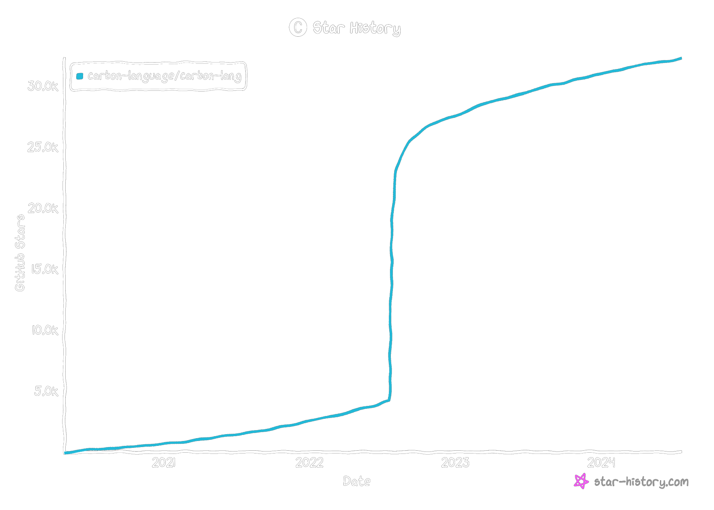

+++
weight = 1
outputs = ["Reveal"]
+++

# What's this Carbon Language?

{}

{}

---



## C {class="col-4 right"}

## → {class="col center"}

## C++ {class="col-4 left"}

---



## C {class="col-4 right"}

## → {class="col center"}

## C++ {class="col-4 left"}

## JavaScript {class="col-4 right"}

## → {class="col center"}

## TypeScript {class="col-4 left"}

---



## C {class="col-4 right"}

## → {class="col center"}

## C++ {class="col-4 left"}

## JavaScript {class="col-4 right"}

## → {class="col center"}

## TypeScript {class="col-4 left"}

## Objective-C {class="col-4 right"}

## → {class="col center"}

## Swift {class="col-4 left"}

---



## C {class="col-4 right"}

## → {class="col center"}

## C++ {class="col-4 left"}

## JavaScript {class="col-4 right"}

## → {class="col center"}

## TypeScript {class="col-4 left"}

## Objective-C {class="col-4 right"}

## → {class="col center"}

## Swift {class="col-4 left"}

## Java {class="col-4 right"}

## → {class="col center"}

## Kotlin {class="col-4 left"}

---



## C {class="col-4 right"}

## → {class="col center"}

## C++ {class="col-4 left"}

## JavaScript {class="col-4 right"}

## → {class="col center"}

## TypeScript {class="col-4 left"}

## Objective-C {class="col-4 right"}

## → {class="col center"}

## Swift {class="col-4 left"}

## Java {class="col-4 right"}

## → {class="col center"}

## Kotlin {class="col-4 left"}

## C++ {class="col-4 right"}

## → {class="col center"}

## **_Carbon_** {class="col-4 left fragment highlight"}

---



## Carbon: an experimental _successor_ to C++

Starts with our goals for C++ in https://wg21.link/p2137r0:

- Performance-critical software
- Software and language evolution
- Code that is easy to read, understand, and write
- Practical safety and testing mechanisms
- Fast and scalable development
- Modern OS platforms, hardware architectures, and environments

{}

- Carbon's goals as a successor language to C++ start from the goals we outlined
  in P2137 for C++ itself: [read goals].
- Today, while C++ may be the best language out there to hit these goals, it
  still leaves a _lot_ on the table, and the gaps are widening in terms of what
  we'd like to see here, not narrowing.
- Because C++ is struggling to improve and better address these goals, we'd like
  to try a different approach as a successor language, which does slightly tweak
  these goals...

{}

---



## Carbon: an experimental _successor_ to C++

- Performance-critical software
- Software and language evolution
- Code that is easy to read, understand, and write
- Practical safety and testing mechanisms
- Fast and scalable development
- Modern OS platforms, hardware architectures, and environments
- _Interoperability
  with and
  migration from
  existing C++ code_

{}

- We need to add a goal to address interoperability and migration from existing
  C++ code. If we can do _that_ while also addressing these other goals, we have
  a really compelling direction.
- But to sustain that going forward, we can't just improve once. We need the
  language to continue to evolve over time.

{}

---

## Carbon open source project

https://github.com/carbon-language/carbon-lang

{}

- We went public two years ago ... you might be able to see when. =D

- Steady activity and growth over the two years since then!

{}

---

## Carbon open source project

- 1856 PRs merged since going public
- 121 new contributors
- Active [Discord server](https://discord.gg/ZjVdShJDAs), both real-time and
  async discussion

---

## Carbon open governance & evolution

- Three Carbon leads: Kate Gregory, Richard Smith, and myself
  - Plan to have teams with their own lead structure as the project scales
- Evolution through proposals: special GitHub pull requests
  - Primarily _documenting_ the change: the problem solved, rationale, and
    alternatives
  - RFC open to feedback from everyone, approved by at least one lead
  - _Rolled back_ if needed -- we may make mistakes, but can fix them!
- Leads questions for _decision making_: special GitHub issues
  - Light weight process to get feedback
  - Extracts controversial or complex decisions from the proposal
- [205 merged proposals][proposals] and [123 closed leads
  questions][leads-questions]

[proposals]:
  https://github.com/carbon-language/carbon-lang/pulls?q=label%3Aproposal
[leads-questions]:
  https://github.com/carbon-language/carbon-lang/issues?q=label%3A%22leads+question%22

---

## Carbon annual roadmap

- Provides focus for the project that year
  - What we will prioritize and spend most of our effort towards
  - What we won't be able to prioritize
- Published at the start of every year
  - As a proposal just like any other
  - Includes a mini-retrospective of the previous year
- [2022 roadmap]: Make Carbon public, get project off the ground!
- [2023 roadmap]: Define & design our MVP of "0.1" Carbon

[2022 roadmap]:
  https://github.com/carbon-language/carbon-lang/blob/92748e6b351dc460bca15fc9d1f3bae00ef04bb8/docs/project/roadmap.md
[2023 roadmap]:
  https://github.com/carbon-language/carbon-lang/blob/a0bacbb26bc266c8cc12e4e6584dbaf93bbc5719/docs/project/roadmap.md

---

## [Roadmap for 2024][2024 roadmap]? Build a working toolchain

[2024 roadmap]:
  https://github.com/carbon-language/carbon-lang/blob/f641cb95d2200774dcc9714e6df3917891f2f698/docs/project/roadmap.md

**_We are here!_**

- Feedback from folks loud and clear: need a working toolchain!
  - Unsurprisingly a blocker for evaluating Carbon in practice
  - Also held folks back from participating / contributing
  - Smells too much like vaporware
- Needs to support building meaningful Carbon programs
- Ideally gets into some amount of C++ interop

---

## [Roadmap for 2025][2025 roadmap]? Finish our MVP of 0.1

[2025 roadmap]:
  https://github.com/carbon-language/carbon-lang/blob/trunk/docs/project/roadmap.md#potential-2025-goals-ship-a-working-01-language-for-evaluation

- Not decided, but each year we try to give a bit of forecast
- But this raises an important question that we glossed over earlier...

_What is this MVP thing?_
_What is 0.1?_

---

## Carbon's milestones

- **0.1**: the MVP (Minimum Viable Product) to _start_ evaluating Carbon
  - Focused on complete, functioning _C++ interop_
- **0.2**: feature complete to enable both finishing evaluations & concluding
  experiment
  - Notable feature: _memory safety_
- **1.0**: _if_ the experiment is successful, our production-ready milestone

{}

Carbon has a set of defined milestones. Unlike the roadmap which is
fundamentally temporal in nature, our milestones surface functional targets and
inflection points that are important to the project and our planning.

{}

---



## These milestones are **_over one year_** in scope

### We're building for _sustainability_ and the _long term_ {.fragment}
