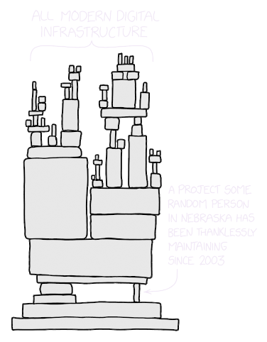
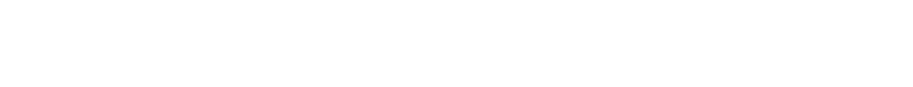

+++
weight = 1
outputs = ["Reveal"]
+++

## Why yet another programming language?

{}

{}

---

## C++ is _heavily_ used across the industry

- The dominant high-performance programming language
- Near universal platform coverage
- Massive existing ecosystem of software, both proprietary and OSS

{}

{}

---

## Increasing user demands that C++ isn't meeting

- Carries 40+ years of technical debt and growing
- Backwards compatibility often prioritized over improvements
- Complex, slow, inconsistent, and toxic evolution process

{}

{}

---

## Result: growing gap from modern languages

- Still struggling to move away from textual inclusion
- Macros still built with the C preprocessor
- No type-checked generics system
- No package manager
- ...

{}

{}

---

## Not a new problem for C++

## And expected to become an existential risk...

{}

{}

---

## And now it has: **memory safety**

{}

{}

---

## What do we mean by memory safety?

{}

First, we need to break down what we actually mean when we talk about memory
safety. There is a fairly broad usage of this term, and I know several others
are working on posts, articles, and presentations discussing this. Here, I'd
like to share the framework that I use to think about these.

{}

---

## Bugs, safety, and safety bugs

<ul><li class="fragment">

**Bugs**: program behavior contrary to the author's intent

{}

- Software, in practice, always has bugs -- we must plan for them
  {}

</li><li class="fragment">

**Safety**: invariants or limits on program behavior _in the face of bugs_

</li><li class="fragment">

**Safety bugs**: bugs where some aspect of program behavior has _no_ invariants

{}

- Checking for an unexpected value and calling `abort()`: detects a _bug_, but
  is _safe_
- Calling `std::unreachable()` is also a bug, but _unsafe_ and a _safety bug_
  {}

</li><li class="fragment">

**Initial bug**: the first deviation of program behavior

{}

- Buggy behavior often causes more buggy behavior -- all are bugs
- Our focus is on fixing the _initial_ bug {}

</li></ul>

{}

Let's start with some basic terms.

{}

---

## Safety, bugs, and security vulnerabilities

<ul><li class="fragment">

**Security vulnerabilities**: ability of a malicious user to subvert a program's
behavior, typically through exploiting bugs

<ul><li class="fragment">

**Detecting**: while still vulnerable, exploits of a bug can be detected or
tracked

</li><li class="fragment">

**Mitigating**: making a vulnerability significantly more expensive, difficult,
or improbable to be exploited

</li><li class="fragment">

**Preventing**: while still a bug, making it impossible to be a vulnerability

</li><li class="fragment">

**Fixing**: no longer a bug, much less a vulnerability

</li></ul></li>
<li class="fragment">

Safety doesn't require _fixing_ bugs, but it can _prevent_ or _mitigate_
vulnerabilities

<ul><li class="fragment">

Constructively-correct or proofs are a subset of safety techniques, 
essentially limiting even forming a program in the face of bugs

</li></ul>
</li></ul>

---

## Memory safety bugs and security

<ul><li class="fragment">

**Memory safety bugs**: Safety bugs that additionally read or write memory

{}

- A focus because they are the dominant cause of _security vulnerabilities_
- Over 65% of high / critical vulnerabilities (sources: [1],[2],[3],[4],[5],[6])

[1]: https://www.chromium.org/Home/chromium-security/memory-safety
[2]:
  https://android-developers.googleblog.com/2020/02/detecting-memory-corruption-bugs-with-hwasan.html
[3]:
  https://docs.google.com/spreadsheets/d/1lkNJ0uQwbeC1ZTRrxdtuPLCIl7mlUreoKfSIgajnSyY/edit#gid=1190662839
[4]: https://twitter.com/geofft/status/1132739184060489729
[5]:
  https://msrc-blog.microsoft.com/2019/07/16/a-proactive-approach-to-more-secure-code/
[6]: https://langui.sh/2019/07/23/apple-memory-safety/

{}

</li><li class="fragment">

**Memory safety**: limits program behavior to only read or write intended
memory, even in the face of bugs

{}

- Sufficient to mitigate and prevent these classes of vulnerabilities in
  practice {}

</li></ul>

{}

{}

---

## Classes of memory safety bugs

<ul><li class="fragment">

**Spatial**: memory access outside of an allocated region

</li><li class="fragment">

**Temporal**: access after the lifetime of the object in memory

</li><li class="fragment">

**Type**: accessing memory which isn't a valid representation for a type

</li><li class="fragment">

**Initialization**: reading memory before it is initialized

</li><li class="fragment">

**Data-Race**: unsynchronized reads & writes by different threads

</li></ul>

{}

{}

---

## Programming languages and memory safety

A _language_ is **_memory-safe_** if it has a default, well-delineated memory
safe subset.

{}
Details:

- Safe subset must be viable as a _default_, with unsafe constructs being
  _exceptional_
- Delineated unsafe constructs must be _visible_ and _auditable_
- Safety can be through any combination of compile-time and runtime protections
  - However, must _prevent_ vulnerabilities, not just _mitigate_ them
{}

{}

###  

#### _This should be the required minimum for new programming languages._

{}

{}

{}

---

## Memory safe programming languages work

TODO: data from
https://security.googleblog.com/2024/09/eliminating-memory-safety-vulnerabilities-Android.html

{}

{}

---

## Modern languages are generally memory safe:

<ul>
<li class="fragment">Java / Kotlin</li>
<li class="fragment">JavaScript / TypeScript</li>
<li class="fragment">Python</li>
<li class="fragment">Go</li>
<li class="fragment">Swift</li>
<li class="fragment">Rust</li>
</ul>

{}

{}

---

## But C++ fundamentally isn't....

{}

{}

---

## And there is a _lot_ of C++ in the world

{}

{}

---

<!--

-->

[XKCD #2347](https://xkcd.com/2347/), edited by
[Hana Dusíková](https://bsky.app/profile/hanicka.net)

## &nbsp;

### All of it part of an _ecosystem_

## &nbsp;

## &nbsp;

## &nbsp;

### With complex and tight dependencies {.fragment}

{}

{}

---

## Need to _move_ existing C++ to memory safety

<ul><li class="fragment">

So "Rewrite it in Rust!" 🦀

</li><li class="fragment">

But _incrementally_...

</li><li class="fragment">

And without breaking its ecosystem...

</li></ul>

{}

{}

---

## _Interop_ with existing C++ is key

{}

{}

---

## Rust _interop_ spectrum today

  

  
- `extern C`
- (c)bindgen
- `cxx` crate
- zngur
- ...

  
- Crubit

  
- ???

  

<h2>Greenfield</h2>

<h2>Brownfield</h2>

{}

{}

---

  

  
_Less_ tightly coupled to an existing C++ ecosystem:

- Strong abstraction boundaries
- Modular architecture

  
_More_ tightly coupled to an existing C++ ecosystem:

- Large API surface
- API uses large language surface area

  

<h2>Greenfield</h2>

<h2>Brownfield</h2>

{}

The spectrum here is really how tightly coupled code is to existing C++ software
and infrastructure. The more this is the case, the more difficult it is to start
cutting new code over to _any_ other language, including Rust.

TODO: figure out how to sequence display here

This is really what we're talking about when we use terms like "greenfield" and
"brownfield". We're discussing how tightly coupled some new code will be to the
existing C++ code and infrastructure.

Some interesting realizations -- brownfield only applies to _new code_ really.
Because if it isn't new code, its not even brownfield, its not development
activity at all. It's just extant, legacy code.

Also means that there isn't a really binary split between green- and brownfield.
It's a spectrum, and in my experience a very large and continuous spectrum.

{}

---

## Rust

🦀

🦀

🦀

## But will it get here?

  

<h2>Greenfield</h2>

<h2>Brownfield</h2>

{}

Rust is starting from the greenfield side of this spectrum. Not 100%, there is
no 100%, but towards that side. It is a mature, production quality language that
exists.

And the interop efforts are shifting its applicability right so that we can use
it in ever less greenfield and more brownfield situations.

Already, Android and other OS and low-level systems code are essentially
completely covered and work great. Now we're pushing into larger and larger, and
over more interdependent and tightly coupled systems.

But will it ever reach the most extreme brownfield end of this spectrum?

{}

---

## Ideally we'd add memory safety directly to C++ ... 😢

{}

Unfortunately, the committee is not moving in this direction.

Need an alternative that is almost as brownfield optimized as adding memory
safety directly to C++ would be... This sounds familiar...

{}

---



## C {class="col-4 right"}

## → {class="col center"}

## C++ {class="col-4 left"}

---



## C {class="col-4 right"}

## → {class="col center"}

## C++ {class="col-4 left"}

## JavaScript {class="col-4 right"}

## → {class="col center"}

## TypeScript {class="col-4 left"}

---



## C {class="col-4 right"}

## → {class="col center"}

## C++ {class="col-4 left"}

## JavaScript {class="col-4 right"}

## → {class="col center"}

## TypeScript {class="col-4 left"}

## Objective-C {class="col-4 right"}

## → {class="col center"}

## Swift {class="col-4 left"}

---



## C {class="col-4 right"}

## → {class="col center"}

## C++ {class="col-4 left"}

## JavaScript {class="col-4 right"}

## → {class="col center"}

## TypeScript {class="col-4 left"}

## Objective-C {class="col-4 right"}

## → {class="col center"}

## Swift {class="col-4 left"}

## Java {class="col-4 right"}

## → {class="col center"}

## Kotlin {class="col-4 left"}

---



## C {class="col-4 right"}

## → {class="col center"}

## C++ {class="col-4 left"}

## JavaScript {class="col-4 right"}

## → {class="col center"}

## TypeScript {class="col-4 left"}

## Objective-C {class="col-4 right"}

## → {class="col center"}

## Swift {class="col-4 left"}

## Java {class="col-4 right"}

## → {class="col center"}

## Kotlin {class="col-4 left"}

## C++ {class="col-4 right"}

## → {class="col center"}

## **_Carbon_** {class="col-4 left fragment"}

---

## Carbon

- An incremental path to evolve and migrate off C++
- And to add memory safety to existing software
- Prioritizing the _most_ brownfield codebases

{}

{}

---

# Rust 🦀 ⇐

# ⇐ Carbon

  

<h2>Greenfield</h2>

<h2>Brownfield</h2>

{}

Essentially, Carbon approaches the entire problem from the opposite end of the
spectrum.

And a key thesis is that this spectrum is really too large for some users to
cover with a single language. By bringing two languages that have these very
different priorities and designs, we can better cover the entire space.

And to repeat, my goal is to get more new code to be memory safe. Happy to pay
the cost of multiple languages if it actually allows us to achieve that outcome.
Realistically, we already have a _bunch_ of languages in the world, and I think
by-and-large they serve their different purposes.

{}

---

## Let's take a look at what Carbon looks like...

{}

{}

---
