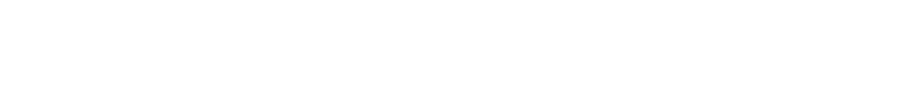

+++
weight = 1
outputs = ["Reveal"]
+++

## What does "memory safety _everywhere_" mean?

{}

{}

---

## Reminder of why emory safety is important

- Memory unsafety remains the dominant cause of security vulnerabilities
  - Over 65% of high / critical vulnerabilities (sources [1], [2], [3], [4],
    [5])
- Only durable solution found: memory safe programming languages
- Evidence clearly shows this works
  - https://security.googleblog.com/2024/09/eliminating-memory-safety-vulnerabilities-Android.html

[1]: https://www.chromium.org/Home/chromium-security/memory-safety
[2]:
  https://android-developers.googleblog.com/2020/02/detecting-memory-corruption-bugs-with-hwasan.html
[3]:
  https://docs.google.com/spreadsheets/d/1lkNJ0uQwbeC1ZTRrxdtuPLCIl7mlUreoKfSIgajnSyY/edit#gid=1190662839
[4]:
  https://msrc-blog.microsoft.com/2019/07/16/a-proactive-approach-to-more-secure-code/
[5]: https://langui.sh/2019/07/23/apple-memory-safety/

{}

{}

---

### You probably know how to write memory safe software!

<ul>
<li class="fragment">Java / Kotlin</li>
<li class="fragment">JavaScript / TypeScript</li>
<li class="fragment">Python</li>
<li class="fragment">... and yes, Rust! 🦀</li>
</ul>

{}

{}

---

## The "_everywhere_" is the tricky part...

{}

{}

---

## A _lot_ of software in the world

{}

{}

---

## &nbsp;

### All part of an _ecosystem_

## &nbsp;
## &nbsp;
## &nbsp;

### Each piece you move has to integrate with the rest {.fragment}

{}

{}

---

## _Interop_ is key

{}

{}

---

## _Interop_ spectrum

  

  
- `extern C`
- (c)bindgen
- `cxx` crate
- zngur
- ...

  
- Crubit

  
- ???

  

Greenfield

Brownfield

{}

{}

---

  

  
_Less_ tightly coupled to existing C++ ecosystem:

- Strong abstraction boundaries
- Modular architecture

  
_More_ tightly coupled to existing C++ ecosystem

- Large API surface
- API uses large language surface area

  

Greenfield

Brownfield

{}

The spectrum here is really how tightly coupled code is to existing C++ software
and infrastructure. The more this is the case, the more difficult it is to start
cutting new code over to _any_ other language, including Rust.

TODO: figure out how to sequence display here

This is really what we're talking about when we use terms like "greenfield" and
"brownfield". We're discussing how tightly coupled some new code will be to the
existing C++ code and infrastructure.

Some interesting realizations -- brownfield only applies to _new code_ really.
Because if it isn't new code, its not even brownfield, its not development
activity at all. It's just extant, legacy code.

Also means that there isn't a really binary split between green- and brownfield.
It's a spectrum, and in my experience a very large and continuous spectrum.

{}

---

🦀

🦀

🦀

🦀

🦀

But will it get here?

  

Greenfield

Brownfield

{}

Rust is starting from the greenfield side of this spectrum. Not 100%, there is
no 100%, but towards that side. It is a mature, production quality language that
exists.

And the interop efforts are shifting its applicability right so that we can use
it in ever less greenfield and more brownfield situations.

Already, Android and other OS and low-level systems code are essentially
completely covered and work great. Now we're pushing into larger and larger, and
over more interdependent and tightly coupled systems.

But will it ever reach the most extreme brownfield end of this spectrum?

{}

---

## _Everywhere_ requires a _maximalist_ approach

{}

That would require covering a really dauntingly large design space. We could try
to it with a single language, but IMO, stretching a single language across such
a large space has a serious risk of it ending up poorly addressing many parts of
the space and being burdened with especially high complexity.

Think you can see this with C++ and C before we started really pushing towards
memory safety in low-level languages. C++ tried to cover everything in the
low-level domain, but struggled in a number of places where its complexity
wasn't the right tradeoff. And C remains used and even preferred in a number of
contexts as a consequence.

{}

---

## Ideally we'd add memory safety directly to C++ ... 😢

{}

Unfortunately, the committee is not moving in this direction.

Need an alternative that is almost as brownfield optimized as adding memory
safety directly to C++ would be... This sounds familiar...

{}

---



## C {class="col-4 right"}

## → {class="col center"}

## C++ {class="col-4 left"}

---



## C {class="col-4 right"}

## → {class="col center"}

## C++ {class="col-4 left"}

## JavaScript {class="col-4 right"}

## → {class="col center"}

## TypeScript {class="col-4 left"}

---



## C {class="col-4 right"}

## → {class="col center"}

## C++ {class="col-4 left"}

## JavaScript {class="col-4 right"}

## → {class="col center"}

## TypeScript {class="col-4 left"}

## Objective-C {class="col-4 right"}

## → {class="col center"}

## Swift {class="col-4 left"}

---



## C {class="col-4 right"}

## → {class="col center"}

## C++ {class="col-4 left"}

## JavaScript {class="col-4 right"}

## → {class="col center"}

## TypeScript {class="col-4 left"}

## Objective-C {class="col-4 right"}

## → {class="col center"}

## Swift {class="col-4 left"}

## Java {class="col-4 right"}

## → {class="col center"}

## Kotlin {class="col-4 left"}

---



## C {class="col-4 right"}

## → {class="col center"}

## C++ {class="col-4 left"}

## JavaScript {class="col-4 right"}

## → {class="col center"}

## TypeScript {class="col-4 left"}

## Objective-C {class="col-4 right"}

## → {class="col center"}

## Swift {class="col-4 left"}

## Java {class="col-4 right"}

## → {class="col center"}

## Kotlin {class="col-4 left"}

## C++ {class="col-4 right"}

## → {class="col center"}

## **_Carbon_** {class="col-4 left fragment"}

---

## Carbon

- An incremental path to evolve and migrate off C++
- And to add memory safety to existing software
- Prioritizing the _most_ brownfield codebases

{}

{}

---

## Greenfield

## Brownfield

# ←────→ {.arrow}

### Rust 🦀 ⇒

### ⇐ Carbon

{}

Essentially, Carbon approaches the entire problem from the opposite end of the
spectrum.

And a key thesis is that this spectrum is really too large for some users to
cover with a single language. By bringing two languages that have these very
different priorities and designs, we can better cover the entire space.

And to repeat, my goal is to get more new code to be memory safe. Happy to pay
the cost of multiple languages if it actually allows us to achieve that outcome.
Realistically, we already have a _bunch_ of languages in the world, and I think
by-and-large they serve their different purposes.

Now, given these different goals and the totally different direction from how
Rust and Carbon are evolving, it's not too surprising that they end up
diverging. That's what I want to spend the rest of today looking at...

{}

---

## Let's look at how they are diverging

{}

How are they diverging?

_Why_ are they diverging in these ways?

And what is the _cost_?

{}

---
