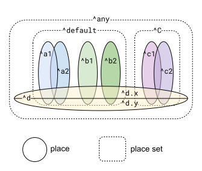

+++
weight = 2
outputs = ["Reveal"]
+++

# Alias tracking

## What could this pointer reference?

---

## Alias tracking

Three kinds:

- Aliasing between parameters
- Aliasing of parameters by returns
- Aliasing in data structures

<br/>

<br/>

Key ingredients for this analysis: places, place sets, and place parameters

{}

References: safety units [30](https://docs.google.com/document/d/1Hjr98zpZMz5FSku_IJfPLV8qs7RmrzmFjTB5oGScNgM/edit?tab=t.0), [42](https://docs.google.com/document/d/1WnEMJCXTDex1OEmlafHDomJ7FYb5EGOgLHlKXb0haRY/edit?tab=t.0)

{}

---

## Aliasing between parameters

### By default, parameters may overlap

```carbon{}
fn Unsafe(ref b: buf(i32), ref s: i32) invalidate(^b.Elts) {
  b.PushBack(s);
  // ❌ Error: ``s`` may overlap ``^b.Elts``,
  //    invalidated by ``b.PushBack(s)``.
  s = b.Size();
}
```

`b.PushBack(s)` invalidates anything that could overlap an element of `b`.  

{}

Parameters by default are allowed to overlap, which means the invalidation from calling `PushBack` prevents later use of the `s` parameter.

Why do we need to prevent this?

{}

---

## Aliasing between parameters

### Problematic caller

```carbon{}
fn Unsafe(ref b: buf(i32), ref s: i32) invalidate(^b.Elts) {
  b.PushBack(s);
  // ❌ Error: ``s`` may overlap ``^b.Elts``,
  //    invalidated by ``b.PushBack(s)``.
  s = b.Size();
}

fn ProblematicCaller() {
  var b: buf(i32) = (1, 20, 300);
  Unsafe(`ref b, ref b[0]`);
}
```

---

## Aliasing between parameters

### Fix: `^` to mark disjoint parameter

```carbon{}
fn Fixed(ref b: buf(i32), `^` ref s: i32) invalidate(^b.Elts) {
  b.PushBack(s);
  // ✅ Okay: caller is required to ensure
  // ``s`` doesn't overlap elements of ``b``.
  s = b.Size();
}

fn ErrorNowInCaller() {
  var b: buf(i32) = (1, 20, 300);

  // ❌ Error: ``b[0]`` may overlap ``^b.any``,
  //    ``Fixed`` requires them to be disjoint.
  Fixed(`ref b, ref b[0]`);

  var s: i32 = 1;
  // ✅ Okay: Every ``var`` gets its own
  //    storage, so ``s`` is disjoint.
  Fixed(`ref b, ref s`);
}
```

{}

- **Click** The `^` by itself means that parameter must be disjoint from all other parameters.
- This removes the error from the body of the function.
- **Click** Now the error moves to any caller that can't prove disjointness of the arguments.
- **Click** But a local variable gets its own storage, and so this second call passes checking.

{}

---

## Aliasing between parameters

### 🦀 Not an issue in Rust

- "Shared XOR mutable" means reference parameters can't interact
- Parameter aliasing is additional information needed for safe non-exclusive mutable references

---

## Overlapping / disjoint parameters

<div class="col-container" style="flex: auto; flex-flow: row wrap">
<div class="col">

```carbon{}
fn F(ref a1: i32, ref a2: i32,
     ^ ref b1: i32, ^ ref b2: i32,
     ^C ref c1: i32, ^C ref c2: i32,
     ^any ref d: {.x: i32, .y: i32});
```

<br/>

- ``a1``, ``a2``, ``b1``, ``b2`` are in ``^default``
  - ``a1``, ``a2`` may overlap each other
  - ``b1``, ``b2`` are disjoint from each other and ``a1``, ``a2``
- ``c1``, ``c2`` are in ``^C``, may overlap each other
- <code><span class="fragment highlight-code">^default</span></code> and ``^C`` are mutually disjoint

</div><div class="col" style="text-align: right;">



</div></div>

- <code><span class="fragment highlight-code">d</span></code>, ``d.x``, and ``d.y`` may overlap any of the parameters, but ``d.x`` is disjoint from ``d.y``

{}

We have a vocabulary for concisely expressing a number of different overlapping / disjoint parameter combinations.

Observe that:

- Every binding has a place, which can be members of place sets.
- **\<click\>** The `default` place set includes all places that aren't in any other named place set.
- **\<click\>** We also model the whole-part relationship of fields

References: safety unit [33](https://docs.google.com/document/d/198w8Zr6ZaLT7sTzp2zIb5mB_jRNYbP0Girhwqfnt85Y/edit?tab=t.0), [34](https://docs.google.com/document/d/1J3P_uEKtLFscz2zw1VWsBm4EBiHXd6yGJvjCLSeojJ8/edit?tab=t.0), [42](https://docs.google.com/document/d/1WnEMJCXTDex1OEmlafHDomJ7FYb5EGOgLHlKXb0haRY/edit?tab=t.0)

{}

---

## Aliasing of parameters by returns

By default, returns are allowed to reference `^default.any`:

```carbon{}
fn First(`<0>ref b: buf(i32)`) -> `<0>i32*` {
  return &b[0];
}

fn UseAfterFree() {
  var b: buf(i32) = (1, 20, 300);
  `<1>var p: i32* = First(ref b)`;
  // ✅ Okay: prints "1".
  Core.Print(*p);
  `<2>b.PushBack(4000)`;
  // ❌ Error: ``*p`` may overlap ``^b.Elts``,
  //    invalidated by ``b.PushBack(4000)``.
  Core.Print(*p);
}
```

<div class="fragment" data-fragment-index="0">

-  ``^default`` contains only ``^b``, so the return type is ``^b.any i32*``

</div><div class="fragment" data-fragment-index="1">

-  ``p`` gets type ``^b.any i32*``

</div><div class="fragment" data-fragment-index="2">

-  ``^b.Elts`` overlaps ``^b.any``, so ``p`` is invalidated as before

</div>

{}

- The `^default` place set includes all parameter places that haven't been given their own name.
- **Click** By default, returned pointers can reference any places within that.
- In this case, that is going to be the elements of the `buf` parameter.
- **Click** Again the local variable `p` has left off the place set, so it is getting the automatic default from the function's return type.
- **Click** We again get an invalidation of the owned elements of `b`, which the `.any` wildcard matches.
- This is use after free again, with the `First` function is performing the "capture" step.

{}

---

## Use any of the parameter place names in returns

```carbon{}
fn F(ref a1: i32, ref a2: i32,
     ^ ref b1: i32, ^ ref b2: i32,
     ^C ref c1: i32, ^C ref c2: i32,
     ^any ref e: {.x: i32, .y: i32})
  -> `^____` ref i32;
```

- default is `^default.any` \= {`^a1`, `^a2`, `^b1`, `^b2`}  
- place of any parameter: `^a1`, `^a2`, `^b1`, `^b2`, `^c1`, `^c2`  
- fields: `^e.x`, `^e.y`
- named place sets: `^C` \= {`^c1`, `^c2`}  
- `^any` \= {`^a1`, `^a2`, `^b1`, `^b2`, `^c1`, `^c2`, `^e.x`, `^e.y`}  
- any member: `^e.any` \= {`^e.x`, `^e.y`}  
- union: `^(a1, b1, C)` is {`^a1`, `^b1`, `^c1`, `^c2`}

{}

What can be placed in **Click** this blank in the return?

This is not legal Carbon syntax, you can put any of the listed place set expressions here.

The places and place sets of the parameters may be used to describe what the return references. This includes anything from the Venn diagram from before, along with unions of those places and sets.

**Click**

- Or omit it entirely and get the default.

References: safety units [32](https://docs.google.com/document/d/1d0Vi6M72wemy2UWk10-QrZ_Gt9zf0lR1iXS-A2PH_S8/edit?tab=t.0), [33b](https://docs.google.com/document/d/1Yflg3Mi59lnrM4YaFexdRI1qAbndOChRr8TTLQdXvis/edit?tab=t.0)

{}

---

## More similar to Rust than parameters

### But still different

- Rust says "return borrows from this parameter"  
  - Parameter must *outlive* the return (preventing use after free)  
  - What you can do with that parameter is limited until the borrow is done
    - Enforces "shared XOR mutable"
  - Connected by using the same lifetime parameter
- Carbon says "return may reference this field of this parameter"  
  - More precise: specific to a field  
  - No restrictions on parameter while being referenced  
  - Return's reference is invalidated when parameter is
  - Connected by the return referencing parameters by name

---

## Aliasing in data structures

### Types with external pointers

- No default for place parameters in a class definition
  - Pointer fields must specify explicitly what they can point to
- To reference something external, the class needs to have a place parameter
  - No other way to reference something outside the class

```carbon{}
class HasPtr(`^A of i32`) {
  var p: `^A` i32*;
}

fn Example() {
  var i: i32 = 1;
  var has_ptr: HasPtr(`^i`) = {.p = &i};
}
```

🦀 Rust similarly requires a lifetime parameter when fields reference something outside that struct. The relationship is similar as for returns.

{}

- If a type is going to reference a place that isn't a field or owned, it needs **Click** a place parameter.
- This introduces a name that can be used in **Click** the types within the class.
- **Click** Which is then specified when instantiating that type.

References: [safety unit 33](https://docs.google.com/document/d/198w8Zr6ZaLT7sTzp2zIb5mB_jRNYbP0Girhwqfnt85Y/edit?tab=t.0)  

{}

---

## Automatic aliasing for locals

<div class="col-container" style="flex: auto; flex-flow: row wrap">
<div class="col">

```carbon{}
fn F() {
  var x: i32 = 1;
  var y: i32 = 2;
  var p: `<0>i32*` = `<1>&x`;
  if (true) {
    `<8>var z`: i32 = 3;
    `<2>p = &z`;
    while (true) `<6>{`
      if (G(p)) {
        `<3>p = &x`;
      } else {
        `<4>p = &y`;
      }
      `<5>if` (H(p)) {
        `<7>break`;
      }
    }
  `<8>}`
  `<9>J(p)`;
}
```

</div><div class="col">

```


`<0>p has type ^*p i32*`, `<1>^*p = ^x`


`<2>^*p = ^z`

`<6>^*p = ^(x, y, z)`
`<3>^*p = ^x`

`<4>^*p = ^y`

`<5>^*p = ^(x, y)`
`<7>^*p = ^(x, y)`


`<8>^*p = ^(x, y), ^z invalidated`
`<9>^*p = ^(x, y)`, ``p`` is still valid

```

</div></div>


{}

If the place parameter on a local is omitted, **Click** it is given a new place
set whose value is determined by the compiler, and is allowed to change
from statement to statement. A flow-sensitive analysis determines a set
of places that are possible at each point.

\<step through the analysis\>

- **Click** Initialization and **Click**  assignment statements overwrite the place set
  based on the type of the right hand side. **Click** **Click** 
- **Click** When two control paths join, we take the union of the places
  that are possible on the two paths. **Click**
- **Click** Note that `p` can only reference `x` or `y` when the loop is exited.
- By having different values at different points, we can get
  more precision than if we had a fixed place set with the union
  over the course of the whole function.
- **Click** Here `p` remains valid even when the local `z` is invalidated from leaving its scope.
- **Click** Allowing its use.

{}

---

## Automatic aliasing for locals

- Few safety annotations needed for locals
  - More concise
  - More like C++
- Additional precision compared to fixed place sets
  - Reduces invalidations
- Flow-sensitive analysis comes _after_ overload resolution
  - Overloads selected is an input into the analysis

{}

- We also have defaults for function signature annotations, but can only use defaults there some of the time
- Don't have defaults for types. Expectation is they are written less often, and require some care

{}
